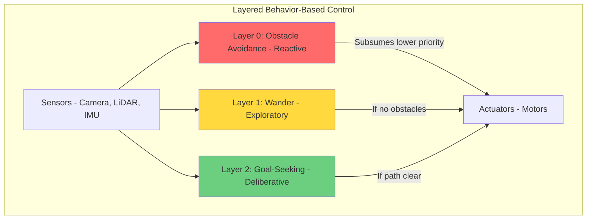
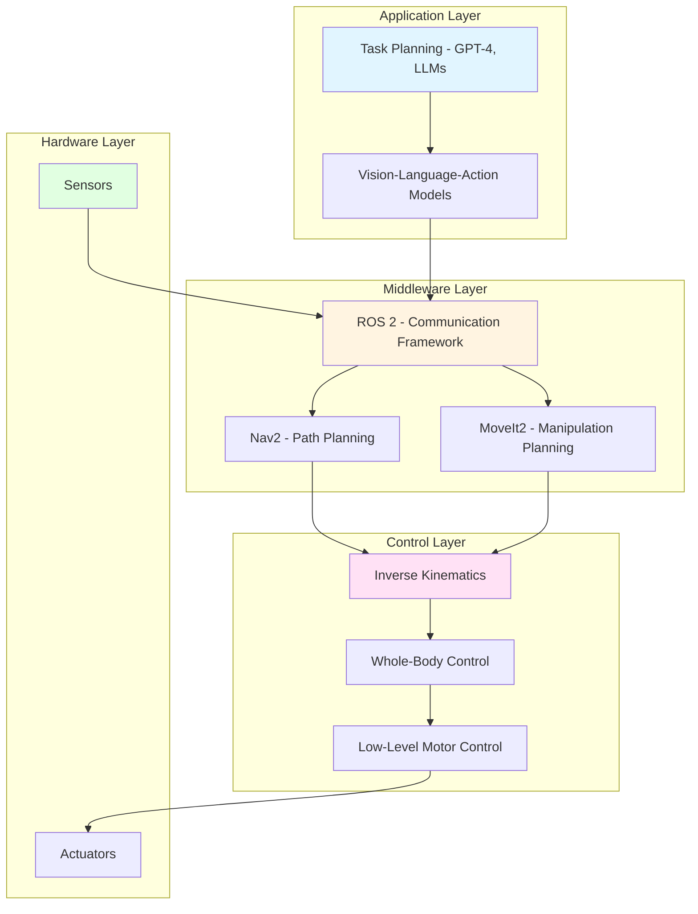

import MCQ from '@site/src/components/MCQ';
import UrduTranslationButton from '@site/src/components/UrduTranslationButton';

<UrduTranslationButton chapterId="ch01" />

# Introduction to Physical AI and Embodied Intelligence

## Learning Objectives

By the end of this chapter, you will be able to:

1. **Understand** the fundamental concepts of Physical AI and embodied intelligence
2. **Distinguish** between disembodied AI (e.g., chatbots) and embodied robotics systems
3. **Identify** key architectural components of modern humanoid robots
4. **Analyze** the subsumption architecture paradigm for reactive robot behavior
5. **Evaluate** real-world applications of Physical AI in industry and research

---

## Theory

### 1.1 What is Physical AI?

**Physical AI** refers to artificial intelligence systems that are embodied in physical agents—robots that interact with the real world through sensors and actuators. Unlike traditional AI systems that operate in purely digital domains (e.g., language models, chess engines), Physical AI must navigate the complexities of:

- **Uncertainty**: Sensor noise, dynamic environments, unpredictable human behavior
- **Real-time constraints**: Decisions must be made in milliseconds to maintain balance or avoid collisions
- **Continuous state spaces**: Unlike discrete game boards, the real world has infinite possible configurations
- **Physical laws**: Gravity, friction, momentum—robots must respect Newtonian physics

**Embodied intelligence** emphasizes that intelligence emerges from the interaction between an agent's body, brain, and environment. Rodney Brooks, a pioneer in this field, famously argued that "the world is its own best model" (Brooks, 1991), meaning robots should react directly to sensory input rather than building complex internal world representations.

**Key Insight**: A humanoid robot learning to walk doesn't need to solve differential equations in real-time. Instead, it uses reflexive feedback loops (like a human adjusting balance based on inner ear signals) to achieve stable locomotion.

#### Disembodied vs. Embodied AI

| Aspect                | Disembodied AI (e.g., GPT-4) | Embodied AI (e.g., Humanoid Robot) |
|-----------------------|------------------------------|-------------------------------------|
| **Environment**       | Text, images, audio          | Physical 3D world                   |
| **Perception**        | Pre-processed data           | Noisy sensors (cameras, LiDAR, IMU) |
| **Action**            | Generate text/images         | Motor commands (joint torques)      |
| **Feedback Loop**     | Human evaluation             | Immediate physical consequences     |
| **Safety**            | Ethical content filtering    | Fall prevention, collision avoidance|

**Example**: A language model can "imagine" picking up a cup by generating descriptive text. A humanoid robot must compute inverse kinematics, grasp force, and balance shifts to physically perform the action without dropping the cup or tipping over.

---

### 1.2 Embodied Intelligence: The Brooks Paradigm

In the 1980s, traditional AI relied on the **sense-plan-act** cycle:
1. **Sense**: Build a complete world model from sensors
2. **Plan**: Use symbolic reasoning to compute optimal actions
3. **Act**: Execute the plan step-by-step

This approach struggled with real-world robotics because:
- World models became outdated by the time planning finished
- Computational cost was prohibitive for real-time tasks
- Brittleness: small sensor errors led to catastrophic failures

#### Subsumption Architecture

Rodney Brooks introduced **subsumption architecture** (Brooks, 1991) as an alternative:

**Key Principles**:
1. **Layered behaviors**: Each layer is a simple sensor-to-actuator mapping (e.g., "if obstacle detected, turn away")
2. **No central planner**: Layers run in parallel, with higher layers **subsuming** (overriding) lower layers when needed
3. **Reactivity**: Fast response times (milliseconds) because behaviors are reflexive, not deliberative
4. **Robustness**: If high-level planning fails, low-level reflexes (obstacle avoidance) keep the robot safe

**Real-World Example**: Boston Dynamics' Atlas robot uses layered control:
- **Layer 0**: Balance reflexes (activate within 10ms of disturbance)
- **Layer 1**: Footstep planning for locomotion
- **Layer 2**: High-level navigation (navigate to kitchen)

When Atlas is pushed, Layer 0 immediately adjusts joint torques to prevent falling, without waiting for Layer 2's permission.

**Citation**: Brooks, R. A. (1991). *Intelligence without representation*. Artificial Intelligence, 47(1-3), 139-159. [https://doi.org/10.1016/0004-3702(91)90053-M](https://doi.org/10.1016/0004-3702(91)90053-M)

---

### 1.3 Humanoid Robot Architecture

Modern humanoid robots integrate multiple subsystems, each with specialized hardware and software:

#### 1.3.1 Perception System
- **Vision**: RGB cameras (scene understanding), depth cameras (3D mapping)
- **Proprioception**: Joint encoders (limb positions), IMU (orientation, acceleration)
- **Tactile**: Force sensors in hands/feet (grasp detection, ground contact)

**Challenge**: Sensor fusion—combining noisy, asynchronous data streams into a coherent world model. ROS 2's `tf2` library handles coordinate transformations between sensor frames.

#### 1.3.2 Computation Platform
- **Onboard**: NVIDIA Jetson (edge AI for real-time inference, 40 TOPS on Orin Nano)
- **Offboard**: Cloud GPUs for training (AWS, Google Colab) or heavy planning tasks
- **Hybrid**: Edge handles low-latency reflexes, cloud handles high-level planning (e.g., GPT-4 for task decomposition)

#### 1.3.3 Actuation System
- **Degrees of Freedom (DOF)**: Humanoids typically have 25-40 DOF (6 per leg, 7 per arm, 3 for neck, etc.)
- **Actuators**: Electric motors (precise, quiet) or hydraulic (high torque for heavy loads)
- **Control**: Position control (move to joint angle) vs. torque control (apply force, useful for compliant manipulation)

#### 1.3.4 Software Stack

**Example Workflow**: Voice-commanded pick-and-place
1. **Application Layer**: Whisper transcribes "Pick up the red cup" → GPT-4 generates plan: `[locate_cup, move_to_cup, grasp_cup, lift_cup]`
2. **Middleware Layer**: ROS 2 action server receives `move_to_cup` → Nav2 plans collision-free path
3. **Control Layer**: Inverse kinematics computes joint angles for end-effector position → Whole-body controller ensures balance during reach
4. **Hardware Layer**: Motor drivers send PWM signals to servos → Force sensors confirm grasp success

---

### 1.4 Real-World Applications of Physical AI

#### 1.4.1 Industrial Automation
- **Warehouse Logistics**: Amazon's robotic fulfillment centers use mobile manipulators for bin picking (vision-guided grasping)
- **Manufacturing**: Tesla's Optimus humanoid assembles car components, replacing repetitive human labor
- **Agriculture**: Harvest robots (e.g., Abundant Robotics) use computer vision to identify ripe fruit and gentle grippers to avoid damage

#### 1.4.2 Healthcare
- **Surgical Robots**: da Vinci system provides surgeons with 10x magnification and tremor-free precision
- **Rehabilitation**: Exoskeleton robots (Ekso Bionics) assist paralyzed patients in walking therapy
- **Elderly Care**: Social robots (Paro seal) provide companionship and monitor vital signs

#### 1.4.3 Research Frontiers
- **Bipedal Locomotion**: Dynamic walking on uneven terrain (Cassie robot navigates stairs, slopes)
- **Dexterous Manipulation**: Shadow Hand learns in-hand object reorientation (rotating a cube without dropping it)
- **Human-Robot Collaboration**: Cobots (collaborative robots) work alongside humans without safety cages, using force sensors to detect collisions

**Case Study**: Boston Dynamics' Spot (quadruped) deployed in Chernobyl to inspect radioactive zones—demonstrating how Physical AI enables exploration in environments too dangerous for humans.

---

### 1.5 Challenges in Physical AI

1. **Sim-to-Real Gap**: Models trained in simulation often fail on real hardware due to unmodeled dynamics (friction, latency, backlash)
   - **Mitigation**: Domain randomization (train on varied simulated environments), system identification (measure real robot parameters)

2. **Sample Efficiency**: Reinforcement learning for locomotion requires millions of training steps—impractical for physical robots
   - **Solution**: Simulate in Isaac Sim (GPU-accelerated), then fine-tune on hardware with few-shot learning

3. **Safety**: A humanoid falling can cause injury or equipment damage
   - **Approach**: Hierarchical control (low-level reflexes prevent falls), extensive sim testing, human-in-the-loop for novel tasks

4. **Cost**: High-fidelity humanoids (e.g., Boston Dynamics Atlas) cost $150k+, limiting accessibility
   - **Democratization**: Open-source platforms (ROBOTIS OP3, Trossen XL-320), cloud robotics (AWS RoboMaker), affordable dev kits (Jetson + RealSense ~$700)

---

## Hands-on Lab: Conceptual Activity

**Objective**: Analyze a humanoid robot video to identify subsumption architecture layers.

### Lab 1.1: Subsumption Architecture Analysis

**Setup**: No code required—this is a conceptual exercise to build intuition before diving into ROS 2 in Chapter 2.

**Instructions**:

1. **Watch Video**: Boston Dynamics Atlas robot performing parkour
   Link: [https://www.youtube.com/watch?v=tF4DML7FIWk](https://www.youtube.com/watch?v=tF4DML7FIWk)
   (Or search "Atlas parkour" on YouTube)

2. **Identify Behaviors**: As you watch, list at least three distinct robot behaviors you observe. For each behavior, classify it into one of these layers:
   - **Layer 0 (Reflexive)**: Immediate reactions to maintain balance (e.g., arm swing during stumble recovery)
   - **Layer 1 (Exploratory)**: Adaptive movements to navigate obstacles (e.g., footstep placement on uneven boxes)
   - **Layer 2 (Deliberative)**: High-level task execution (e.g., planning sequence of jumps to reach goal)

3. **Analyze Subsumption**: Answer these questions:
   - At 0:23, Atlas lands awkwardly after a jump. Which layer likely triggered the immediate balance recovery?
   - How does the robot decide when to jump vs. step? Is this Layer 1 or Layer 2?
   - What sensors do you think Atlas uses for each behavior? (Hint: cameras for planning, IMU for balance)

4. **Document Findings**: Write a short paragraph (5-7 sentences) describing one behavior and its subsumption layer. Explain why you classified it that way, referencing Brooks' principles.

**Example Analysis**:
> "At 0:45, Atlas performs a backflip while maintaining balance. This is a Layer 2 deliberative behavior—the robot pre-computes the full-body trajectory before execution. However, mid-flip at 0:47, you see subtle torso rotations that appear reactive, not pre-planned. These are likely Layer 0 reflexes triggered by the IMU detecting unexpected angular velocity. This demonstrates subsumption: the high-level backflip plan runs on Layer 2, but Layer 0 continuously monitors and corrects execution in real-time without waiting for Layer 2's approval. This separation allows fast reflexes (10ms) to coexist with slow planning (100ms+)."

**Extension (Optional)**: If you have access to a simple robot (even a wheeled robot), implement a two-layer controller:
- Layer 0: If distance sensor detects obstacle &lt;20cm, reverse motors
- Layer 1: Otherwise, drive forward
Test how Layer 0 "subsumes" Layer 1 when obstacles appear.

---

## Assessment

Test your understanding with these multiple-choice questions. Select the best answer, then click "Submit" to see explanations.

<MCQ
  id="ch01-mcq-01"
  question="What is the primary difference between disembodied AI and embodied AI?"
  options={[
    "Disembodied AI runs on CPUs, embodied AI requires GPUs",
    "Disembodied AI operates in digital domains, embodied AI interacts with the physical world through sensors and actuators",
    "Disembodied AI uses supervised learning, embodied AI uses reinforcement learning",
    "Disembodied AI is faster because it doesn't need real-time perception"
  ]}
  correctIndex={1}
  explanation="Correct! The key distinction is the interaction medium. Disembodied AI (like ChatGPT) processes pre-digitized data (text, images), while embodied AI (like humanoid robots) must perceive the physical world through noisy sensors and act via actuators. This introduces challenges like real-time constraints, sensor uncertainty, and physical safety—absent in purely digital systems. See Section 1.1 'Disembodied vs. Embodied AI' table for a detailed comparison."
  difficulty="easy"
/>

<MCQ
  id="ch01-mcq-02"
  question="In Brooks' subsumption architecture, what does it mean for a higher layer to 'subsume' a lower layer?"
  options={[
    "The higher layer deletes the lower layer's code to save memory",
    "The higher layer overrides the lower layer's outputs when both are active",
    "The higher layer sends commands to the lower layer, which then executes them",
    "The higher layer runs first, and the lower layer only runs if the higher layer fails"
  ]}
  correctIndex={1}
  explanation="Correct! Subsumption means the higher layer's output takes precedence when both layers are active. For example, if Layer 0 (obstacle avoidance) and Layer 2 (goal-seeking) both send motor commands, Layer 2's commands are used—unless an obstacle is detected, in which case Layer 0 'subsumes' (overrides) Layer 2 to prioritize safety. This is NOT sequential execution; all layers run in parallel, and the architecture resolves conflicts via priority. Brooks (1991) introduced this to avoid the brittleness of centralized planners."
  difficulty="medium"
/>

<MCQ
  id="ch01-mcq-03"
  question="Which of the following is an example of a Layer 0 (reflexive) behavior in a humanoid robot?"
  options={[
    "Planning a 10-step sequence to assemble a chair",
    "Immediately adjusting joint torques to prevent falling when pushed",
    "Exploring a room by wandering and mapping obstacles",
    "Using a language model to generate task plans from voice commands"
  ]}
  correctIndex={1}
  explanation="Correct! Layer 0 behaviors are immediate, reflexive responses to sensory input, designed to keep the robot safe without waiting for higher-level planning. Adjusting torques to prevent falling after a push is a classic example—it must happen within ~10ms (faster than human reaction time) to be effective. Options A and D are Layer 2 (deliberative planning), while Option C is Layer 1 (exploratory behavior). See Section 1.2 'Subsumption Architecture' for the layer definitions."
  difficulty="medium"
/>

<MCQ
  id="ch01-mcq-04"
  question="What is the 'sim-to-real gap' in Physical AI, and why is it a challenge?"
  options={[
    "Simulations run slower than real-time, making robot testing impractical",
    "Simulated environments lack visual realism, confusing computer vision models",
    "Models trained in simulation often fail on real hardware due to unmodeled dynamics like friction and sensor noise",
    "Real robots are more expensive than simulators, limiting research budgets"
  ]}
  correctIndex={2}
  explanation="Correct! The sim-to-real gap refers to the performance drop when deploying simulation-trained models to physical robots. Simulators (like Gazebo, Isaac Sim) use simplified physics models—they may not perfectly replicate motor backlash, surface friction variations, or sensor noise profiles. A policy that works flawlessly in simulation might cause a real robot to fall because it didn't account for 50ms actuation latency. Mitigation strategies include domain randomization (training on diverse simulated conditions) and system identification (measuring real robot parameters to improve sim accuracy). See Section 1.5 'Challenges in Physical AI'."
  difficulty="hard"
/>

<MCQ
  id="ch01-mcq-05"
  question="Why did Rodney Brooks argue that 'the world is its own best model'?"
  options={[
    "Building accurate world models requires too much memory for embedded systems",
    "Robots should react directly to sensory input rather than maintaining complex internal representations",
    "The physical world is deterministic, so robots don't need to predict future states",
    "Symbolic AI is more accurate than sensor-based approaches for navigation"
  ]}
  correctIndex={1}
  explanation="Correct! Brooks' famous quote challenged the sense-plan-act paradigm, which required robots to build detailed internal world models before acting. He argued this was computationally expensive, slow (models become outdated), and brittle (sensor errors corrupt the model). Instead, subsumption architecture advocates for direct sensor-to-actuator mappings: the robot queries the world in real-time via sensors, rather than relying on a possibly-stale internal representation. This doesn't mean robots never use models (high-level planning still needs some representation), but low-level behaviors should be reactive. See Section 1.2 for Brooks (1991) citation and full context."
  difficulty="hard"
/>

---

## Summary

In this chapter, you learned:

1. **Physical AI** is AI embodied in robots that interact with the real world, facing challenges like uncertainty, real-time constraints, and physical laws.
2. **Subsumption architecture** (Brooks, 1991) uses layered, behavior-based control where higher layers can override lower layers, enabling fast reflexes without centralized planning.
3. **Humanoid robot architecture** integrates perception (sensors), computation (Jetson, cloud), actuation (motors), and software (ROS 2, Nav2, MoveIt2).
4. **Real-world applications** span industrial automation (warehouses), healthcare (surgical robots), and research (bipedal locomotion).
5. **Key challenges** include the sim-to-real gap, sample efficiency, safety, and cost—addressed through simulation, cloud robotics, and open-source platforms.

**Next Steps**: In [Chapter 2: ROS 2 Fundamentals](/docs/ch02-ros2-fundamentals), you'll implement your first ROS 2 nodes to publish sensor data and subscribe to actuator commands—the foundation for all subsequent robotics labs.

---

## Further Reading

- Brooks, R. A. (1991). Intelligence without representation. *Artificial Intelligence*, 47(1-3), 139-159. [https://doi.org/10.1016/0004-3702(91)90053-M](https://doi.org/10.1016/0004-3702(91)90053-M)
- [ROS 2 Humble Documentation](https://docs.ros.org/en/humble/)
- [NVIDIA Isaac Sim Documentation](https://docs.omniverse.nvidia.com/isaacsim/latest/index.html)
- [Boston Dynamics Atlas Technical Papers](https://www.bostondynamics.com/atlas)
- Thrun, S., Burgard, W., & Fox, D. (2005). *Probabilistic Robotics*. MIT Press. (Foundational textbook on robot perception and planning)

---

**Chapter 1 Complete** | Next: [Chapter 2: ROS 2 Fundamentals](/docs/ch02-ros2-fundamentals)
