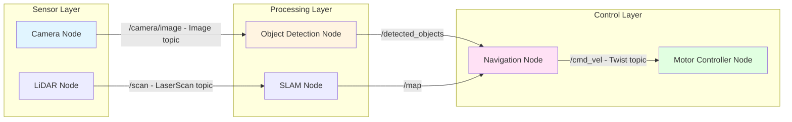
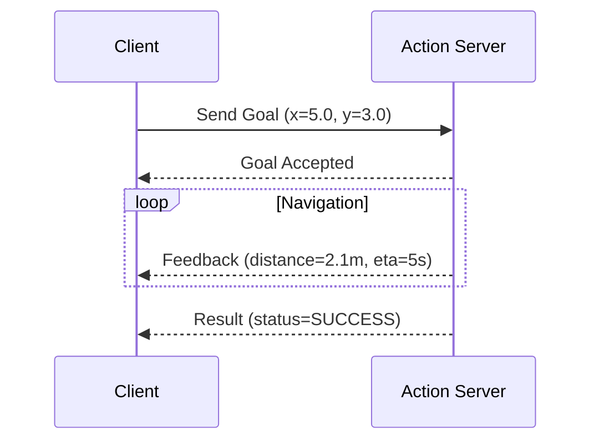

import MCQ from '@site/src/components/MCQ';
import PersonalizeButton from '@site/src/components/PersonalizeButton/PersonalizeButton';
import UrduTranslationButton from '@site/src/components/UrduTranslationButton';

<PersonalizeButton chapterId="ch02" chapterContent="ROS 2 Fundamentals" />

<UrduTranslationButton chapterId="ch02" />

# ROS 2 Fundamentals: Nodes, Topics, Services, and Actions

## Learning Objectives

By the end of this chapter, you will be able to:

1. **Understand** ROS 2 node architecture and the DDS middleware communication layer
2. **Implement** publisher-subscriber pattern with Python rclpy library for sensor data streaming
3. **Create** service clients and servers for request-response interactions
4. **Debug** ROS 2 topics, nodes, and services using CLI tools
5. **Design** launch files to orchestrate multi-node robotic systems

---

## Theory

### 2.1 What is ROS 2?

**ROS 2 (Robot Operating System 2)** is an open-source middleware framework for building modular robot software. Despite its name, ROS 2 is **not an operating system**—it runs on top of Linux (Ubuntu), Windows, or macOS.

**Key Features**:
- **Distributed architecture**: Nodes (processes) communicate over a network without a central master (unlike ROS 1)
- **Real-time capable**: Support for RTOS (Real-Time Operating Systems) via DDS middleware
- **Multi-language**: Python, C++, Rust clients (this textbook uses Python `rclpy`)
- **Quality of Service (QoS)**: Configure reliability, latency, durability for different data streams
- **Security**: DDS-Security for encrypted communication between nodes

**Why ROS 2 over ROS 1?**
- **No master node**: ROS 1's `roscore` was a single point of failure. ROS 2 uses DDS discovery for peer-to-peer communication.
- **Production-ready**: ROS 2 Humble (2022) has 5-year LTS support, used in commercial products (autonomous vehicles, industrial robots).
- **Better real-time**: DDS middleware (FastDDS, CycloneDDS) meets real-time constraints for safety-critical systems.

**Citation**: [ROS 2 Humble Documentation](https://docs.ros.org/en/humble/)

---

### 2.2 ROS 2 Architecture: Nodes and Graphs

#### 2.2.1 Nodes

A **node** is an independent process (Python script or C++ executable) that performs a specific task:
- **Sensor Node**: Publishes camera images to `/camera/image_raw` topic
- **Control Node**: Subscribes to `/cmd_vel`, sends motor commands
- **Planning Node**: Provides a `/plan_path` service for navigation

**Design Principle**: Single Responsibility. Each node should do one thing well (modular, testable, reusable).

#### 2.2.2 Computation Graph

Nodes connect via **topics**, **services**, and **actions** to form a **computation graph**:



**Introspection**: Use `rqt_graph` to visualize your live ROS 2 system:
```bash
ros2 run rqt_graph rqt_graph
```

---

### 2.3 Topics: Publisher-Subscriber Pattern

**Topics** enable asynchronous, many-to-many communication. A topic is a named bus over which nodes exchange **messages**.

#### 2.3.1 Message Types

ROS 2 uses **interface definition language (IDL)** to define message structures. Common types:

| Message Type           | Package               | Use Case                          |
|------------------------|-----------------------|-----------------------------------|
| `std_msgs/String`      | `std_msgs`            | Simple text (debugging)           |
| `sensor_msgs/Image`    | `sensor_msgs`         | Camera images (RGB, depth)        |
| `geometry_msgs/Twist`  | `geometry_msgs`       | Velocity commands (linear, angular)|
| `nav_msgs/Odometry`    | `nav_msgs`            | Robot pose and velocity           |

**Example**: `geometry_msgs/Twist` message structure (simplified):
```yaml
# Linear velocity (m/s) in x, y, z
Vector3 linear
  float64 x
  float64 y
  float64 z

# Angular velocity (rad/s) around x, y, z
Vector3 angular
  float64 x
  float64 y
  float64 z
```

For a wheeled robot moving forward at 0.5 m/s with no rotation:
```python
twist_msg.linear.x = 0.5
twist_msg.angular.z = 0.0
```

#### 2.3.2 Quality of Service (QoS)

DDS middleware allows configuring message delivery guarantees:

| QoS Policy     | Reliable                  | Best Effort              |
|----------------|---------------------------|--------------------------|
| **Reliability**| Guaranteed delivery (TCP-like) | Drop packets if network slow (UDP-like) |
| **Use Case**   | Robot commands (critical) | Sensor streams (tolerate loss) |
| **Latency**    | Higher (acks, retries)    | Lower (no acks)          |

**Example**: Camera images use "best effort" (30 FPS stream, dropping frames is acceptable). Motor commands use "reliable" (missing a stop command could cause collisions).

```python
from rclpy.qos import QoSProfile, ReliabilityPolicy

# Reliable QoS for critical commands
cmd_qos = QoSProfile(depth=10, reliability=ReliabilityPolicy.RELIABLE)

# Best-effort QoS for high-frequency sensor data
sensor_qos = QoSProfile(depth=10, reliability=ReliabilityPolicy.BEST_EFFORT)
```

**Citation**: [ROS 2 QoS Documentation](https://docs.ros.org/en/humble/Concepts/Intermediate/About-Quality-of-Service-Settings.html)

---

### 2.4 Services: Request-Response Pattern

**Services** provide synchronous, one-to-one communication for request-response interactions (like HTTP REST APIs).

#### 2.4.1 When to Use Services vs. Topics

| Criterion       | Topics                    | Services                  |
|-----------------|---------------------------|---------------------------|
| **Pattern**     | Pub-Sub (asynchronous)    | Request-Reply (synchronous)|
| **Cardinality** | Many-to-many              | One-to-one                |
| **Use Case**    | Continuous data streams   | Sporadic queries/commands |
| **Example**     | `/camera/image` (30 Hz)   | `/add_two_ints` (on-demand)|

**Real-World Analogy**:
- **Topic**: Radio broadcast (many listeners, continuous stream)
- **Service**: Phone call (one-to-one, request-response)

#### 2.4.2 Service Types

Services consist of **request** and **response** message definitions.

**Example**: `example_interfaces/AddTwoInts` service (for demonstration):
```yaml
# Request
int64 a
int64 b
---
# Response
int64 sum
```

**Usage**:
```bash
# Call service from command line
ros2 service call /add_two_ints example_interfaces/srv/AddTwoInts "{a: 5, b: 3}"

# Expected response:
# requester: making request: example_interfaces.srv.AddTwoInts_Request(a=5, b=3)
# response:
# example_interfaces.srv.AddTwoInts_Response(sum=8)
```

---

### 2.5 Actions: Long-Running Tasks

**Actions** extend services for tasks that:
1. Take time to complete (seconds to minutes)
2. Provide progress feedback
3. Can be cancelled mid-execution

**Example**: Navigate to a waypoint:
- **Goal**: Target coordinates (x, y)
- **Feedback**: Distance remaining, estimated time
- **Result**: Success or failure (e.g., "Reached goal" or "Path blocked")



**Citation**: [ROS 2 Actions Tutorial](https://docs.ros.org/en/humble/Tutorials/Intermediate/Writing-an-Action-Server-Client/Py.html)

---

## Hands-on Lab

### Lab 2.1: Publisher-Subscriber (Talker-Listener)

**Objective**: Create a publisher that sends "Hello World" messages and a subscriber that prints them.

#### Step 1: Setup ROS 2 Workspace

```bash
# Create workspace (if not exists)
mkdir -p ~/ros2_ws/src
cd ~/ros2_ws/src

# Create Python package
ros2 pkg create --build-type ament_python py_pubsub --dependencies rclpy std_msgs

# Navigate to package
cd py_pubsub/py_pubsub
```

#### Step 2: Publisher Node (talker.py)

Create `py_pubsub/talker.py`:

```python
#!/usr/bin/env python3
"""
Publisher node that sends "Hello World" messages at 1 Hz.
"""

import rclpy
from rclpy.node import Node
from std_msgs.msg import String


class MinimalPublisher(Node):
    """Simple publisher node."""

    def __init__(self):
        super().__init__('minimal_publisher')

        # Create publisher: topic='/chatter', message_type=String, queue_size=10
        self.publisher_ = self.create_publisher(String, 'chatter', 10)

        # Timer: call timer_callback every 1.0 second
        timer_period = 1.0  # seconds
        self.timer = self.create_timer(timer_period, self.timer_callback)

        self.i = 0  # Message counter

    def timer_callback(self):
        """Publish a message every timer tick."""
        msg = String()
        msg.data = f'Hello World: {self.i}'

        self.publisher_.publish(msg)
        self.get_logger().info(f'Publishing: "{msg.data}"')

        self.i += 1


def main(args=None):
    rclpy.init(args=args)
    node = MinimalPublisher()

    try:
        rclpy.spin(node)  # Keep node running until Ctrl+C
    except KeyboardInterrupt:
        pass
    finally:
        node.destroy_node()
        rclpy.shutdown()


if __name__ == '__main__':
    main()
```

**Key Concepts**:
- **`create_publisher()`**: Registers a topic with DDS middleware
- **`create_timer()`**: Schedules periodic callbacks (non-blocking)
- **`rclpy.spin()`**: Processes incoming messages and timer callbacks (event loop)

#### Step 3: Subscriber Node (listener.py)

Create `py_pubsub/listener.py`:

```python
#!/usr/bin/env python3
"""
Subscriber node that listens to "Hello World" messages.
"""

import rclpy
from rclpy.node import Node
from std_msgs.msg import String


class MinimalSubscriber(Node):
    """Simple subscriber node."""

    def __init__(self):
        super().__init__('minimal_subscriber')

        # Create subscriber: topic='/chatter', message_type=String, callback=listener_callback
        self.subscription = self.create_subscription(
            String,
            'chatter',
            self.listener_callback,
            10  # QoS queue size
        )
        self.subscription  # prevent unused variable warning

    def listener_callback(self, msg):
        """Called whenever a message is received on /chatter topic."""
        self.get_logger().info(f'I heard: "{msg.data}"')


def main(args=None):
    rclpy.init(args=args)
    node = MinimalSubscriber()

    try:
        rclpy.spin(node)
    except KeyboardInterrupt:
        pass
    finally:
        node.destroy_node()
        rclpy.shutdown()


if __name__ == '__main__':
    main()
```

#### Step 4: Update package configuration

Edit `setup.py` to include entry points:

```python
entry_points={
    'console_scripts': [
        'talker = py_pubsub.talker:main',
        'listener = py_pubsub.listener:main',
    ],
},
```

#### Step 5: Build and Run

```bash
# Build workspace
cd ~/ros2_ws
colcon build --packages-select py_pubsub

# Source workspace
source install/setup.bash

# Terminal 1: Run publisher
ros2 run py_pubsub talker

# Terminal 2: Run subscriber
ros2 run py_pubsub listener
```

**Expected Output**:

Terminal 1 (talker):
```
[INFO] [minimal_publisher]: Publishing: "Hello World: 0"
[INFO] [minimal_publisher]: Publishing: "Hello World: 1"
[INFO] [minimal_publisher]: Publishing: "Hello World: 2"
```

Terminal 2 (listener):
```
[INFO] [minimal_subscriber]: I heard: "Hello World: 0"
[INFO] [minimal_subscriber]: I heard: "Hello World: 1"
[INFO] [minimal_subscriber]: I heard: "Hello World: 2"
```

#### Step 6: Debug with CLI Tools

```bash
# List active nodes
ros2 node list
# Output: /minimal_publisher, /minimal_subscriber

# List active topics
ros2 topic list
# Output: /chatter, /rosout

# Show topic info
ros2 topic info /chatter
# Output: Type: std_msgs/msg/String, Publisher count: 1, Subscriber count: 1

# Echo topic (see messages in real-time)
ros2 topic echo /chatter

# Measure topic frequency
ros2 topic hz /chatter
# Output: average rate: 1.000
```

---

### Lab 2.2: Service (AddTwoInts)

**Objective**: Create a service server that adds two integers and a client that calls it.

#### Step 1: Service Server

Create `py_pubsub/add_two_ints_server.py`:

```python
#!/usr/bin/env python3
"""
Service server that adds two integers.
"""

import rclpy
from rclpy.node import Node
from example_interfaces.srv import AddTwoInts


class AddTwoIntsServer(Node):
    """Service server for adding two integers."""

    def __init__(self):
        super().__init__('add_two_ints_server')

        # Create service: name='/add_two_ints', type=AddTwoInts, callback=add_callback
        self.srv = self.create_service(
            AddTwoInts,
            'add_two_ints',
            self.add_callback
        )

        self.get_logger().info('AddTwoInts service is ready.')

    def add_callback(self, request, response):
        """Service callback: compute sum and return response."""
        response.sum = request.a + request.b

        self.get_logger().info(
            f'Incoming request: a={request.a}, b={request.b} -> sum={response.sum}'
        )

        return response


def main(args=None):
    rclpy.init(args=args)
    node = AddTwoIntsServer()

    try:
        rclpy.spin(node)
    except KeyboardInterrupt:
        pass
    finally:
        node.destroy_node()
        rclpy.shutdown()


if __name__ == '__main__':
    main()
```

#### Step 2: Service Client

Create `py_pubsub/add_two_ints_client.py`:

```python
#!/usr/bin/env python3
"""
Service client that requests addition of two integers.
"""

import sys
import rclpy
from rclpy.node import Node
from example_interfaces.srv import AddTwoInts


class AddTwoIntsClient(Node):
    """Service client for adding two integers."""

    def __init__(self):
        super().__init__('add_two_ints_client')

        # Create client: service='/add_two_ints', type=AddTwoInts
        self.cli = self.create_client(AddTwoInts, 'add_two_ints')

        # Wait for service to be available
        while not self.cli.wait_for_service(timeout_sec=1.0):
            self.get_logger().info('Service not available, waiting...')

    def send_request(self, a, b):
        """Send service request and wait for response."""
        request = AddTwoInts.Request()
        request.a = a
        request.b = b

        self.get_logger().info(f'Sending request: a={a}, b={b}')

        # Call service asynchronously
        future = self.cli.call_async(request)
        return future


def main(args=None):
    rclpy.init(args=args)

    # Parse command-line arguments
    if len(sys.argv) < 3:
        print('Usage: ros2 run py_pubsub add_two_ints_client <a> <b>')
        sys.exit(1)

    a = int(sys.argv[1])
    b = int(sys.argv[2])

    node = AddTwoIntsClient()
    future = node.send_request(a, b)

    # Wait for response
    rclpy.spin_until_future_complete(node, future)

    if future.result() is not None:
        response = future.result()
        node.get_logger().info(f'Result: {a} + {b} = {response.sum}')
    else:
        node.get_logger().error('Service call failed')

    node.destroy_node()
    rclpy.shutdown()


if __name__ == '__main__':
    main()
```

#### Step 3: Update setup.py

```python
entry_points={
    'console_scripts': [
        'talker = py_pubsub.talker:main',
        'listener = py_pubsub.listener:main',
        'add_two_ints_server = py_pubsub.add_two_ints_server:main',
        'add_two_ints_client = py_pubsub.add_two_ints_client:main',
    ],
},
```

#### Step 4: Build and Run

```bash
# Rebuild package
cd ~/ros2_ws
colcon build --packages-select py_pubsub
source install/setup.bash

# Terminal 1: Run service server
ros2 run py_pubsub add_two_ints_server

# Terminal 2: Run service client
ros2 run py_pubsub add_two_ints_client 5 3

# Expected output in Terminal 2:
# [INFO] [add_two_ints_client]: Sending request: a=5, b=3
# [INFO] [add_two_ints_client]: Result: 5 + 3 = 8
```

#### Step 5: Test with CLI

```bash
# List active services
ros2 service list
# Output: /add_two_ints

# Call service from command line
ros2 service call /add_two_ints example_interfaces/srv/AddTwoInts "{a: 10, b: 15}"

# Expected response:
# response:
# example_interfaces.srv.AddTwoInts_Response(sum=25)
```

---

### Lab 2.3: Launch Files (Orchestrate Multiple Nodes)

**Objective**: Use a launch file to start talker and listener nodes simultaneously.

Create `launch/pubsub_launch.py`:

```python
"""
Launch file to start talker and listener nodes.
"""

from launch import LaunchDescription
from launch_ros.actions import Node


def generate_launch_description():
    """Generate launch description with two nodes."""
    return LaunchDescription([
        Node(
            package='py_pubsub',
            executable='talker',
            name='talker',
            output='screen'  # Print logs to console
        ),
        Node(
            package='py_pubsub',
            executable='listener',
            name='listener',
            output='screen'
        ),
    ])
```

Update `setup.py` to include launch files:

```python
import os
from glob import glob

# ... existing code ...

data_files=[
    # ... existing data_files ...
    (os.path.join('share', package_name, 'launch'), glob('launch/*.py')),
],
```

**Run launch file**:

```bash
cd ~/ros2_ws
colcon build --packages-select py_pubsub
source install/setup.bash

ros2 launch py_pubsub pubsub_launch.py
```

**Expected Output**: Both nodes start, and you see interleaved logs from talker and listener.

---

## Assessment

<MCQ
  id="ch02-mcq-01"
  question="What is the default middleware used in ROS 2 Humble for inter-node communication?"
  options={[
    "DDS-RTPS (Data Distribution Service - Real-Time Publish-Subscribe)",
    "ZeroMQ (high-performance asynchronous messaging)",
    "RabbitMQ (message broker for distributed systems)",
    "gRPC (Google's RPC framework)"
  ]}
  correctIndex={0}
  explanation="Correct! ROS 2 uses DDS-RTPS as its default middleware. DDS (Data Distribution Service) is an OMG standard for real-time, peer-to-peer communication, eliminating the need for a central broker (unlike ROS 1's roscore). Popular DDS implementations include FastDDS (default) and CycloneDDS. See Section 2.1 'What is ROS 2?' and the ROS 2 DDS documentation: https://docs.ros.org/en/humble/Concepts/Intermediate/About-Different-Middleware-Vendors.html"
  difficulty="medium"
/>

<MCQ
  id="ch02-mcq-02"
  question="Which QoS (Quality of Service) reliability policy should you use for streaming high-frequency camera images (30 FPS)?"
  options={[
    "RELIABLE (guaranteed delivery with acknowledgments)",
    "BEST_EFFORT (drop packets if network is slow)",
    "TRANSIENT_LOCAL (persist messages for late-joining subscribers)",
    "VOLATILE (only send to existing subscribers)"
  ]}
  correctIndex={1}
  explanation="Correct! For high-frequency sensor data like camera images, BEST_EFFORT is preferred. Dropping an occasional frame is acceptable (the next frame arrives in 33ms), but RELIABLE would introduce latency from acknowledgments and retransmissions, potentially causing frame buildup and stale data. Use RELIABLE for critical commands (motor control, safety stops) where every message must arrive. See Section 2.3.2 'Quality of Service (QoS)' and the QoS table comparing Reliable vs. Best Effort policies."
  difficulty="medium"
/>

<MCQ
  id="ch02-mcq-03"
  question="In a ROS 2 publisher-subscriber system, what happens if a subscriber starts after the publisher has already sent 5 messages?"
  options={[
    "The subscriber receives all 5 historical messages (default behavior)",
    "The subscriber only receives messages published after it starts (default behavior)",
    "The subscriber receives historical messages only if TRANSIENT_LOCAL durability QoS is set",
    "The publisher restarts and sends the messages again"
  ]}
  correctIndex={2}
  explanation="Correct! By default, ROS 2 topics use VOLATILE durability, meaning late-joining subscribers only receive messages published after they connect. If you need historical messages (e.g., a map that doesn't change), set QoS durability to TRANSIENT_LOCAL on both publisher and subscriber. This is common for static data like robot descriptions (URDF) or maps. See ROS 2 QoS documentation for durability policies: https://docs.ros.org/en/humble/Concepts/Intermediate/About-Quality-of-Service-Settings.html"
  difficulty="hard"
/>

<MCQ
  id="ch02-mcq-04"
  question="What is the key difference between ROS 2 topics and services?"
  options={[
    "Topics are faster because they use UDP, services use TCP",
    "Topics are asynchronous pub-sub (many-to-many), services are synchronous request-reply (one-to-one)",
    "Topics only support Python, services support both Python and C++",
    "Topics require a central broker, services are peer-to-peer"
  ]}
  correctIndex={1}
  explanation="Correct! Topics implement the asynchronous publish-subscribe pattern (many publishers, many subscribers, continuous streams like sensor data). Services implement synchronous request-reply (one client, one server, sporadic queries like 'add two numbers'). Both use DDS middleware (not directly UDP/TCP), and both support multiple languages. See Section 2.4.1 'When to Use Services vs. Topics' table for detailed comparison. Use topics for continuous data, services for on-demand operations."
  difficulty="medium"
/>

<MCQ
  id="ch02-mcq-05"
  question="In the provided talker.py code, what does 'rclpy.spin(node)' do?"
  options={[
    "Rotates the robot in a circle",
    "Runs the node's event loop to process callbacks (timers, subscriptions) until interrupted",
    "Compiles the Python code into bytecode for faster execution",
    "Sends a spinning animation to the ROS 2 visualization tool (RViz)"
  ]}
  correctIndex={1}
  explanation="Correct! 'rclpy.spin(node)' is the event loop that keeps the node alive, processing incoming messages, timer callbacks, and service requests. Without spin(), the node would start and immediately exit. It blocks until you press Ctrl+C (KeyboardInterrupt). For more control, you can use 'rclpy.spin_once()' to process one event, or 'rclpy.spin_until_future_complete()' to wait for a specific async operation (used in the service client example). See Lab 2.1 Step 2 for usage."
  difficulty="easy"
/>

<MCQ
  id="ch02-mcq-06"
  question="Why does ROS 2 not require a 'roscore' master node like ROS 1?"
  options={[
    "ROS 2 uses a centralized cloud server for node discovery",
    "ROS 2's DDS middleware uses peer-to-peer discovery, eliminating the need for a central broker",
    "ROS 2 requires manual configuration of IP addresses for all nodes",
    "ROS 2 only supports single-machine deployments, so no discovery is needed"
  ]}
  correctIndex={1}
  explanation="Correct! ROS 2 leverages DDS (Data Distribution Service) middleware, which implements automatic peer-to-peer discovery using multicast. Nodes announce their presence on the network, and other nodes discover them without a central coordinator. This eliminates ROS 1's single point of failure (roscore crashing would break the entire system). ROS 2 is fully distributed and works across multiple machines without additional configuration. See Section 2.1 'Why ROS 2 over ROS 1?' for this and other improvements."
  difficulty="hard"
/>

<MCQ
  id="ch02-mcq-07"
  question="What command would you use to see the frequency (messages per second) of a ROS 2 topic called '/camera/image'?"
  options={[
    "ros2 topic list /camera/image",
    "ros2 topic info /camera/image",
    "ros2 topic hz /camera/image",
    "ros2 topic echo /camera/image"
  ]}
  correctIndex={2}
  explanation="Correct! 'ros2 topic hz /camera/image' measures and displays the publishing frequency (e.g., '30.0 Hz' for a 30 FPS camera). This is useful for debugging: if your camera is configured for 30 FPS but 'ros2 topic hz' shows 15 Hz, you know there's a bottleneck (network, processing, or publisher issue). 'ros2 topic echo' shows message contents, 'ros2 topic info' shows publishers/subscribers, 'ros2 topic list' shows all topics. See Lab 2.1 Step 6 for CLI debugging tools."
  difficulty="easy"
/>

<MCQ
  id="ch02-mcq-08"
  question="When would you use a ROS 2 action instead of a service?"
  options={[
    "When the task completes in less than 1 second",
    "When you need to return a single result without progress updates",
    "When the task takes a long time (seconds to minutes) and you want periodic feedback and cancellation ability",
    "When you need to broadcast data to multiple subscribers"
  ]}
  correctIndex={2}
  explanation="Correct! Actions are designed for long-running tasks like navigation ('drive to kitchen'), manipulation ('pick up object'), or file downloads. They provide: (1) Goal acceptance/rejection, (2) Periodic feedback (e.g., 'distance remaining: 2.3m'), (3) Cancellation (client can abort mid-execution), (4) Final result (success/failure). Use services for quick queries (<1s), topics for continuous streams, actions for long tasks with feedback. See Section 2.5 'Actions: Long-Running Tasks' and the Mermaid sequence diagram showing feedback loop."
  difficulty="medium"
/>

---

## Summary

In this chapter, you learned:

1. **ROS 2 architecture**: Nodes communicate via DDS middleware without a central master, using topics (pub-sub), services (request-reply), and actions (long-running tasks).
2. **Publisher-Subscriber**: Created `talker.py` (publishes "Hello World" at 1 Hz) and `listener.py` (subscribes and prints messages).
3. **Services**: Implemented `add_two_ints_server.py` (adds two numbers) and `add_two_ints_client.py` (calls the service).
4. **QoS (Quality of Service)**: Configured reliability (RELIABLE vs. BEST_EFFORT) and durability (VOLATILE vs. TRANSIENT_LOCAL) for different data streams.
5. **CLI debugging tools**: Used `ros2 topic list`, `ros2 topic echo`, `ros2 topic hz`, and `ros2 service call` to inspect running systems.
6. **Launch files**: Orchestrated multiple nodes with `pubsub_launch.py`.

**Next Steps**: In [Chapter 3: Robot Modeling](/docs/ch03-robot-modeling), you'll learn URDF (Unified Robot Description Format) to model humanoid robot links and joints, and TF2 for coordinate frame transformations.

---

## Further Reading

- [ROS 2 Humble Documentation](https://docs.ros.org/en/humble/)
- [ROS 2 Tutorials - Beginner: CLI Tools](https://docs.ros.org/en/humble/Tutorials/Beginner-CLI-Tools.html)
- [ROS 2 DDS Middleware](https://docs.ros.org/en/humble/Concepts/Intermediate/About-Different-Middleware-Vendors.html)
- [rclpy API Documentation](https://docs.ros2.org/humble/api/rclpy/index.html)
- [QoS Settings Guide](https://docs.ros.org/en/humble/Concepts/Intermediate/About-Quality-of-Service-Settings.html)

---

**Chapter 2 Complete** | Next: [Chapter 3: Robot Modeling (URDF, TF2, Xacro)](/docs/ch03-robot-modeling)
