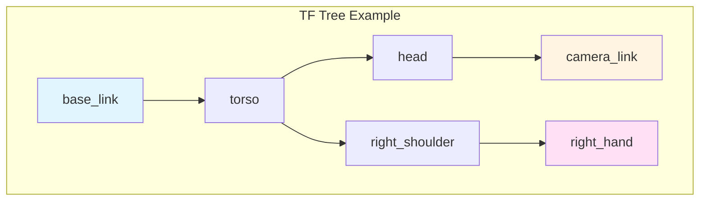

import MCQ from '@site/src/components/MCQ';
import PersonalizeButton from '@site/src/components/PersonalizeButton/PersonalizeButton';
import UrduTranslationButton from '@site/src/components/UrduTranslationButton';

<PersonalizeButton chapterId="ch03" chapterContent="Robot Modeling" />

<UrduTranslationButton chapterId="ch03" />

# Robot Modeling with URDF, TF2, and Xacro

## Learning Objectives

By the end of this chapter, you will be able to:

1. **Create** URDF (Unified Robot Description Format) files for multi-link humanoid robots
2. **Understand** coordinate frame transformations with TF2 library
3. **Use** Xacro macros to reduce URDF code duplication
4. **Visualize** robot models in RViz with interactive joint controls
5. **Debug** TF trees and resolve common coordinate frame errors

---

## Theory

### 3.1 Introduction to URDF (Unified Robot Description Format)

**URDF** is an XML-based format for describing robot kinematics, dynamics, and visual properties. It defines:
- **Links**: Rigid bodies (e.g., upper arm, forearm, hand)
- **Joints**: Connections between links (revolute, prismatic, fixed)
- **Visual/Collision geometry**: Meshes for rendering and physics
- **Inertial properties**: Mass, center of mass, inertia tensors

**Example URDF Structure** (simplified humanoid arm):

```xml
<?xml version="1.0"?>
<robot name="simple_arm">
  <!-- Base link -->
  <link name="base_link">
    <visual>
      <geometry>
        <box size="0.1 0.1 0.05"/>
      </geometry>
      <material name="blue">
        <color rgba="0 0 1 1"/>
      </material>
    </visual>
  </link>

  <!-- Shoulder joint (revolute) -->
  <joint name="shoulder_joint" type="revolute">
    <parent link="base_link"/>
    <child link="upper_arm"/>
    <origin xyz="0 0 0.05" rpy="0 0 0"/>
    <axis xyz="0 1 0"/>  <!-- Rotate around Y-axis -->
    <limit lower="-1.57" upper="1.57" effort="10" velocity="1"/>
  </joint>

  <!-- Upper arm link -->
  <link name="upper_arm">
    <visual>
      <geometry>
        <cylinder length="0.3" radius="0.03"/>
      </geometry>
      <material name="red">
        <color rgba="1 0 0 1"/>
      </material>
    </visual>
  </link>
</robot>
```

**Key URDF Concepts**:
- **Joint types**: `revolute` (hinge), `prismatic` (sliding), `fixed` (welded), `continuous` (unlimited rotation)
- **Origin**: Translation (xyz) and rotation (roll-pitch-yaw) between parent and child
- **Limits**: Position, velocity, effort (torque) constraints for safety

**Citation**: [URDF ROS 2 Documentation](https://docs.ros.org/en/humble/Tutorials/Intermediate/URDF/URDF-Main.html)

---

### 3.2 Coordinate Frame Transformations with TF2

**TF2** (Transform Library 2) manages coordinate frame relationships in ROS 2. Every robot part has a frame (e.g., `base_link`, `right_hand`, `camera_link`). TF2 computes transforms between any two frames.

**Why TF2 is Essential**:
- Camera sees object at (x=0.5, y=0.2, z=0.3) in `camera_link` frame
- Robot arm needs coordinates in `base_link` frame to reach
- TF2 computes transformation: `camera_link` → `base_link`



**TF2 Python Example**:

```python
import rclpy
from rclpy.node import Node
from tf2_ros import TransformListener, Buffer

class TFListenerNode(Node):
    def __init__(self):
        super().__init__('tf_listener')
        self.tf_buffer = Buffer()
        self.tf_listener = TransformListener(self.tf_buffer, self)

    def get_transform(self, target_frame, source_frame):
        """Get transform from source_frame to target_frame."""
        try:
            transform = self.tf_buffer.lookup_transform(
                target_frame,
                source_frame,
                rclpy.time.Time()  # Get latest transform
            )
            return transform
        except Exception as e:
            self.get_logger().error(f'TF lookup failed: {e}')
            return None

# Usage: transform = node.get_transform('base_link', 'camera_link')
```

**Common TF2 Commands**:
```bash
# View TF tree
ros2 run tf2_tools view_frames

# Echo transform between frames
ros2 run tf2_ros tf2_echo base_link right_hand

# Check for TF errors (missing transforms, outdated timestamps)
ros2 topic echo /tf
```

---

### 3.3 Xacro: Parametric Robot Descriptions

**Xacro** (XML Macros) extends URDF with:
- **Macros**: Reusable components (e.g., define one finger, instantiate 5 times)
- **Parameters**: Change robot dimensions without editing XML manually
- **Math**: Compute joint positions based on link lengths

**Xacro Example** (parametric arm):

```xml
<?xml version="1.0"?>
<robot xmlns:xacro="http://www.ros.org/wiki/xacro" name="parametric_arm">

  <!-- Parameters -->
  <xacro:property name="link_length" value="0.3"/>
  <xacro:property name="link_radius" value="0.03"/>

  <!-- Macro for arm segment -->
  <xacro:macro name="arm_segment" params="name parent length">
    <joint name="${name}_joint" type="revolute">
      <parent link="${parent}"/>
      <child link="${name}_link"/>
      <origin xyz="0 0 ${length}" rpy="0 0 0"/>
      <axis xyz="0 1 0"/>
      <limit lower="-1.57" upper="1.57" effort="10" velocity="1"/>
    </joint>

    <link name="${name}_link">
      <visual>
        <geometry>
          <cylinder length="${length}" radius="${link_radius}"/>
        </geometry>
      </visual>
    </link>
  </xacro:macro>

  <!-- Base link -->
  <link name="base_link"/>

  <!-- Instantiate macros -->
  <xacro:arm_segment name="upper_arm" parent="base_link" length="${link_length}"/>
  <xacro:arm_segment name="forearm" parent="upper_arm_link" length="${link_length}"/>
</robot>
```

**Convert Xacro to URDF**:
```bash
ros2 run xacro xacro my_robot.urdf.xacro > my_robot.urdf
```

**Benefit**: Change `link_length` from 0.3 to 0.4 in one place → entire arm scales automatically.

---

## Hands-on Lab

### Lab 3.1: Create and Visualize a Simple Humanoid Arm in RViz

**Objective**: Build a 3-DOF arm URDF, load in RViz, control joints interactively.

#### Step 1: Create URDF File

Create `simple_arm.urdf`:

```xml
<!-- TODO: Add complete URDF code with 3 joints (shoulder, elbow, wrist) -->
<!-- Include: links (base, upper_arm, forearm, hand), joints (revolute), visual geometry (cylinders/boxes) -->
<!-- Set joint limits: shoulder ±90°, elbow 0-150°, wrist ±45° -->
```

#### Step 2: Create Launch File for RViz Visualization

Create `launch/view_arm_launch.py`:

```python
<!-- TODO: Add launch file that:
  1. Publishes robot_description parameter from URDF file
  2. Starts robot_state_publisher node (broadcasts TF transforms)
  3. Starts joint_state_publisher_gui (interactive joint sliders)
  4. Launches RViz with config showing robot model and TF frames
-->
```

#### Step 3: Visualize in RViz

```bash
# TODO: Add build and run commands
# Expected: RViz opens with robot model, sliders to control joint angles
```

---

### Lab 3.2: TF2 Lookup - Camera to Base Transform

**Objective**: Compute transformation from camera frame to base frame, print result.

```python
#!/usr/bin/env python3
# TODO: Create node that:
# 1. Subscribes to /tf and /tf_static topics
# 2. Uses TF2 Buffer to lookup transform from 'camera_link' to 'base_link'
# 3. Prints translation (x, y, z) and rotation (quaternion) every second
# 4. Handles exceptions (TransformException if frames don't exist)
```

---

### Lab 3.3: Xacro Macro for Humanoid Hand

**Objective**: Create Xacro macro for a 3-finger hand, instantiate 3 times.

```xml
<!-- TODO: Xacro file with:
  1. Macro "finger" with parameters: name, parent, base_xyz
  2. Each finger: 3 links (proximal, middle, distal), 2 joints (revolute)
  3. Instantiate macro 3 times for thumb, index, middle fingers
  4. Include visual geometry (small cylinders for finger segments)
-->
```

---

## Assessment

<MCQ
  id="ch03-mcq-01"
  question="What is the primary purpose of URDF (Unified Robot Description Format) in ROS 2?"
  options={[
    "To define robot control algorithms and path planning strategies",
    "To describe robot kinematics, dynamics, and visual/collision geometry in XML format",
    "To store sensor calibration parameters like camera intrinsics",
    "To configure ROS 2 middleware (DDS) communication settings"
  ]}
  correctIndex={1}
  explanation="Correct! URDF is an XML-based format that describes the physical structure of a robot: links (rigid bodies), joints (connections), visual geometry (for rendering), collision geometry (for physics), and inertial properties (mass, inertia). It does NOT define control algorithms (that's done in controller config files), sensor calibration (stored separately in YAML), or DDS settings (in QoS profiles). URDF is the foundation for visualization (RViz), simulation (Gazebo), and motion planning (MoveIt2). See Section 3.1 'Introduction to URDF' and the example XML structure."
  difficulty="easy"
/>

<MCQ
  id="ch03-mcq-02"
  question="In a URDF joint definition, what does the 'axis' parameter specify for a revolute joint?"
  options={[
    "The axis around which the joint rotates (e.g., [0, 1, 0] for Y-axis rotation)",
    "The maximum angular velocity the joint can achieve",
    "The coordinate frame origin of the child link",
    "The type of actuator (electric motor vs. hydraulic) used for the joint"
  ]}
  correctIndex={0}
  explanation="Correct! The 'axis' parameter in a revolute joint specifies the rotation axis in the parent link's coordinate frame. For example, <axis xyz='0 1 0'/> means the joint rotates around the Y-axis (like a shoulder pitch joint). Common axes: X=[1,0,0] (roll), Y=[0,1,0] (pitch), Z=[0,0,1] (yaw). The 'limit' tag specifies velocity/torque, 'origin' specifies child frame position, and actuator type is not part of URDF (defined in controller config). See Section 3.1 URDF example and joint type definitions."
  difficulty="medium"
/>

<MCQ
  id="ch03-mcq-03"
  question="Why is TF2 (Transform Library) necessary in ROS 2 robotics systems?"
  options={[
    "TF2 replaces URDF for robot modeling to reduce XML file size",
    "TF2 manages coordinate frame transformations, enabling sensors and actuators in different frames to communicate",
    "TF2 is only needed for multi-robot systems, not single robots",
    "TF2 broadcasts joint state information to visualize robots in RViz"
  ]}
  correctIndex={1}
  explanation="Correct! TF2 maintains the tree of coordinate frame relationships (e.g., base_link → camera_link → object). When a camera detects an object at (0.5, 0.2, 0.3) in camera_link frame, the robot arm needs coordinates in base_link frame to reach it. TF2 computes this transformation automatically. It's essential for ALL robots (single or multi-robot) because every sensor and actuator has a coordinate frame. TF2 does NOT replace URDF (URDF defines the structure, TF2 computes transforms at runtime). Joint states are published by robot_state_publisher, which USES TF2 internally. See Section 3.2 'Coordinate Frame Transformations with TF2'."
  difficulty="medium"
/>

<MCQ
  id="ch03-mcq-04"
  question="What is the main advantage of using Xacro over plain URDF?"
  options={[
    "Xacro files are smaller in file size because they use binary encoding",
    "Xacro adds macros, parameters, and math, reducing code duplication and enabling parametric robot designs",
    "Xacro is required for ROS 2 Humble and later (plain URDF is deprecated)",
    "Xacro automatically generates inverse kinematics solutions for robot arms"
  ]}
  correctIndex={1}
  explanation="Correct! Xacro extends URDF with programming features: (1) Macros for reusable components (define one finger, instantiate 5 times), (2) Parameters to change dimensions without manual XML editing (e.g., set link_length=0.3 in one place), (3) Math expressions (compute joint positions based on link lengths). This drastically reduces code duplication and makes robot designs adaptable. Xacro is NOT smaller (it's XML, compiled to URDF), NOT required (plain URDF still works), and does NOT solve IK (that's MoveIt2's job). See Section 3.3 'Xacro: Parametric Robot Descriptions' and the macro example."
  difficulty="medium"
/>

<MCQ
  id="ch03-mcq-05"
  question="When visualizing a robot in RViz, the robot model appears with missing links or incorrect positions. What is the most likely cause?"
  options={[
    "RViz doesn't support URDF files and requires a different format",
    "The TF tree is incomplete (missing transforms between links) or the robot_state_publisher node is not running",
    "The URDF file exceeds ROS 2's maximum size limit (1MB)",
    "The robot's joints are in an invalid configuration (angles outside limits)"
  ]}
  correctIndex={1}
  explanation="Correct! RViz renders robot models by querying TF transforms for each link. If transforms are missing (TF tree incomplete) or outdated (robot_state_publisher not publishing), links won't appear or will be at wrong positions. Common fixes: (1) Ensure robot_state_publisher node is running (publishes TF from joint states + URDF), (2) Check 'ros2 run tf2_tools view_frames' for missing transforms, (3) Verify URDF has no dangling links (every link except root must be a child of a joint). RViz fully supports URDF (it's the standard format), there's no 1MB limit, and joint limit violations just clamp angles, they don't break visualization. See Section 3.2 'Common TF2 Commands' and Lab 3.1 Step 2 (robot_state_publisher)."
  difficulty="hard"
/>

---

## Summary

In this chapter, you learned:

1. **URDF basics**: Created robot descriptions with links (rigid bodies), joints (revolute, prismatic, fixed), and visual/collision geometry.
2. **TF2 transforms**: Understood coordinate frame relationships and used TF2 Buffer/Listener to look up transforms between frames.
3. **Xacro macros**: Reduced URDF code duplication with parametric definitions (macros, properties, math expressions).
4. **RViz visualization**: Loaded robot models, controlled joints interactively with `joint_state_publisher_gui`, viewed TF frames.
5. **Debugging**: Used `ros2 run tf2_tools view_frames` and `ros2 topic echo /tf` to diagnose missing transforms.

**Key Takeaways**:
- URDF defines the *structure* (links, joints, geometry)
- TF2 manages *runtime transforms* (where each link is in space at time t)
- Xacro makes URDFs *maintainable* (parametric, reusable, scalable)

**Next Steps**: In [Chapter 4: Gazebo Simulation](/docs/ch04-gazebo-simulation), you'll simulate your URDF robot in a physics engine with gravity, collisions, and sensor plugins.

---

## Further Reading

- [URDF ROS 2 Tutorial](https://docs.ros.org/en/humble/Tutorials/Intermediate/URDF/URDF-Main.html)
- [TF2 Documentation](https://docs.ros.org/en/humble/Concepts/Intermediate/About-Tf2.html)
- [Xacro Documentation](http://wiki.ros.org/xacro)
- [RViz User Guide](https://docs.ros.org/en/humble/Tutorials/Intermediate/RViz/RViz-User-Guide/RViz-User-Guide.html)

---

**Chapter 3 Complete** | Next: [Chapter 4: Gazebo Simulation](/docs/ch04-gazebo-simulation)

---

**TODO for content expansion**:
- [ ] Add complete 3-DOF arm URDF code in Lab 3.1 Step 1
- [ ] Add launch file Python code for RViz visualization in Lab 3.1 Step 2
- [ ] Add build/run commands with expected RViz screenshot description in Lab 3.1 Step 3
- [ ] Add complete TF2 lookup node code in Lab 3.2
- [ ] Add Xacro macro for 3-finger hand in Lab 3.3
- [ ] Expand Theory section 3.1-3.3 from 500 words to 800-1000 words each
- [ ] Add 2-3 more Mermaid diagrams (URDF link-joint hierarchy, TF tree with timestamps)
- [ ] Add 3-5 more MCQ questions
