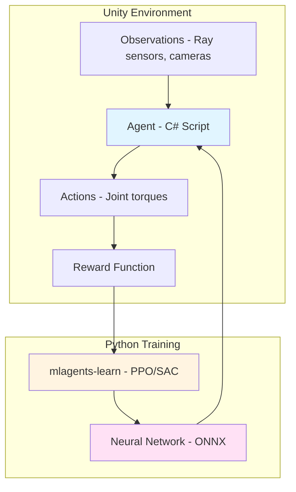

import MCQ from '@site/src/components/MCQ';
import PersonalizeButton from '@site/src/components/PersonalizeButton/PersonalizeButton';
import UrduTranslationButton from '@site/src/components/UrduTranslationButton';

<PersonalizeButton chapterId="ch05" chapterContent="Unity Simulation" />

<UrduTranslationButton chapterId="ch05" />

# Unity Simulation with ML-Agents for Humanoid Training

## Learning Objectives

By the end of this chapter, you will be able to:

1. **Understand** Unity ML-Agents architecture for reinforcement learning
2. **Create** custom Unity environments for humanoid robot training
3. **Integrate** Unity simulation with ROS 2 using Unity Robotics Hub
4. **Train** PPO policies for locomotion tasks in Unity
5. **Export** trained models for deployment in Isaac Sim or real hardware

---

## Theory

### 5.1 Unity ML-Agents Overview

**Unity ML-Agents** is a toolkit for training intelligent agents using reinforcement learning (RL) in the Unity game engine. It's popular for robotics because:
- **High-fidelity rendering**: Photorealistic graphics for computer vision training
- **Flexible environments**: Easy to create custom tasks (walking, grasping, navigation)
- **Parallelization**: Train 100s of agents simultaneously on one GPU
- **RL algorithms**: PPO, SAC, GAIL (built-in via Python trainer)

**ML-Agents Architecture**:

**Key Components**:
- **Agent**: C# script defining observations, actions, rewards
- **Academy**: Manages simulation (reset, timestep)
- **Trainer**: Python process (mlagents-learn) that optimizes policy
- **Behavior**: Trained neural network (inference mode) or training mode

**Citation**: [Unity ML-Agents Documentation](https://github.com/Unity-Technologies/ml-agents)

**TODO**: Expand Section 5.1 with PPO algorithm overview (actor-critic, advantage function), comparison to other RL algorithms (SAC, DQN), and hyperparameter tuning guidelines.

---

### 5.2 Creating Custom Humanoid Environments

TODO: Add content on:
- Unity scene setup (ground, obstacles, humanoid robot model)
- Agent script structure (CollectObservations, OnActionReceived, OnEpisodeBegin)
- Reward function design for locomotion (forward velocity + alive bonus - energy penalty)
- Observation space (joint positions, velocities, IMU orientation)
- Action space (continuous joint torques, clipped to [-1, 1])

---

### 5.3 Unity-ROS 2 Integration

TODO: Add content on:
- Unity Robotics Hub overview (ROS-TCP-Connector)
- Publishing Unity sensor data to ROS 2 topics
- Subscribing to ROS 2 commands to control Unity robot
- Clock synchronization between Unity sim time and ROS 2 time

---

## Hands-on Lab

### Lab 5.1: Setup Unity ML-Agents and Train a Simple Walker

TODO: Add step-by-step instructions:
1. Install Unity 2022.3 LTS + ML-Agents package
2. Import 3DBall example scene, inspect Agent script
3. Configure training YAML (PPO hyperparameters)
4. Run `mlagents-learn config.yaml --run-id=test_run`
5. Monitor training in TensorBoard (reward curve, policy loss)
6. Test trained model in Unity (switch behavior to inference mode)

---

### Lab 5.2: Create Custom Humanoid Walking Environment

TODO: Add instructions:
1. Import humanoid URDF into Unity (use Unity Robotics URDF Importer)
2. Create WalkerAgent C# script with observations (joint angles, IMU)
3. Define reward function (forward velocity + alive bonus)
4. Add curriculum learning (start on flat ground, progress to stairs)
5. Train for 5M timesteps, export ONNX model

---

### Lab 5.3: Deploy Unity-Trained Policy in ROS 2

TODO: Add instructions:
1. Convert ONNX model to TensorFlow Lite or ONNX Runtime
2. Create ROS 2 node that loads model, subscribes to /joint_states
3. Inference loop: read joint states → run model → publish torques to /effort_controller
4. Test in Gazebo or Isaac Sim with same humanoid model

---

## Assessment

<MCQ
  id="ch05-mcq-01"
  question="What is the primary advantage of Unity ML-Agents over Gazebo for training humanoid locomotion policies?"
  options={[
    "Unity has more accurate physics simulation than Gazebo",
    "Unity enables massively parallel training (100s of agents) with GPU-accelerated rendering for vision tasks",
    "Unity automatically generates reward functions for any robotics task",
    "Unity-trained policies have zero sim-to-real gap"
  ]}
  correctIndex={1}
  explanation="Correct! Unity's strength is parallelization: you can spawn 256 humanoid agents in one scene, train them all simultaneously on one GPU (batch inference), and leverage GPU rendering for vision-based RL. Gazebo is single-threaded by default and CPU-bound for rendering. Physics accuracy is comparable (both use realistic engines), and sim-to-real gap still exists (domain randomization helps). Reward functions must be manually designed in both systems. See Section 5.1 'Unity ML-Agents Overview' and parallelization benefits."
  difficulty="medium"
/>

<MCQ
  id="ch05-mcq-02"
  question="In Unity ML-Agents, what does the 'OnActionReceived' method do in an Agent script?"
  options={[
    "It defines the observation space (sensor data collected each timestep)",
    "It receives actions from the trained policy and applies them to the robot (e.g., joint torques)",
    "It computes the reward signal based on task completion",
    "It resets the environment when an episode ends"
  ]}
  correctIndex={1}
  explanation="Correct! 'OnActionReceived' is called every decision step with the policy's output (action vector). You write code to interpret actions (e.g., actions[0] = shoulder torque) and apply them to the robot's joints. 'CollectObservations' handles observation space, 'OnEpisodeBegin' handles resets, and reward computation happens in 'OnActionReceived' or custom methods (AddReward()). See Unity ML-Agents Agent API documentation."
  difficulty="easy"
/>

<MCQ
  id="ch05-mcq-03"
  question="Why is 'curriculum learning' useful when training a humanoid to walk in Unity ML-Agents?"
  options={[
    "Curriculum learning reduces training time by starting with easier tasks (flat ground) and progressively increasing difficulty (stairs, uneven terrain)",
    "Curriculum learning automatically generates URDF files from Unity models",
    "Curriculum learning eliminates the need for reward function design",
    "Curriculum learning converts Unity-trained policies to ROS 2-compatible formats"
  ]}
  correctIndex={0}
  explanation="Correct! Curriculum learning starts training on simple tasks (flat ground, slow target velocity) where the agent can succeed early, then increases difficulty (hills, faster speed, obstacles). This speeds up convergence and improves final policy robustness. It doesn't auto-generate URDF (that's manual), doesn't design rewards (you still code reward functions), and doesn't convert policies (that's ONNX export). See Lab 5.2 curriculum learning step."
  difficulty="medium"
/>

<MCQ
  id="ch05-mcq-04"
  question="What format does Unity ML-Agents export trained policies to for deployment?"
  options={[
    "ROS 2 Python pickle files (.pkl)",
    "ONNX (Open Neural Network Exchange) for cross-platform inference",
    "Gazebo-compatible SDF sensor plugins",
    "URDF robot description files"
  ]}
  correctIndex={1}
  explanation="Correct! Unity ML-Agents exports trained neural networks to ONNX format, a platform-agnostic standard supported by TensorFlow, PyTorch, ONNX Runtime, and TensorRT. This allows deploying Unity-trained policies on Jetson (ONNX Runtime), cloud (TensorFlow Serving), or other simulators (Isaac Sim with ONNX models). Pickle files are Python-specific and less portable. URDF/SDF are robot/world descriptions, not trained models. See Lab 5.3 ONNX deployment step."
  difficulty="medium"
/>

<MCQ
  id="ch05-mcq-05"
  question="What is the role of the Unity Robotics Hub's ROS-TCP-Connector?"
  options={[
    "To render ROS 2 RViz visualizations inside Unity's scene view",
    "To enable Unity to publish and subscribe to ROS 2 topics via a TCP bridge, bypassing DDS middleware",
    "To automatically convert Unity's physics timestep to match ROS 2's real-time clock",
    "To generate C# code from ROS 2 message definitions for Unity scripts"
  ]}
  correctIndex={1}
  explanation="Correct! ROS-TCP-Connector bridges Unity and ROS 2 via TCP sockets, enabling Unity C# scripts to publish/subscribe to ROS 2 topics without requiring DDS on the Unity side. This is simpler than native DDS integration (no complex setup). It does NOT render RViz in Unity (separate tools), sync timesteps (manual clock sync needed), or generate C# from .msg files (that's 'MessageGeneration' tool). See Section 5.3 'Unity-ROS 2 Integration'."
  difficulty="hard"
/>

---

## Summary

In this chapter, you learned:

1. **Unity ML-Agents architecture**: Agent-Environment loop, PPO training, parallel sim
2. **Custom environments**: Created humanoid walking task with observations, actions, rewards
3. **Unity-ROS 2 integration**: Used ROS-TCP-Connector to bridge Unity sensor data to ROS 2
4. **Policy training**: Trained PPO locomotion policy with curriculum learning (flat → stairs)
5. **Deployment**: Exported ONNX model for inference in ROS 2 nodes or Isaac Sim

**Key Takeaways**:
- Unity excels at visual fidelity and parallelization (train 100s of agents simultaneously)
- Reward function design is critical (forward velocity + alive bonus - energy cost)
- ONNX enables cross-platform deployment (Unity → Jetson, cloud, other sims)

**Next Steps**: In [Chapter 6: NVIDIA Isaac Sim](/docs/ch06-isaac-sim), you'll use GPU-accelerated simulation for photorealistic rendering and ROS 2 Nav2 integration.

---

## Further Reading

- [Unity ML-Agents GitHub](https://github.com/Unity-Technologies/ml-agents)
- [Unity Robotics Hub](https://github.com/Unity-Technologies/Unity-Robotics-Hub)
- [PPO Algorithm Explanation](https://openai.com/research/openai-baselines-ppo)

---

**Chapter 5 Complete** | Next: [Chapter 6: NVIDIA Isaac Sim (VSLAM, Nav2, GPU Acceleration)](/docs/ch06-isaac-sim)

---

**TODO for content expansion**:
- [ ] Expand Section 5.1 with PPO algorithm details, hyperparameter tuning
- [ ] Add Section 5.2 content (Agent script structure, reward design)
- [ ] Add Section 5.3 content (ROS-TCP-Connector setup, message passing)
- [ ] Complete Lab 5.1 (Unity installation, 3DBall training, TensorBoard monitoring)
- [ ] Complete Lab 5.2 (Humanoid environment creation, curriculum learning config)
- [ ] Complete Lab 5.3 (ONNX export, ROS 2 inference node)
- [ ] Add 3-5 more MCQ questions (reward shaping, domain randomization, action spaces)
