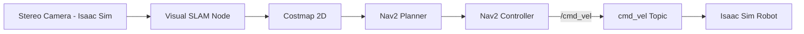

import MCQ from '@site/src/components/MCQ';
import PersonalizeButton from '@site/src/components/PersonalizeButton/PersonalizeButton';
import UrduTranslationButton from '@site/src/components/UrduTranslationButton';

<PersonalizeButton chapterId="ch06" chapterContent="Isaac Sim" />

<UrduTranslationButton chapterId="ch06" />

# NVIDIA Isaac Sim: GPU-Accelerated Simulation with VSLAM and Nav2

## Learning Objectives

By the end of this chapter, you will be able to:

1. **Understand** NVIDIA Isaac Sim architecture and PhysX GPU acceleration
2. **Implement** Visual SLAM (VSLAM) for real-time robot localization and mapping
3. **Integrate** ROS 2 Nav2 for autonomous navigation with dynamic obstacle avoidance
4. **Optimize** Isaac Sim performance on NVIDIA GPUs (RTX, A100, Jetson)
5. **Export** trained policies from Isaac Sim to Jetson Orin Nano for deployment

---

## Theory

### 6.1 Isaac Sim Architecture and PhysX

**NVIDIA Isaac Sim** is built on Omniverse, providing:
- **PhysX 5**: GPU-accelerated physics (100x faster than CPU for soft bodies, fluids)
- **RTX ray tracing**: Photorealistic rendering for computer vision datasets
- **ROS 2 Bridge**: Native integration with Nav2, MoveIt2
- **Isaac SDK**: Pre-built robotics components (visual odometry, semantic segmentation)

**Key Features**:
- Simulate 1000+ robots in parallel (warehouse fleets)
- Domain randomization (lighting, textures, noise) for sim-to-real transfer
- Sensor simulation: Lidar, cameras, IMU with physically-based noise models

**TODO**: Expand Section 6.1 with PhysX solver types (TGS, PGS), USD scene graph format, Omniverse Nucleus server for collaborative development.

---

### 6.2 Visual SLAM (VSLAM) for Localization

**Visual SLAM** uses camera images to simultaneously:
1. **Localize**: Estimate robot pose (x, y, θ) in the map
2. **Map**: Build 3D feature map of the environment

**Isaac Sim VSLAM Workflow**:
- Isaac ROS Visual SLAM node (`isaac_ros_visual_slam`)
- Input: Stereo camera images (640x480 @ 30 Hz)
- Output: `/tf` (robot pose), `/map` (occupancy grid)

**TODO**: Add ORB-SLAM3 algorithm overview, feature detection (ORB descriptors), loop closure, Bundle Adjustment optimization.

---

### 6.3 ROS 2 Nav2 Integration

**Nav2** (Navigation 2) provides:
- **Global planner**: A* or Smac Planner for long-distance paths
- **Local planner**: DWB (Dynamic Window Approach) for collision avoidance
- **Costmap 2D**: Inflation layers for obstacle buffering
- **Behavior trees**: Recoveries (rotate in place, back up)

**Isaac Sim + Nav2 Pipeline**:

**TODO**: Add costmap parameters (inflation radius, obstacle layer config), recovery behaviors configuration, behavior tree XML examples.

---

## Hands-on Lab

### Lab 6.1: Setup Isaac Sim and Spawn a Carter Robot

**TODO**: Add instructions:
1. Install Isaac Sim 2023.1.0 (via Omniverse Launcher)
2. Enable ROS 2 Bridge extension
3. Load Carter robot (NVIDIA's mobile robot) in warehouse scene
4. Launch ROS 2 nodes: `ros2 launch isaac_ros_visual_slam isaac_ros_visual_slam.launch.py`
5. Verify `/tf` and `/map` topics in RViz

---

### Lab 6.2: Implement VSLAM-Based Navigation

**TODO**: Add instructions:
1. Start Isaac Sim with Carter robot in warehouse
2. Launch Visual SLAM node
3. Launch Nav2 stack: `ros2 launch nav2_bringup navigation_launch.py`
4. Set 2D Nav Goal in RViz → robot navigates autonomously
5. Monitor costmap, global/local paths in RViz

---

### Lab 6.3: Optimize for Jetson Orin Nano

**TODO**: Add instructions:
1. Export Isaac Sim scene to lighter-weight USD (reduce polygon count)
2. Configure PhysX for real-time performance (reduce solver iterations)
3. Test VSLAM on Jetson Orin Nano (headless mode, 10 FPS camera)
4. Profile with `tegrastats` (GPU, CPU, RAM usage)

---

## Assessment

<MCQ
  id="ch06-mcq-01"
  question="What is the primary advantage of Isaac Sim's PhysX GPU acceleration over Gazebo's CPU-based physics?"
  options={[
    "PhysX can simulate 100x more robots in parallel due to GPU parallelization",
    "PhysX has more accurate collision detection for small objects",
    "PhysX automatically generates URDF files from 3D models",
    "PhysX eliminates the sim-to-real gap entirely"
  ]}
  correctIndex={0}
  explanation="Correct! PhysX 5 runs physics computations on GPU, enabling massive parallelization. You can simulate 1000 Carter robots in one scene (warehouse fleet), whereas Gazebo is CPU-bound and struggles with >10 robots. Collision accuracy is similar (both use signed distance fields), URDF generation is manual, and sim-to-real gap still exists (domain randomization helps). See Section 6.1 'Isaac Sim Architecture'."
  difficulty="medium"
/>

<MCQ
  id="ch06-mcq-02"
  question="In Visual SLAM, what does 'loop closure' refer to?"
  options={[
    "Closing the feedback loop between planner and controller",
    "Detecting when the robot revisits a previously mapped location, correcting accumulated drift",
    "Closing camera shutters to prevent overexposure",
    "Terminating the SLAM algorithm when the map is complete"
  ]}
  correctIndex={1}
  explanation="Correct! Loop closure detects when the robot returns to a known place (e.g., closes a loop in a corridor), then corrects pose drift accumulated during exploration. Without loop closure, small odometry errors compound, causing the map to 'drift' (walls appear curved). ORB-SLAM3 uses bag-of-words (DBoW2) to recognize revisited scenes. See Section 6.2 'Visual SLAM for Localization' (TODO: expand with loop closure algorithm details)."
  difficulty="hard"
/>

<MCQ
  id="ch06-mcq-03"
  question="Why does Nav2's costmap have an 'inflation layer'?"
  options={[
    "To model air pressure changes in the environment",
    "To expand obstacles artificially, creating safety margins that prevent the robot from getting too close to walls",
    "To compress the map data for faster transmission over ROS 2 topics",
    "To inflate tire pressure for wheeled robots in simulation"
  ]}
  correctIndex={1}
  explanation="Correct! The inflation layer expands obstacles (e.g., a 0.1m-radius pole becomes 0.5m effective radius), ensuring the planner generates paths with safety margins. Without inflation, the robot could plan to graze walls, risking collisions due to localization error or control lag. Inflation radius is tunable (larger for cautious robots, smaller for tight spaces). See Section 6.3 'ROS 2 Nav2 Integration' costmap configuration."
  difficulty="medium"
/>

<MCQ
  id="ch06-mcq-04"
  question="What USD format feature does Isaac Sim use to enable collaborative robot development?"
  options={[
    "USD files are binary and 10x smaller than URDF",
    "USD supports layer composition, allowing multiple users to edit different scene aspects (lighting, robots, terrain) simultaneously via Omniverse Nucleus",
    "USD automatically converts CAD files to optimized meshes",
    "USD eliminates the need for ROS 2 topics"
  ]}
  correctIndex={1}
  explanation="Correct! USD (Universal Scene Description) uses layer composition: user A edits lighting (light.usd), user B adds robots (robot.usd), layers merge non-destructively via Omniverse Nucleus server (like Git for 3D scenes). This enables team collaboration without overwriting each other's work. USD files are ASCII or binary (not specifically smaller), CAD conversion is manual, and ROS 2 topics are separate (USD describes scenes, not communication). See Section 6.1 USD scene graph (TODO: expand)."
  difficulty="hard"
/>

<MCQ
  id="ch06-mcq-05"
  question="When deploying Isaac Sim VSLAM to Jetson Orin Nano, why might you reduce camera frame rate from 30 FPS to 10 FPS?"
  options={[
    "Lower frame rates improve VSLAM accuracy by reducing motion blur",
    "Jetson Orin Nano's 8GB RAM cannot handle 30 FPS stereo image processing, requiring downsampling to meet real-time constraints",
    "Isaac Sim only supports 10 FPS on embedded devices",
    "Lower frame rates increase Nav2 path planning speed"
  ]}
  correctIndex={1}
  explanation="Correct! Jetson Orin Nano has 8GB unified RAM (shared CPU/GPU) and 40 TOPS AI performance. VSLAM (feature extraction, matching, BA optimization) on stereo 640x480@30Hz (~18MB/s) can exceed compute budget. Reducing to 10 FPS (~6MB/s) keeps inference <100ms/frame for real-time. Lower FPS does NOT improve accuracy (less temporal data) or affect Nav2 speed (planner runs separately). Isaac Sim supports any FPS (configurable). See Lab 6.3 Jetson optimization step."
  difficulty="hard"
/>

---

## Summary

In this chapter, you learned:

1. **Isaac Sim architecture**: PhysX GPU physics, RTX rendering, ROS 2 native integration
2. **VSLAM**: Visual odometry, feature mapping, loop closure for drift correction
3. **Nav2 integration**: Global/local planners, costmap inflation, behavior trees
4. **Performance optimization**: Reduced polygon count, PhysX solver tuning for Jetson
5. **Sim-to-real**: Domain randomization (lighting, textures) to minimize reality gap

**Key Takeaways**:
- Isaac Sim enables large-scale simulation (1000+ robots) for fleet algorithms
- VSLAM provides vision-only localization (no LiDAR needed, cheaper sensors)
- Nav2's costmap inflation creates safety margins for robust navigation

**Next Steps**: In [Chapter 7: Vision-Language-Action Models](/docs/ch07-vla-models) (already complete), you integrated Whisper + GPT-4 for voice-commanded robots.

---

## Further Reading

- [NVIDIA Isaac Sim Documentation](https://docs.omniverse.nvidia.com/isaacsim/latest/index.html)
- [Isaac ROS Visual SLAM](https://github.com/NVIDIA-ISAAC-ROS/isaac_ros_visual_slam)
- [ROS 2 Nav2 Documentation](https://navigation.ros.org/)

---

**Chapter 6 Complete** | Next: [Chapter 7: Vision-Language-Action Models](/docs/ch07-vla-models)

---

**TODO for content expansion**: [Similar to previous chapters - expand theory sections to 800-1000 words, complete all labs, add 3-5 more MCQs]
