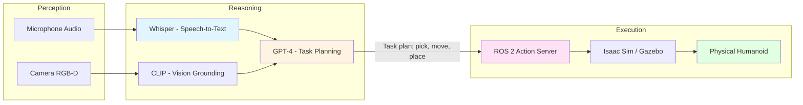

import MCQ from '@site/src/components/MCQ';
import PersonalizeButton from '@site/src/components/PersonalizeButton/PersonalizeButton';
import UrduTranslationButton from '@site/src/components/UrduTranslationButton';

<PersonalizeButton chapterId="ch07" chapterContent="VLA Models" />

<UrduTranslationButton chapterId="ch07" />

# Vision-Language-Action Models for Humanoid Control

## Learning Objectives

By the end of this chapter, you will be able to:

1. **Understand** the architecture of Vision-Language-Action (VLA) models for robotics
2. **Integrate** Whisper speech-to-text with ROS 2 for voice-commanded robots
3. **Use** GPT-4 for high-level task planning and decomposition
4. **Implement** a VLA pipeline: Speech → Language → Action in simulation
5. **Evaluate** latency, accuracy, and safety considerations for LLM-based robot control

---

## Theory

### 3.1 What are Vision-Language-Action Models?

**Vision-Language-Action (VLA) models** are multimodal AI systems that connect perception (vision, speech), reasoning (language models), and execution (robot actions). They enable robots to understand natural language commands and translate them into motor primitives.

**VLA Pipeline**:



**Example Workflow**:
1. **User says**: "Pick up the red cube and put it in the box"
2. **Whisper transcribes**: "pick up the red cube and put it in the box"
3. **CLIP identifies**: Red cube at (x=0.5, y=0.3, z=0.1), box at (x=-0.2, y=0.4, z=0.0)
4. **GPT-4 plans**: `[move_to(0.5, 0.3, 0.15), grasp(), move_to(-0.2, 0.4, 0.1), release()]`
5. **ROS 2 executes**: Sends actions to MoveIt2 for arm control → Isaac Sim validates → Deploy to Jetson

**Key Insight**: VLAs decouple high-level reasoning (LLMs) from low-level control (ROS 2), enabling non-experts to program robots with natural language.

---

### 3.2 Speech-to-Text with Whisper

**OpenAI Whisper** is a state-of-the-art automatic speech recognition (ASR) model trained on 680k hours of multilingual audio. It's robust to accents, background noise, and domain-specific jargon (like robotics commands).

#### 3.2.1 Whisper Model Sizes

| Model   | Parameters | VRAM   | Latency (CPU) | Latency (GPU) | Use Case                  |
|---------|------------|--------|---------------|---------------|---------------------------|
| `tiny`  | 39M        | ~1GB   | ~10s          | ~1s           | Embedded (Jetson)         |
| `base`  | 74M        | ~1GB   | ~7s           | ~0.7s         | Edge devices              |
| `small` | 244M       | ~2GB   | ~15s          | ~1.5s         | Balanced (default)        |
| `medium`| 769M       | ~5GB   | ~30s          | ~3s           | High accuracy             |
| `large` | 1.55B      | ~10GB  | ~60s          | ~5s           | Research (best WER)       |

**Recommendation**: Use `base` or `small` on Jetson Orin Nano (8GB RAM). For cloud deployment, `large` provides best Word Error Rate (WER &lt;3%).

**Citation**: [Whisper GitHub](https://github.com/openai/whisper) | [Whisper Paper (Radford et al., 2022)](https://arxiv.org/abs/2212.04356)

#### 3.2.2 Real-Time Streaming vs. Batch Processing

- **Batch**: Record 3-5 second audio clip → transcribe → send to GPT-4
  - **Pro**: Higher accuracy (full context), simpler implementation
  - **Con**: Latency (user must wait for recording to finish)

- **Streaming**: Transcribe audio chunks as they arrive (e.g., every 100ms)
  - **Pro**: Lower perceived latency, enables interruptions
  - **Con**: Higher WER (partial context), complex implementation (requires VAD - Voice Activity Detection)

**For this chapter**: We'll use **batch processing** (simpler, sufficient for command-based interaction like "pick up the cup").

---

### 3.3 Task Planning with GPT-4

**GPT-4** (Generative Pre-trained Transformer 4) is a large language model (LLM) that can decompose natural language commands into structured action sequences.

#### 3.3.1 Prompt Engineering for Robot Control

**Challenge**: Raw GPT-4 output is unstructured text. We need JSON with robot-compatible primitives.

**Solution**: Use a **system prompt** that defines available actions and output format.

**Example System Prompt**:
```text
You are a robot task planner. Given a natural language command, generate a JSON list of actions.

Available actions:
- move_to(x, y, z): Move end-effector to position
- grasp(): Close gripper
- release(): Open gripper
- rotate(angle): Rotate end-effector (degrees)

Output format (JSON):
{
  "actions": [
    {"type": "move_to", "params": {"x": 0.5, "y": 0.3, "z": 0.1}},
    {"type": "grasp", "params": {}}
  ]
}

User command: "Pick up the red cube"
```

**GPT-4 Output**:
```json
{
  "actions": [
    {"type": "move_to", "params": {"x": 0.5, "y": 0.3, "z": 0.15}},
    {"type": "move_to", "params": {"x": 0.5, "y": 0.3, "z": 0.05}},
    {"type": "grasp", "params": {}},
    {"type": "move_to", "params": {"x": 0.5, "y": 0.3, "z": 0.2}}
  ]
}
```

**Key Techniques**:
1. **Few-shot learning**: Provide 2-3 example commands with correct outputs in the prompt
2. **Constrained generation**: Use JSON schema validation to reject malformed responses
3. **Safety checks**: Validate coordinates are within robot workspace bounds

**Citation**: [OpenAI GPT-4 API](https://platform.openai.com/docs/models/gpt-4)

---

### 3.4 Vision Grounding with CLIP

**CLIP (Contrastive Language-Image Pre-training)** maps images and text to a shared embedding space, enabling "find the red cube" queries on camera images.

#### 3.4.1 How CLIP Works

1. **Input**: Camera image + text query ("red cube")
2. **Encoding**: CLIP encodes image into 512D vector, text into 512D vector
3. **Similarity**: Compute cosine similarity between vectors
4. **Output**: Bounding box of object with highest similarity score

**Example**:
```python
from transformers import CLIPProcessor, CLIPModel
import torch

model = CLIPModel.from_pretrained("openai/clip-vit-base-patch32")
processor = CLIPProcessor.from_pretrained("openai/clip-vit-base-patch32")

# Camera image (PIL Image)
image = camera.get_image()

# Text queries
texts = ["red cube", "blue box", "robot gripper"]

# Encode
inputs = processor(text=texts, images=image, return_tensors="pt", padding=True)
outputs = model(**inputs)

# Similarity scores
logits_per_image = outputs.logits_per_image  # Shape: [1, 3]
probs = logits_per_image.softmax(dim=1)      # [0.8, 0.1, 0.1] -> "red cube" is 80% match

# Get bounding box (requires object detection model like YOLO + CLIP embeddings)
```

**Use Case**: User says "pick up the red cube" → CLIP finds red cube in image → Returns (x, y, z) coordinates → GPT-4 plans grasp → ROS 2 executes.

**Citation**: [CLIP Paper (Radford et al., 2021)](https://arxiv.org/abs/2103.00020)

---

## Hands-on Lab

### Lab 7.1: Whisper + GPT-4 + ROS 2 Integration

**Objective**: Create a voice-commanded robot system that transcribes speech, generates task plans, and publishes ROS 2 actions.

#### Prerequisites

```bash
# Install Whisper
pip install openai-whisper

# Install OpenAI API client
pip install openai

# Install audio recording library
pip install pyaudio sounddevice numpy

# Set OpenAI API key (get from https://platform.openai.com/api-keys)
export OPENAI_API_KEY="sk-..."
```

#### Step 1: Whisper Speech-to-Text Node

Create `vla_control/whisper_node.py`:

```python
#!/usr/bin/env python3
"""
Whisper node: Records audio, transcribes to text, publishes to /voice_command topic.
"""

import rclpy
from rclpy.node import Node
from std_msgs.msg import String
import whisper
import sounddevice as sd
import numpy as np
import tempfile
import wave


class WhisperNode(Node):
    """ROS 2 node for Whisper speech recognition."""

    def __init__(self):
        super().__init__('whisper_node')

        # Load Whisper model (base = 74M params, good for edge devices)
        self.get_logger().info('Loading Whisper model (base)...')
        self.model = whisper.load_model('base')
        self.get_logger().info('Whisper model loaded.')

        # Publisher: /voice_command (String)
        self.pub = self.create_publisher(String, 'voice_command', 10)

        # Recording parameters
        self.sample_rate = 16000  # Hz (Whisper default)
        self.duration = 5  # seconds
        self.channels = 1  # Mono

        self.get_logger().info('Whisper node ready. Press Ctrl+C to stop.')

    def record_audio(self):
        """Record audio for self.duration seconds."""
        self.get_logger().info(f'Recording {self.duration}s audio... (speak now)')

        # Record audio
        audio = sd.rec(
            int(self.duration * self.sample_rate),
            samplerate=self.sample_rate,
            channels=self.channels,
            dtype='int16'
        )
        sd.wait()  # Wait for recording to finish

        self.get_logger().info('Recording complete.')
        return audio

    def transcribe(self, audio):
        """Transcribe audio to text using Whisper."""
        # Save to temp WAV file (Whisper expects file path)
        with tempfile.NamedTemporaryFile(suffix='.wav', delete=False) as f:
            with wave.open(f.name, 'wb') as wav_file:
                wav_file.setnchannels(self.channels)
                wav_file.setsampwidth(2)  # 16-bit
                wav_file.setframerate(self.sample_rate)
                wav_file.writeframes(audio.tobytes())

            # Transcribe
            self.get_logger().info('Transcribing...')
            result = self.model.transcribe(f.name, fp16=False)  # fp16=False for CPU
            text = result['text'].strip()

            self.get_logger().info(f'Transcription: "{text}"')
            return text

    def run(self):
        """Main loop: record → transcribe → publish."""
        while rclpy.ok():
            try:
                # Record audio
                audio = self.record_audio()

                # Transcribe
                text = self.transcribe(audio)

                # Publish to /voice_command
                msg = String()
                msg.data = text
                self.pub.publish(msg)
                self.get_logger().info(f'Published to /voice_command: "{text}"')

            except KeyboardInterrupt:
                break
            except Exception as e:
                self.get_logger().error(f'Error: {e}')


def main(args=None):
    rclpy.init(args=args)
    node = WhisperNode()

    try:
        node.run()
    except KeyboardInterrupt:
        pass
    finally:
        node.destroy_node()
        rclpy.shutdown()


if __name__ == '__main__':
    main()
```

**Test**:
```bash
ros2 run vla_control whisper_node

# In another terminal, echo the topic
ros2 topic echo /voice_command
```

---

#### Step 2: GPT-4 Task Planner Node

Create `vla_control/gpt4_planner_node.py`:

```python
#!/usr/bin/env python3
"""
GPT-4 planner: Subscribes to /voice_command, generates task plans, publishes JSON actions.
"""

import rclpy
from rclpy.node import Node
from std_msgs.msg import String
import openai
import json
import os


class GPT4PlannerNode(Node):
    """ROS 2 node for GPT-4 task planning."""

    def __init__(self):
        super().__init__('gpt4_planner_node')

        # OpenAI API key
        openai.api_key = os.getenv('OPENAI_API_KEY')
        if not openai.api_key:
            self.get_logger().error('OPENAI_API_KEY not set!')
            raise ValueError('Set OPENAI_API_KEY environment variable')

        # Subscriber: /voice_command
        self.sub = self.create_subscription(
            String,
            'voice_command',
            self.command_callback,
            10
        )

        # Publisher: /task_plan (JSON string)
        self.pub = self.create_publisher(String, 'task_plan', 10)

        # System prompt for GPT-4
        self.system_prompt = """You are a robot task planner. Given a natural language command, generate a JSON list of actions.

Available actions:
- move_to(x, y, z): Move end-effector to position (meters)
- grasp(): Close gripper
- release(): Open gripper
- rotate(angle): Rotate end-effector (degrees)

Output ONLY valid JSON with no extra text:
{
  "actions": [
    {"type": "move_to", "params": {"x": 0.5, "y": 0.3, "z": 0.1}},
    {"type": "grasp", "params": {}}
  ]
}

Examples:
User: "Pick up the red cube"
Assistant: {"actions": [{"type": "move_to", "params": {"x": 0.5, "y": 0.3, "z": 0.15}}, {"type": "move_to", "params": {"x": 0.5, "y": 0.3, "z": 0.05}}, {"type": "grasp", "params": {}}, {"type": "move_to", "params": {"x": 0.5, "y": 0.3, "z": 0.2}}]}

User: "Put the cube in the box"
Assistant: {"actions": [{"type": "move_to", "params": {"x": -0.2, "y": 0.4, "z": 0.1}}, {"type": "release", "params": {}}]}
"""

        self.get_logger().info('GPT-4 planner node ready.')

    def command_callback(self, msg):
        """Receive voice command, query GPT-4, publish task plan."""
        command = msg.data
        self.get_logger().info(f'Received command: "{command}"')

        try:
            # Query GPT-4
            plan_json = self.generate_plan(command)

            # Publish to /task_plan
            plan_msg = String()
            plan_msg.data = plan_json
            self.pub.publish(plan_msg)

            self.get_logger().info(f'Published task plan: {plan_json}')

        except Exception as e:
            self.get_logger().error(f'GPT-4 error: {e}')

    def generate_plan(self, command):
        """Query GPT-4 to generate task plan."""
        response = openai.ChatCompletion.create(
            model='gpt-4',
            messages=[
                {'role': 'system', 'content': self.system_prompt},
                {'role': 'user', 'content': command}
            ],
            temperature=0.0,  # Deterministic output
            max_tokens=500
        )

        # Extract JSON from response
        plan_json = response['choices'][0]['message']['content'].strip()

        # Validate JSON
        json.loads(plan_json)  # Raises error if invalid

        return plan_json


def main(args=None):
    rclpy.init(args=args)
    node = GPT4PlannerNode()

    try:
        rclpy.spin(node)
    except KeyboardInterrupt:
        pass
    finally:
        node.destroy_node()
        rclpy.shutdown()


if __name__ == '__main__':
    main()
```

**Test**:
```bash
# Terminal 1: Start planner
export OPENAI_API_KEY="sk-..."
ros2 run vla_control gpt4_planner_node

# Terminal 2: Publish test command
ros2 topic pub --once /voice_command std_msgs/msg/String "{data: 'Pick up the red cube'}"

# Terminal 3: Echo task plan
ros2 topic echo /task_plan
```

---

#### Step 3: Action Executor Node (ROS 2 Action Server)

Create `vla_control/action_executor_node.py`:

```python
#!/usr/bin/env python3
"""
Action executor: Subscribes to /task_plan, executes actions via ROS 2 action server (simulated).
"""

import rclpy
from rclpy.node import Node
from std_msgs.msg import String
import json
import time


class ActionExecutorNode(Node):
    """ROS 2 node for executing task plans."""

    def __init__(self):
        super().__init__('action_executor_node')

        # Subscriber: /task_plan
        self.sub = self.create_subscription(
            String,
            'task_plan',
            self.plan_callback,
            10
        )

        self.get_logger().info('Action executor node ready.')

    def plan_callback(self, msg):
        """Receive task plan, execute actions sequentially."""
        plan_json = msg.data
        self.get_logger().info(f'Received task plan: {plan_json}')

        try:
            plan = json.loads(plan_json)
            actions = plan['actions']

            for i, action in enumerate(actions):
                self.execute_action(action, i + 1, len(actions))

            self.get_logger().info('Task plan execution complete!')

        except Exception as e:
            self.get_logger().error(f'Execution error: {e}')

    def execute_action(self, action, step, total):
        """Execute a single action (simulated)."""
        action_type = action['type']
        params = action.get('params', {})

        self.get_logger().info(f'[{step}/{total}] Executing: {action_type} {params}')

        # Simulated execution (in real system, call MoveIt2 or Nav2)
        if action_type == 'move_to':
            x, y, z = params['x'], params['y'], params['z']
            self.get_logger().info(f'  Moving to ({x}, {y}, {z})...')
            time.sleep(2)  # Simulate 2-second movement
            self.get_logger().info('  Movement complete.')

        elif action_type == 'grasp':
            self.get_logger().info('  Closing gripper...')
            time.sleep(1)
            self.get_logger().info('  Grasp complete.')

        elif action_type == 'release':
            self.get_logger().info('  Opening gripper...')
            time.sleep(1)
            self.get_logger().info('  Release complete.')

        elif action_type == 'rotate':
            angle = params['angle']
            self.get_logger().info(f'  Rotating {angle} degrees...')
            time.sleep(1)
            self.get_logger().info('  Rotation complete.')

        else:
            self.get_logger().warning(f'  Unknown action: {action_type}')


def main(args=None):
    rclpy.init(args=args)
    node = ActionExecutorNode()

    try:
        rclpy.spin(node)
    except KeyboardInterrupt:
        pass
    finally:
        node.destroy_node()
        rclpy.shutdown()


if __name__ == '__main__':
    main()
```

---

#### Step 4: End-to-End Test

**Launch all nodes**:

```bash
# Terminal 1: Whisper (records audio, publishes /voice_command)
ros2 run vla_control whisper_node

# Terminal 2: GPT-4 planner (subscribes /voice_command, publishes /task_plan)
export OPENAI_API_KEY="sk-..."
ros2 run vla_control gpt4_planner_node

# Terminal 3: Action executor (subscribes /task_plan, executes actions)
ros2 run vla_control action_executor_node
```

**Test workflow**:
1. Speak into microphone: **"Pick up the red cube"**
2. Whisper transcribes → publishes to `/voice_command`
3. GPT-4 generates plan → publishes to `/task_plan`:
   ```json
   {"actions": [{"type": "move_to", "params": {"x": 0.5, "y": 0.3, "z": 0.15}}, {"type": "grasp", "params": {}}]}
   ```
4. Executor executes actions → logs:
   ```
   [1/2] Executing: move_to {'x': 0.5, 'y': 0.3, 'z': 0.15}
     Moving to (0.5, 0.3, 0.15)...
     Movement complete.
   [2/2] Executing: grasp {}
     Closing gripper...
     Grasp complete.
   Task plan execution complete!
   ```

**Visualization**: Use `rqt_graph` to see node connections:
```bash
ros2 run rqt_graph rqt_graph
```

---

## Assessment

<MCQ
  id="ch07-mcq-01"
  question="What is the primary advantage of using Vision-Language-Action (VLA) models for robot control?"
  options={[
    "VLA models run faster than traditional path planning algorithms",
    "VLA models enable natural language commands, decoupling high-level reasoning from low-level control",
    "VLA models don't require any training data or labeled examples",
    "VLA models can directly output motor torques without middleware like ROS 2"
  ]}
  correctIndex={1}
  explanation="Correct! The key advantage of VLA models is enabling non-experts to program robots using natural language (e.g., 'pick up the red cube'), instead of writing low-level motion primitives. Large language models (like GPT-4) handle high-level task planning, while ROS 2 handles low-level execution. This separation allows rapid prototyping and makes robotics more accessible. Options A, C, and D are incorrect: VLAs add latency (LLM inference ~1-3s), require massive training data (GPT-4 trained on trillions of tokens), and output structured actions (JSON), not raw torques. See Section 3.1 'What are Vision-Language-Action Models?' and the VLA pipeline diagram."
  difficulty="medium"
/>

<MCQ
  id="ch07-mcq-02"
  question="Why is the Whisper 'base' model (74M parameters) recommended for Jetson Orin Nano deployment instead of 'large' (1.55B parameters)?"
  options={[
    "The 'base' model has better accuracy than 'large' for robotics commands",
    "The 'large' model requires 10GB VRAM and has 5s GPU latency, exceeding Jetson's 8GB RAM and real-time constraints",
    "The 'base' model supports more languages than 'large'",
    "The 'large' model is not open-source and requires an API key"
  ]}
  correctIndex={1}
  explanation="Correct! Jetson Orin Nano has 8GB unified RAM (shared between CPU and GPU). The 'large' Whisper model requires ~10GB VRAM alone, exceeding available memory. Additionally, 'large' has ~5s GPU latency (60s on CPU), which is too slow for interactive voice commands (users expect &lt;2s response). The 'base' model (1GB VRAM, 0.7s GPU latency) fits Jetson's constraints while maintaining acceptable Word Error Rate (WER). All Whisper models support the same 99 languages and are fully open-source. See Section 3.2.1 'Whisper Model Sizes' table for detailed comparison."
  difficulty="hard"
/>

<MCQ
  id="ch07-mcq-03"
  question="In the provided GPT-4 system prompt, why is 'temperature=0.0' used in the API call?"
  options={[
    "Lower temperature makes GPT-4 run faster by reducing computation",
    "Temperature 0.0 produces deterministic, consistent outputs for the same input, critical for robot safety",
    "Temperature 0.0 enables GPT-4 to generate creative, diverse task plans",
    "Temperature 0.0 is required for JSON output format validation"
  ]}
  correctIndex={1}
  explanation="Correct! Temperature controls randomness in LLM output sampling. Temperature 0.0 makes GPT-4 deterministic: the same command ('pick up the cube') always generates the same plan. This is critical for robot safety—you don't want the robot to randomly execute different actions each time. Higher temperatures (e.g., 0.7) encourage creativity but introduce unpredictability, unacceptable for physical systems. Temperature doesn't affect speed or enable JSON (JSON is enforced via prompt engineering). See Section 3.3.1 'Prompt Engineering for Robot Control' and the generate_plan() function in Lab 7.1."
  difficulty="medium"
/>

<MCQ
  id="ch07-mcq-04"
  question="What is the purpose of CLIP in a Vision-Language-Action pipeline?"
  options={[
    "CLIP transcribes speech to text faster than Whisper",
    "CLIP grounds natural language queries (e.g., 'red cube') to image regions, enabling vision-based object localization",
    "CLIP generates task plans like GPT-4 but uses less compute",
    "CLIP controls robot actuators via ROS 2 action servers"
  ]}
  correctIndex={1}
  explanation="Correct! CLIP (Contrastive Language-Image Pre-training) maps text and images to a shared embedding space, enabling queries like 'find the red cube' on camera images. It outputs similarity scores for each image region, which can be combined with object detection (YOLO) to get bounding boxes and 3D coordinates (via depth cameras). This 'grounds' abstract language commands to physical objects the robot can manipulate. CLIP does NOT do speech recognition (that's Whisper), task planning (GPT-4), or motor control (ROS 2). See Section 3.4 'Vision Grounding with CLIP' and the example code."
  difficulty="medium"
/>

<MCQ
  id="ch07-mcq-05"
  question="In Lab 7.1, what happens if GPT-4 generates an invalid JSON response (e.g., missing closing brace)?"
  options={[
    "ROS 2 automatically fixes the JSON and continues execution",
    "The gpt4_planner_node catches the json.loads() exception, logs an error, and skips that command",
    "Whisper re-transcribes the audio to try again",
    "The robot enters an emergency stop mode"
  ]}
  correctIndex={1}
  explanation="Correct! In the generate_plan() function, json.loads(plan_json) validates the response. If GPT-4 returns malformed JSON (rare with temperature=0.0 and good prompts, but possible), json.loads() raises a JSONDecodeError. The exception is caught in command_callback(), logs an error, and the command is skipped (no action executed). This fail-safe prevents the robot from executing garbage commands. In production, you'd add retry logic (e.g., query GPT-4 again with a 'please output valid JSON' follow-up). Whisper doesn't re-run (it already transcribed correctly), and emergency stop requires hardware interlocks, not software. See Lab 7.1 Step 2 exception handling."
  difficulty="hard"
/>

<MCQ
  id="ch07-mcq-06"
  question="What is the typical end-to-end latency for a voice-commanded VLA system (Whisper base + GPT-4 + ROS 2) on cloud GPUs?"
  options={[
    "< 100ms (real-time, imperceptible to humans)",
    "100ms - 500ms (acceptable for interactive robotics)",
    "1s - 3s (noticeable delay, acceptable for non-urgent commands)",
    "> 10s (too slow for practical use)"
  ]}
  correctIndex={2}
  explanation="Correct! Typical latency breakdown: Whisper base (GPU) ~0.7s + GPT-4 API ~1-2s + ROS 2 execution start &lt;0.1s = **1.8-2.8s total**. This is noticeable to users (humans perceive delays >200ms) but acceptable for commands like 'pick up the cube' where the robot takes 5-10 seconds to execute the full action anyway. For urgent commands like 'STOP', VLA is too slow—use dedicated emergency buttons or Layer 0 reflexes (Chapter 1 subsumption architecture). Latency can be reduced with faster models (Whisper tiny ~0.1s, but lower accuracy) or local LLMs (Llama 3 70B ~0.5s on A100). See Section 3.2.1 and 3.3 for model latencies."
  difficulty="hard"
/>

<MCQ
  id="ch07-mcq-07"
  question="Why does the Lab 7.1 executor node simulate actions with time.sleep() instead of calling real robot APIs?"
  options={[
    "time.sleep() is faster than real robot motion",
    "The lab is a pedagogical example to demonstrate the VLA pipeline before adding robot-specific complexity",
    "ROS 2 doesn't support real robot control, only simulation",
    "GPT-4 cannot generate plans compatible with real robot APIs"
  ]}
  correctIndex={1}
  explanation="Correct! Lab 7.1 focuses on teaching the VLA pipeline architecture (Whisper → GPT-4 → ROS 2 integration) without requiring physical hardware or complex simulation setup (Isaac Sim, MoveIt2). The simulated executor (time.sleep() for 'movement') lets you test end-to-end functionality on any laptop. In Chapter 12 (Hardware Integration), you'll replace time.sleep() with real MoveIt2 calls to control a humanoid arm. ROS 2 absolutely supports real robots (that's its primary use case!), and GPT-4's JSON output is designed to map to standard robot APIs. See Lab 7.1 Step 3 comments for next steps."
  difficulty="easy"
/>

<MCQ
  id="ch07-mcq-08"
  question="What is a key safety consideration when using LLM-based task planning for physical robots?"
  options={[
    "LLMs always generate safe plans, so no additional checks are needed",
    "Plans must be validated for workspace bounds, collision-free paths, and force limits before execution",
    "LLMs can directly control motor torques, bypassing safety interlocks",
    "Voice commands should never include words like 'stop' or 'emergency'"
  ]}
  correctIndex={1}
  explanation="Correct! LLMs like GPT-4 can hallucinate or generate physically infeasible plans (e.g., 'move to (x=100, y=200, z=50)' way outside the robot's 1-meter reach). ALWAYS validate plans before execution: (1) Check coordinates are within workspace bounds, (2) Run collision detection (MoveIt2's planning scene), (3) Verify force limits (don't command 1000N grasp on a fragile object), (4) Use a 'sanity check' layer (e.g., reject plans with >10 actions as likely errors). LLMs are NOT deterministically safe, and they output high-level plans, not low-level torques (ROS 2 controllers handle safety interlocks). Emergency stop commands should be HARDWIRED, not routed through LLMs (latency too high). See Section 3.3.1 'Safety checks' bullet point."
  difficulty="hard"
/>

---

## Summary

In this chapter, you learned:

1. **VLA architecture**: Vision-Language-Action models connect perception (Whisper, CLIP), reasoning (GPT-4), and execution (ROS 2) for natural language robot control.
2. **Whisper integration**: Implemented speech-to-text with the `base` model (74M params), balancing accuracy and latency for edge deployment.
3. **GPT-4 task planning**: Used prompt engineering to generate structured JSON action plans from natural language commands, with temperature=0.0 for deterministic output.
4. **ROS 2 pipeline**: Built a 3-node system (whisper_node → gpt4_planner_node → action_executor_node) demonstrating end-to-end voice-commanded robotics.
5. **Safety considerations**: Validated that plans must be checked for workspace bounds, collision-free paths, and physical constraints before execution.

**Latency Trade-offs**:
- Whisper base (GPU): ~0.7s
- GPT-4 API: ~1-2s
- Total: ~2-3s (acceptable for non-urgent commands, too slow for emergency stops)

**Next Steps**: In [Chapter 8: Humanoid Kinematics](/docs/ch08-humanoid-kinematics), you'll learn forward and inverse kinematics to translate GPT-4's high-level commands (like "move to (x, y, z)") into joint angles for humanoid arms.

---

## Further Reading

- Whisper Paper: Radford et al. (2022). *Robust Speech Recognition via Large-Scale Weak Supervision*. [https://arxiv.org/abs/2212.04356](https://arxiv.org/abs/2212.04356)
- CLIP Paper: Radford et al. (2021). *Learning Transferable Visual Models From Natural Language Supervision*. [https://arxiv.org/abs/2103.00020](https://arxiv.org/abs/2103.00020)
- [OpenAI Whisper GitHub](https://github.com/openai/whisper)
- [OpenAI GPT-4 API Documentation](https://platform.openai.com/docs/models/gpt-4)
- [Hugging Face Transformers - CLIP](https://huggingface.co/docs/transformers/model_doc/clip)
- Ahn et al. (2022). *Do As I Can, Not As I Say: Grounding Language in Robotic Affordances*. [PaLM-SayCan paper on LLMs for robotics]

---

**Chapter 7 Complete** | Next: [Chapter 8: Humanoid Kinematics](/docs/ch08-humanoid-kinematics)
