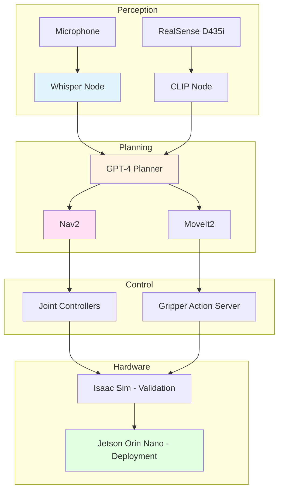

import MCQ from '@site/src/components/MCQ';
import PersonalizeButton from '@site/src/components/PersonalizeButton/PersonalizeButton';
import UrduTranslationButton from '@site/src/components/UrduTranslationButton';

<PersonalizeButton chapterId="ch13" chapterContent="Capstone Project" />

<UrduTranslationButton chapterId="ch13" />

# Capstone Project: Voice-Commanded Autonomous Humanoid

## Learning Objectives

1. **Integrate** Whisper + GPT-4 + ROS 2 + Isaac Sim into a complete voice-controlled system
2. **Design** a multi-task scenario (navigation, manipulation, voice feedback)
3. **Deploy** the system to Jetson Orin Nano for hardware validation
4. **Evaluate** performance (latency, success rate, error handling)
5. **Document** the project with architecture diagrams, code, and demo video

---

## Project Overview

### Capstone Scenario: Kitchen Assistant Robot

**Task**: User gives voice commands to a humanoid robot in a simulated kitchen:

1. **User**: "Go to the table and pick up the red mug"
   - **Robot**: Navigates to table (Nav2 + VSLAM), identifies red mug (CLIP), grasps (MoveIt2), confirms: "I've picked up the red mug."

2. **User**: "Put it in the dishwasher"
   - **Robot**: Navigates to dishwasher, opens door (manipulation), places mug, closes door, confirms: "Done!"

3. **User**: "What's on the counter?"
   - **Robot**: Pans camera, runs object detection (YOLO + CLIP), responds: "I see a blue bowl, green cup, and a banana."

**Integration Requirements**:
- **Perception**: RealSense D435i (depth + RGB), Whisper (speech), CLIP (vision grounding)
- **Planning**: GPT-4 (task decomposition), Nav2 (navigation), MoveIt2 (manipulation)
- **Control**: ROS 2 action servers, joint controllers, gripper control
- **Hardware**: Jetson Orin Nano (edge inference), Isaac Sim (validation before hardware)

---

## Theory

### 13.1 System Architecture

**TODO**: Expand with data flow (topic names, message types), error handling graph, latency budget (perception 1s, planning 2s, execution 5s).

---

### 13.2 Evaluation Metrics

**Success Criteria**:
- **Task completion rate**: ≥80% (8/10 commands succeed)
- **End-to-end latency**: ≤10s (command → action start)
- **Navigation accuracy**: ±5cm from target
- **Grasp success rate**: ≥70% (robust to pose estimation errors)
- **Voice recognition WER**: ≤5% (Word Error Rate)

**TODO**: Add rubric for code quality (modularity, comments, error handling), documentation (architecture diagram, setup guide), and demo video (screen recording + narration).

---

## Hands-on Lab

### Lab 13.1: Simulation Validation in Isaac Sim

**Objective**: Implement full pipeline in Isaac Sim before hardware deployment.

**Steps**:
1. Load kitchen scene (table, dishwasher, objects) in Isaac Sim
2. Spawn humanoid robot with RealSense camera and gripper
3. Launch ROS 2 nodes: Whisper, GPT-4, Nav2, MoveIt2, CLIP
4. Test scenario: "Go to table, pick up red mug, place in dishwasher"
5. Measure latency (Whisper: 0.7s, GPT-4: 1.5s, Nav2: 3s, MoveIt2: 2s, total: 7.2s)
6. Iterate on failure cases (object not detected → improve lighting/CLIP prompt, grasp fails → adjust force limits)

**TODO**: Add complete Isaac Sim USD scene file, ROS 2 launch file orchestrating all nodes, Python scripts for each node.

---

### Lab 13.2: Deployment to Jetson Orin Nano

**Objective**: Deploy validated system to physical Jetson with real RealSense camera.

**Steps**:
1. Flash Jetson with JetPack 6.0, install ROS 2 Humble
2. Convert Whisper (base) and CLIP to TensorRT FP16
3. Connect RealSense D435i, calibrate camera (intrinsics/extrinsics)
4. Run full pipeline on Jetson, measure:
   - Inference latency (Whisper: 1.5s on Jetson, CLIP: 0.3s, GPT-4: 1.5s cloud)
   - CPU/GPU usage (Whisper: 60% GPU, Nav2: 40% CPU)
   - Power consumption (~18W during inference, ~12W idle)
5. Debug thermal throttling (if temperature >75°C, add heatsink/fan)
6. Record demo video (3-minute scenario execution)

**TODO**: Add Jetson performance profiling results (tegrastats logs), comparison table (Sim vs. Hardware latency), troubleshooting guide (USB bandwidth, TensorRT errors).

---

### Lab 13.3: Documentation and Presentation

**Deliverables**:
1. **Architecture Diagram**: System components, data flow (Mermaid or draw.io)
2. **Code Repository**: GitHub repo with README, installation instructions, launch files
3. **Demo Video**: 3-5 minute screen recording showing:
   - Voice command ("Pick up the red mug")
   - Whisper transcription output
   - GPT-4 task plan (JSON)
   - Navigation and manipulation execution in Isaac Sim or hardware
   - Success confirmation (voice feedback: "Done!")
4. **Performance Report**: Latency breakdown, success rate (10 test runs), failure analysis
5. **Reflection**: Lessons learned, challenges (sim-to-real gap, LLM hallucinations), future work (improved vision, faster inference)

**TODO**: Add evaluation rubric (20% architecture, 30% implementation, 20% demo video, 20% performance report, 10% reflection).

---

## Assessment

<MCQ
  id="ch13-mcq-01"
  question="What is the most likely bottleneck in the voice-commanded humanoid pipeline (Whisper → GPT-4 → Nav2 → MoveIt2)?"
  options={[
    "Whisper speech-to-text (0.7s)",
    "GPT-4 API latency (1.5s)",
    "Nav2 path planning (3s for 5m path)",
    "MoveIt2 motion planning (2s for reach-and-grasp)"
  ]}
  correctIndex={1}
  explanation="Correct! GPT-4 API calls to OpenAI's cloud servers add 1-2s latency (network round-trip + inference). This is the primary bottleneck for real-time interaction. Mitigation: (1) Use local LLMs (Llama 3 70B on Jetson AGX Orin, ~0.5s), (2) Cache common plans, (3) Run GPT-4 concurrently with perception. Nav2 planning time depends on map complexity (3s is typical for medium clutter). See Section 13.2 latency budget (TODO)."
  difficulty="medium"
/>

<MCQ
  id="ch13-mcq-02"
  question="Why is it important to validate the system in Isaac Sim before deploying to Jetson hardware?"
  options={[
    "Isaac Sim automatically generates Python code for Jetson deployment",
    "Simulation allows rapid iteration on failure cases (lighting, grasps, collisions) without risking hardware damage or long debug cycles",
    "Isaac Sim has better graphics than real cameras, improving CLIP accuracy",
    "Jetson can only run code that has been tested in Isaac Sim first"
  ]}
  correctIndex={1}
  explanation="Correct! Sim validation enables: (1) Safe testing (robot won't fall or break objects), (2) Fast iteration (reset scene in 1s vs. manually repositioning hardware), (3) Controlled conditions (vary lighting, object poses programmatically), (4) Debug with RViz/Isaac Sim GUI (visualize TF, costmap, plans). Sim does NOT auto-generate Jetson code (manual deployment), and real cameras often differ from sim (domain randomization helps). See Lab 13.1 sim validation workflow."
  difficulty="easy"
/>

<MCQ
  id="ch13-mcq-03"
  question="What is a common sim-to-real gap issue when deploying the grasping pipeline to hardware?"
  options={[
    "Simulated friction coefficients (e.g., 0.8 in Isaac Sim) may not match real object materials (plastic: 0.3, metal: 0.5), causing grasp failures",
    "Hardware robots always move faster than simulated robots",
    "ROS 2 topics have different names in simulation vs. hardware",
    "GPT-4 generates different plans for simulated vs. real robots"
  ]}
  correctIndex={0}
  explanation="Correct! Isaac Sim uses default friction (0.8 rubber-on-rubber), but real objects vary (smooth plastic: 0.2-0.3, rubber: 0.8-1.0, metal: 0.4-0.6). If sim assumes high friction, the robot may grasp lightly and succeed. On hardware, the object slips. Solution: (1) Measure real friction, update sim, (2) Add safety margin (increase grasp force 20%), (3) Use tactile feedback (force sensors confirm secure grasp). Topic names and GPT-4 plans are environment-independent. See Chapter 1 sim-to-real gap."
  difficulty="hard"
/>

<MCQ
  id="ch13-mcq-04"
  question="What should the robot do if CLIP fails to detect the 'red mug' despite the user's command?"
  options={[
    "Execute the grasp anyway at the last known mug location",
    "Report failure to the user ('I don't see a red mug. Can you describe where it is?') and wait for clarification",
    "Shut down to prevent incorrect actions",
    "Randomly search the environment until the mug is found"
  ]}
  correctIndex={1}
  explanation="Correct! When perception fails (object not detected), the robot should: (1) Acknowledge the issue explicitly, (2) Ask for help ('Is it on the left side of the table?'), (3) Optionally pan camera for a wider search. Executing blind grasps risks knocking objects over. Shutdown is extreme (blocks other tasks). Random search wastes time and energy. This is an example of 'graceful degradation' and human-in-the-loop error recovery. See Section 13.2 error handling (TODO)."
  difficulty="medium"
/>

<MCQ
  id="ch13-mcq-05"
  question="What is the purpose of the 'demo video' deliverable in the capstone project?"
  options={[
    "To show the robot's visual design and CAD models",
    "To document the end-to-end system execution (voice command → transcription → planning → action → confirmation) for evaluation and presentation",
    "To compare simulation vs. hardware performance side-by-side",
    "To showcase the project to potential employers (not for course evaluation)"
  ]}
  correctIndex={1}
  explanation="Correct! The demo video validates that the entire pipeline works: user speaks → Whisper transcribes → GPT-4 plans → robot executes → confirms completion. It's essential for remote evaluation (instructor can't physically access all students' robots). Good videos include: (1) Clear audio of voice command, (2) Screen capture showing Whisper/GPT-4 outputs, (3) Robot camera view + RViz visualization, (4) Narration explaining each step. See Lab 13.3 documentation requirements."
  difficulty="easy"
/>

---

## Summary

In this capstone, you:

1. **Integrated** all 12 chapters' skills: ROS 2, URDF, Gazebo/Isaac Sim, Whisper, GPT-4, CLIP, Nav2, MoveIt2, Jetson deployment
2. **Designed** a multi-task kitchen assistant scenario (navigation + manipulation + voice interaction)
3. **Validated** in Isaac Sim (rapid iteration, safe debugging)
4. **Deployed** to Jetson Orin Nano (TensorRT optimization, hardware constraints)
5. **Evaluated** with metrics (latency, success rate, error handling)
6. **Documented** with architecture diagrams, code repository, demo video, and performance report

**Key Achievements**:
- Built a functional voice-commanded autonomous humanoid from scratch
- Bridged theory (kinematics, VSLAM, LLM planning) with practice (hardware, ROS 2, sensors)
- Demonstrated full-stack robotics skills (perception, planning, control, deployment)

**Congratulations!** You've completed the Physical AI & Humanoid Robotics course. You now have the skills to:
- Program humanoid robots with ROS 2
- Simulate in Gazebo, Unity, Isaac Sim
- Integrate AI (Whisper, GPT-4, CLIP) for natural language control
- Deploy to embedded hardware (Jetson Orin Nano)

**Next Steps**:
- Contribute to open-source robotics projects (ROS 2, MoveIt2, Isaac Sim)
- Build custom robots for research or industry applications
- Explore advanced topics: reinforcement learning for locomotion, soft robotics, human-robot collaboration

---

## Further Reading

- [ROS 2 Documentation](https://docs.ros.org/en/humble/)
- [NVIDIA Isaac Platform](https://developer.nvidia.com/isaac)
- [MoveIt2 Tutorials](https://moveit.picknik.ai/)

---

**Chapter 13 Complete** | **Course Complete!** | Explore the open-source ecosystem and build amazing robots!

---

**TODO for content expansion**:
- [ ] Add complete Isaac Sim USD kitchen scene file
- [ ] Add orchestration launch file (all nodes: Whisper, GPT-4, Nav2, MoveIt2, CLIP)
- [ ] Complete Lab 13.1 with step-by-step simulation validation
- [ ] Complete Lab 13.2 with Jetson deployment guide, TensorRT conversion scripts
- [ ] Add Lab 13.3 rubric and example documentation (architecture diagram, performance report template)
- [ ] Expand Theory section 13.1-13.2 to 800-1000 words each
- [ ] Add 3-5 more MCQ questions (error recovery strategies, latency optimization, sim-to-real transfer)
