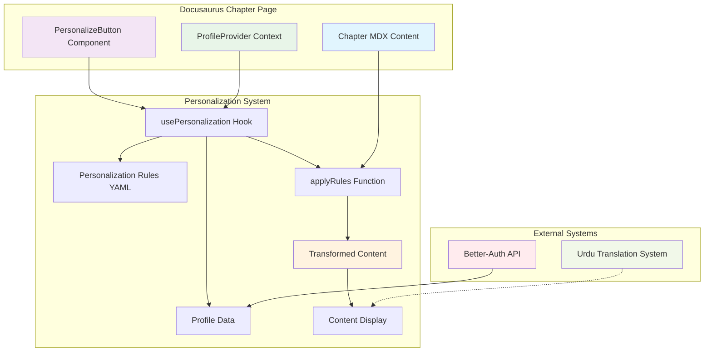

# Implementation Plan: Personalize Button System

**Branch**: `006-personalize-button` | **Date**: 2025-12-10 | **Spec**: [specs/006-personalize-button/spec.md](specs/006-personalize-button/spec.md)

**Note**: This template is filled in by the `/sp.plan` command. See `.specify/templates/commands/plan.md` for the execution workflow.

## Summary

Implementation of a client-side personalization system that allows users to customize chapter content based on their profile (hardware access, experience level, learning goals). The system integrates with Better-Auth for profile retrieval and uses React state management to transform content without page reloads. The feature includes a "Personalize this chapter" button in each of the 13 chapters that adapts content based on user's background (cloud vs local, beginner vs expert, etc.).

## Technical Context

**Language/Version**: TypeScript/JavaScript, React 18+
**Primary Dependencies**: React (for component state management), Docusaurus (for documentation site), Better-Auth (for user profiles)
**Storage**: Browser localStorage for caching profile data, Neon Postgres via Better-Auth API
**Testing**: Jest for unit tests, Cypress for E2E tests
**Target Platform**: Web browser (Docusaurus site), responsive for mobile/desktop
**Project Type**: Web application with frontend personalization components
**Performance Goals**: <500ms content transformation, <100ms React rendering
**Constraints**: <500ms personalization time, no page reload, preserve scroll position, maintain Urdu translation compatibility
**Scale/Scope**: 13 chapters, all authenticated users, session-based caching

## Constitution Check

*GATE: Must pass before Phase 0 research. Re-check after Phase 1 design.*

- ✅ **Helpful and Impactful**: Personalization tailors content to user backgrounds, improving learning outcomes
- ✅ **Honest and Accurate**: Uses actual user profile data from Better-Auth, no fabricated information
- ✅ **Harmless and Inclusive**: Supports Urdu translation, accessible via keyboard/screen readers, hardware-inclusive options
- ✅ **Spec-Driven and AI-Native**: Follows Spec-Kit Plus templates, enables future AI agent generation
- ✅ **Structured and Comprehensive**: Complete component architecture with proper state management
- ✅ **Efficient and Scalable**: Client-side transformation with caching, minimal backend calls
- ✅ **Innovative yet Practical**: Dynamic content personalization while maintaining compatibility

## Project Structure

### Documentation (this feature)
```
specs/006-personalize-button/
├── plan.md              # This file (/sp.plan command output)
├── research.md          # Phase 0 output (/sp.plan command)
├── data-model.md        # Phase 1 output (/sp.plan command)
├── quickstart.md        # Phase 1 output (/sp.plan command)
├── contracts/           # Phase 1 output (/sp.plan command)
└── tasks.md             # Phase 2 output (/sp.tasks command - NOT created by /sp.plan)
```

### Source Code (repository root)
```
docusaurus/
├── src/
│   ├── components/
│   │   ├── PersonalizeButton/
│   │   │   ├── PersonalizeButton.tsx          # Main button component
│   │   │   ├── PersonalizeButton.module.css   # Button styling
│   │   │   ├── usePersonalization.ts          # Custom hook for personalization logic
│   │   │   └── types.ts                       # TypeScript types for personalization
│   │   ├── PersonalizedContent/
│   │   │   ├── PersonalizedContent.tsx        # Content transformation component
│   │   │   └── applyRules.ts                  # Rule application logic
│   │   └── ProfileProvider/
│   │       ├── ProfileProvider.tsx            # Context provider for user profile
│   │       └── useProfile.ts                  # Hook to access profile data
│   ├── utils/
│   │   ├── personalization-rules.ts           # Personalization rules configuration
│   │   ├── profile-helpers.ts                 # Profile processing utilities
│   │   └── content-transformer.ts             # Content transformation utilities
│   └── styles/
│       └── personalization.css                # Global personalization styles
└── docs/
    ├── ch01-intro/
    ├── ch02-ros2/
    ├── ch03-modeling/
    ├── ch04-gazebo/
    ├── ch05-unity/
    ├── ch06-isaac-sim/
    ├── ch07-vision/
    ├── ch08-kinematics/
    ├── ch09-locomotion/
    ├── ch10-manipulation/
    ├── ch11-conversational/
    ├── ch12-hardware/
    └── ch13-capstone/
```

**Structure Decision**: Web application structure chosen since this is a Docusaurus-based documentation site with personalization components integrated into each chapter page.

## Complexity Tracking

> **Fill ONLY if Constitution Check has violations that must be justified**

| Violation | Why Needed | Simpler Alternative Rejected Because |
|-----------|------------|-------------------------------------|
| Client-side rule evaluation | Performance requirement (500ms transformation) | Server-side transformation would cause page reloads, violating spec |

## Phase 0: Research & Analysis

### Research Findings

**Decision**: Client-side personalization using React state management
**Rationale**: Meets performance requirement of <500ms transformation without page reloads, preserves scroll position and form state as required
**Alternatives considered**: Server-side rendering (violates no-reload requirement), static site generation (doesn't allow real-time personalization)

**Decision**: Profile caching in React Context with localStorage fallback
**Rationale**: Ensures profile data is available immediately when user clicks personalization button, reducing latency
**Alternatives considered**: Always fetch from API (would add network delay, violating 500ms requirement)

**Decision**: YAML configuration for personalization rules
**Rationale**: Allows non-technical team members to modify personalization rules without code changes, meeting maintainability requirement
**Alternatives considered**: Hardcoded rules in components (would require code changes for any rule modification)

### Personalization Rules Architecture

The personalization system will use a rules-based approach where each rule maps user profile attributes to content transformations:

1. **Rule Structure**: `{ rule_id, profile_key, profile_value, content_selector, transformation_type, parameters }`
2. **Content Transformation Types**:
   - `show/hide`: Show or hide content sections
   - `emphasize`: Highlight important sections for user profile
   - `replace_text`: Replace technical terms with user-appropriate alternatives
   - `add_content`: Inject additional content (like ROS2 primer for beginners)

3. **Rule Evaluation**: Client-side evaluation using profile data to determine which transformations to apply

### Integration with Existing Systems

The personalization system will integrate with:
1. **Better-Auth**: For retrieving user profile data
2. **Urdu Translation System**: Personalized content must remain translatable
3. **Docusaurus**: Components must work within Docusaurus MDX pages

## Phase 1: Design & Contracts

### Data Model

```typescript
// UserProfile: User profile data from Better-Auth
interface UserProfile {
  id: string;
  hardware_experience: 'none' | 'some' | 'proficient' | 'expert';
  gpu_access: 'none' | 'consumer' | 'midrange' | 'highend';
  ros2_knowledge: 'none' | 'basic' | 'intermediate' | 'advanced';
  learning_goal: 'academic' | 'hobby' | 'career_transition' | 'professional';
  python_level: 'beginner' | 'intermediate' | 'advanced' | 'expert';
  learning_environment: 'cloud_only' | 'cloud_preferred' | 'local_preferred' | 'local_only';
  profile_hash: string; // SHA-256 of sorted profile values
  timestamp: string;
}

// PersonalizationRule: Configuration for content transformation
interface PersonalizationRule {
  rule_id: string;
  profile_key: keyof UserProfile;
  profile_value: string;
  content_selector: string; // CSS selector for content to transform
  transformation_type: 'show' | 'hide' | 'emphasize' | 'replace_text' | 'add_content';
  parameters?: Record<string, any>;
}

// PersonalizedContentState: React state for personalization
interface PersonalizedContentState {
  isPersonalized: boolean;
  profileSummary: string;
  appliedRules: string[];
  originalContent: string; // Cached original content for toggling
  transformedContent: string; // Transformed content
}
```

### Component Architecture

```
ProfileProvider (Context)
├── PersonalizeButton
│   ├── usePersonalization (Hook)
│   └── Profile Data Access
└── PersonalizedContent
    ├── applyRules (Transformation Logic)
    ├── Rule Configuration (YAML)
    └── Content Transformation
```

### API Contracts

The personalization system doesn't require backend API changes since it operates client-side using profile data from Better-Auth. However, the following frontend contracts are established:

1. **Profile Access Contract**: Components can access user profile via `useProfile()` hook
2. **Personalization Contract**: `PersonalizeButton` triggers content transformation via `usePersonalization()` hook
3. **Content Transformation Contract**: `PersonalizedContent` component applies rules to transform content based on profile

### Quickstart Guide

1. **Installation**: Add personalization components to Docusaurus project
2. **Configuration**: Set up personalization rules in YAML format
3. **Integration**: Add `<PersonalizeButton />` and `<PersonalizedContent />` to each chapter
4. **Testing**: Verify personalization works with different profile combinations
5. **Deployment**: Deploy with existing Docusaurus site

## Component Diagram



## Personalization Rules (Exact Implementation)

### Rule Configuration (personalization-rules.yaml)

```yaml
# Learning Environment Rules
- rule_id: "env-cloud-only-hide-local"
  profile_key: "learning_environment"
  profile_value: "cloud_only"
  content_selector: ".local-installation-section"
  transformation_type: "hide"

- rule_id: "env-cloud-pref-hide-local"
  profile_key: "learning_environment"
  profile_value: "cloud_preferred"
  content_selector: ".local-installation-section"
  transformation_type: "hide"

- rule_id: "env-cloud-show-cloud"
  profile_key: "learning_environment"
  profile_value: ["cloud_only", "cloud_preferred"]
  content_selector: ".cloud-instructions"
  transformation_type: "show"

- rule_id: "env-local-show-local"
  profile_key: "learning_environment"
  profile_value: ["local_preferred", "local_only"]
  content_selector: ".local-installation-section"
  transformation_type: "show"

# ROS2 Knowledge Rules
- rule_id: "ros2-none-add-primer"
  profile_key: "ros2_knowledge"
  profile_value: "none"
  content_selector: "body"
  transformation_type: "add_content"
  parameters:
    content: |
      <div class="primer-section">
        <h3>ROS2 Primer</h3>
        <p>For beginners, here are the key concepts you should understand before proceeding...</p>
      </div>
    position: "prepend"

- rule_id: "ros2-none-hide-advanced"
  profile_key: "ros2_knowledge"
  profile_value: "none"
  content_selector: ".advanced-ros2-section"
  transformation_type: "hide"

# Hardware Experience Rules
- rule_id: "hw-none-simplify"
  profile_key: "hardware_experience"
  profile_value: ["none", "some"]
  content_selector: ".technical-specs"
  transformation_type: "hide"

- rule_id: "hw-expert-show-advanced"
  profile_key: "hardware_experience"
  profile_value: ["proficient", "expert"]
  content_selector: ".advanced-config"
  transformation_type: "show"

# GPU Access Rules
- rule_id: "gpu-none-prioritize-cloud"
  profile_key: "gpu_access"
  profile_value: "none"
  content_selector: ".cloud-alternatives"
  transformation_type: "show"

- rule_id: "gpu-none-hide-local-gpu"
  profile_key: "gpu_access"
  profile_value: "none"
  content_selector: ".gpu-intensive-section"
  transformation_type: "hide"

# Python Level Rules
- rule_id: "python-beginner-add-explanations"
  profile_key: "python_level"
  profile_value: "beginner"
  content_selector: "code"
  transformation_type: "add_content"
  parameters:
    content: "<div class='python-explanation'>This code example demonstrates...</div>"
    position: "after"
```

### Implementation Approach

The personalization system will be implemented in the following layers:

1. **Profile Layer**: Retrieve and cache user profile from Better-Auth
2. **Rule Layer**: Define transformation rules in YAML configuration
3. **Transformation Layer**: Apply rules to content based on profile
4. **UI Layer**: Button component with state management and visual feedback
5. **Integration Layer**: Connect with existing Urdu translation system

This architecture ensures that personalization is:
- Fast (client-side with caching)
- Maintainable (rules in YAML)
- Compatible (preserves existing functionality)
- Accessible (follows web standards)