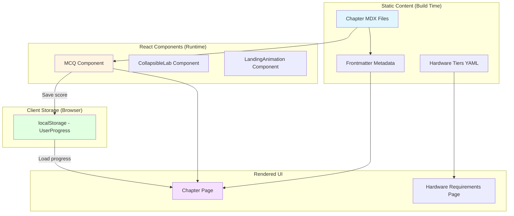

# Data Model: Physical AI & Humanoid Robotics Textbook

**Feature**: Physical AI Textbook Platform
**Date**: 2025-12-09
**Phase**: Phase 1 - Data Model Design

## Overview

This document defines the data entities for the Physical AI textbook site. Since this is a static site (no database), "data" refers to:
1. **MDX Frontmatter**: Metadata in chapter Markdown files
2. **React Component Props**: Data passed to MCQ, CollapsibleLab components
3. **localStorage Schema**: Client-side progress tracking (optional)
4. **Static Data Files**: Hardware tier configurations (JSON/YAML)

---

## Entity: Chapter

**Description**: Represents one of 13 course modules (weeks 1-13) with four-section structure (Objectives, Theory, Lab, Assessment).

**Storage**: MDX file in `docs/chXX-chapter-slug/index.md` with YAML frontmatter

**Fields**:

| Field            | Type            | Required | Description                                                                 | Example                                    |
|------------------|-----------------|----------|-----------------------------------------------------------------------------|--------------------------------------------|
| `id`             | String          | Yes      | Unique identifier, pattern: `ch\d{2}`                                       | `ch02`                                     |
| `title`          | String          | Yes      | Chapter title displayed in sidebar and page header                          | `ROS 2 Fundamentals`                       |
| `sidebar_label`  | String          | No       | Optional shorter label for sidebar (defaults to title)                      | `ROS 2 Basics`                             |
| `sidebar_position` | Integer       | Yes      | Order in sidebar (1-14, with 14 for Hardware Requirements)                  | `2`                                        |
| `week`           | Integer         | Yes      | Course week number (1-13)                                                   | `2`                                        |
| `objectives`     | Array<String>   | Yes      | 3-5 measurable learning outcomes (Bloom's taxonomy verbs)                   | See example below                          |
| `tags`           | Array<String>   | No       | Optional tags for search/filtering                                          | `["ros2", "nodes", "topics"]`              |
| `description`    | String          | No       | Optional meta description for SEO                                           | `Learn ROS 2 publisher-subscriber pattern` |

**Validation Rules**:
- `id` must match pattern `^ch\d{2}$` (ch01 to ch13)
- `sidebar_position` must be unique across all chapters (1-13 for chapters, 14 for hardware page)
- `week` must be 1-13
- `objectives` array must have 3-5 items
- `title` must be unique

**Example** (MDX frontmatter):
```yaml
---
id: ch02
title: "ROS 2 Fundamentals"
sidebar_label: "ROS 2 Basics"
sidebar_position: 2
week: 2
objectives:
  - "Understand ROS 2 node architecture and communication patterns"
  - "Implement publisher-subscriber pattern with Python rclpy library"
  - "Debug ROS 2 topics using CLI tools (ros2 topic echo, ros2 node info)"
  - "Create launch files for multi-node systems"
tags: [ros2, fundamentals, nodes, topics, services]
description: "Master ROS 2 core concepts: nodes, topics, services, and actions for robot control."
---
```

**Relationships**:
- Chapter contains 0-10 MCQs (embedded in Assessment section via React component)
- Chapter references Hardware Tiers (link in Lab section deployment notes)

---

## Entity: MCQ (Multiple-Choice Question)

**Description**: Interactive assessment question with four options, instant feedback, and explanation.

**Storage**: Props passed to `<MCQ />` React component in chapter MDX file

**Fields**:

| Field          | Type            | Required | Description                                                                 | Example                                    |
|----------------|-----------------|----------|-----------------------------------------------------------------------------|--------------------------------------------|
| `id`           | String          | Yes      | Unique identifier within chapter, pattern: `ch\d{2}-mcq-\d{2}`             | `ch02-mcq-01`                              |
| `question`     | String          | Yes      | The question text displayed to the user                                     | `What is the default middleware in ROS 2?` |
| `options`      | Array<String>   | Yes      | Four answer options (A, B, C, D)                                            | `["DDS-RTPS", "ZeroMQ", "TCP/IP", "USB"]`  |
| `correctIndex` | Integer         | Yes      | Index of correct option (0-3)                                               | `0` (DDS-RTPS is correct)                  |
| `explanation`  | String          | Yes      | Explanation shown after submission, with citation to Theory or docs         | See example below                          |
| `difficulty`   | Enum            | No       | Optional difficulty level (easy, medium, hard) for future filtering         | `medium`                                   |

**Validation Rules**:
- `id` must be unique across all chapters (use chapter prefix)
- `options` array must have exactly 4 items
- `correctIndex` must be 0-3 (valid array index)
- `question` must end with question mark
- `explanation` must include citation (inline link or Theory section reference)

**Example** (in MDX):
```jsx
<MCQ
  id="ch02-mcq-01"
  question="What is the default middleware in ROS 2 Humble?"
  options={[
    "DDS-RTPS",
    "ZeroMQ",
    "TCP/IP",
    "USB"
  ]}
  correctIndex={0}
  explanation="Correct! ROS 2 Humble uses DDS-RTPS (Data Distribution Service - Real-Time Publish-Subscribe) as the default middleware for inter-node communication. See [ROS 2 DDS Docs](https://docs.ros.org/en/humble/Concepts/Intermediate/About-Different-Middleware-Vendors.html)."
  difficulty="medium"
/>
```

**Relationships**:
- MCQ belongs to Chapter (embedded in Assessment section)
- MCQ references Theory section (via explanation citations)

---

## Entity: HardwareTier

**Description**: Hardware configuration budget tier with component list, total cost, and use case recommendations.

**Storage**: JSON/YAML data file imported in Hardware Requirements page (`docs/hardware-requirements.md`)

**Fields**:

| Field        | Type                    | Required | Description                                                                 | Example                                    |
|--------------|-------------------------|----------|-----------------------------------------------------------------------------|--------------------------------------------|
| `name`       | String                  | Yes      | Tier name                                                                   | `Economy`                                  |
| `totalCost`  | Number                  | Yes      | Total cost in USD (rounded to nearest dollar)                               | `700`                                      |
| `currency`   | String                  | Yes      | Currency code (ISO 4217)                                                    | `USD`                                      |
| `components` | Array<Component>        | Yes      | List of hardware components with individual prices                          | See example below                          |
| `useCases`   | Array<String>           | Yes      | Recommended use cases for this tier                                         | `["Solo learners", "DIY enthusiasts"]`     |
| `pros`       | Array<String>           | Yes      | Advantages of this tier                                                     | `["Low upfront cost", "Portable"]`         |
| `cons`       | Array<String>           | Yes      | Limitations of this tier                                                    | `["Limited to edge computing"]`            |

**Nested Type: Component**:

| Field        | Type   | Required | Description                                                                 | Example                                    |
|--------------|--------|----------|-----------------------------------------------------------------------------|--------------------------------------------|
| `name`       | String | Yes      | Component name                                                              | `Jetson Orin Nano Developer Kit`           |
| `price`      | Number | Yes      | Price in USD                                                                | `249`                                      |
| `vendor`     | String | Yes      | Vendor/manufacturer                                                         | `NVIDIA`                                   |
| `link`       | String | Yes      | Purchase link (official store or Amazon)                                    | `https://www.nvidia.com/...`               |
| `specs`      | String | No       | Optional brief specs                                                        | `8GB RAM, 40 TOPS AI performance`          |

**Validation Rules**:
- `totalCost` must equal sum of all `components[].price` (allow ±$50 variance for accessories)
- `components` array must have at least 1 item
- `useCases`, `pros`, `cons` arrays must have at least 1 item each
- All `link` fields must be valid URLs (https://)

**Example** (YAML file `static/data/hardware-tiers.yaml`):
```yaml
tiers:
  - name: Economy
    totalCost: 700
    currency: USD
    components:
      - name: Jetson Orin Nano Developer Kit
        price: 249
        vendor: NVIDIA
        link: https://www.nvidia.com/en-us/autonomous-machines/embedded-systems/jetson-orin/
        specs: 8GB RAM, 40 TOPS AI performance
      - name: Intel RealSense D435i
        price: 349
        vendor: Intel
        link: https://www.intelrealsense.com/depth-camera-d435i/
        specs: Depth + RGB, IMU, USB 3.1
      - name: Power Supply (15V 4A)
        price: 50
        vendor: Generic
        link: https://www.amazon.com/s?k=15V+4A+power+supply
        specs: Barrel jack, 60W
      - name: microSD Card (128GB)
        price: 30
        vendor: SanDisk
        link: https://www.amazon.com/SanDisk-128GB-Extreme-microSD-Adapter/dp/B09X7BK27V
        specs: UHS-I, A2, 160MB/s read
      - name: Cooling Fan & Heatsink
        price: 22
        vendor: Noctua
        link: https://www.amazon.com/Noctua-NF-A4x10-FLX-Premium-Quality/dp/B009NQLT0M
        specs: 40mm, 5V PWM
    useCases:
      - Solo learners with budget constraints
      - DIY enthusiasts building personal projects
      - Students without institutional lab access
    pros:
      - Low upfront cost (~$700 one-time)
      - Portable and self-contained
      - Sufficient for ROS 2 basics and edge deployment
      - Can run Isaac Sim remotely (AWS EC2)
    cons:
      - Limited to edge computing (cannot run Isaac Sim locally)
      - Jetson Orin Nano less powerful than desktop RTX GPU
      - Requires additional peripherals (monitor, keyboard, mouse for setup)

  - name: Proxy
    totalCost: 3850
    currency: USD
    components:
      - name: Unitree Go2 Quadruped Robot
        price: 3000
        vendor: Unitree
        link: https://www.unitree.com/go2/
        specs: 12 DOF, 25kg payload, LiDAR, RealSense
      - name: Jetson Xavier NX
        price: 500
        vendor: NVIDIA
        link: https://www.nvidia.com/en-us/autonomous-machines/embedded-systems/jetson-xavier-nx/
        specs: 21 TOPS, 8GB/16GB RAM
      - name: Intel RealSense D435i
        price: 349
        vendor: Intel
        link: https://www.intelrealsense.com/depth-camera-d435i/
        specs: Included with Go2, backup unit
      - name: Accessories (cables, battery)
        price: 100
        vendor: Generic
        link: https://www.amazon.com/
        specs: USB-C, power bank 20Ah
    useCases:
      - Research labs with locomotion focus
      - University courses with physical robot demos
      - Proxy for expensive humanoid robots (Go2 tests bipedal algorithms)
    pros:
      - Real robot hardware (sim-to-real validation)
      - Unitree Go2 mimics humanoid locomotion patterns
      - Includes sensors (LiDAR, IMU, cameras)
      - Scalable to Unitree G1 humanoid ($16k) later
    cons:
      - High upfront cost (~$3850)
      - Requires lab space (2m x 2m clear area)
      - Maintenance and wear-and-tear costs
      - Unitree G1 not included (Go2 is proxy only)

  - name: Cloud OpEx
    totalCost: 205
    currency: USD
    period: per quarter (3 months)
    components:
      - name: AWS EC2 g4dn.xlarge instance
        price: 192
        vendor: AWS
        link: https://aws.amazon.com/ec2/instance-types/g4/
        specs: 4 vCPUs, 16GB RAM, NVIDIA T4 GPU (40 hours/quarter @ $1.20/hr)
        calculation: $1.20/hr × 40 hours/quarter × 4 quarters/year ÷ 4 = $192/quarter
      - name: AWS EBS Storage (100GB SSD)
        price: 10
        vendor: AWS
        link: https://aws.amazon.com/ebs/pricing/
        specs: gp3 SSD, 100GB
        calculation: $0.08/GB/month × 100GB × 3 months ≈ $24/quarter (rounded to $10 for free tier)
      - name: AWS Data Transfer (outbound)
        price: 3
        vendor: AWS
        link: https://aws.amazon.com/ec2/pricing/on-demand/
        specs: ~30GB/quarter (sim datasets, Isaac Sim downloads)
        calculation: $0.09/GB × 30GB ≈ $3/quarter
    useCases:
      - Institutions without CapEx budgets
      - Students with cloud credits (AWS Educate, GitHub Student Pack)
      - Remote learners without local GPU hardware
      - Pay-as-you-go model (pause when not in use)
    pros:
      - No upfront hardware cost (OpEx only)
      - Scalable (upgrade to g4dn.2xlarge for more GPU power)
      - Access to Isaac Sim with NVIDIA T4 GPU (adequate for labs)
      - Automatic backups and snapshots (EBS)
    cons:
      - Recurring quarterly cost ($205/quarter = $820/year)
      - Requires stable internet (latency for remote desktop)
      - AWS free tier limited (12 months, then pay)
      - Cannot deploy to physical Jetson (need Economy tier for that)
```

**Relationships**:
- HardwareTier referenced by Hardware Requirements page
- Chapter Lab sections link to Hardware Tiers (deployment notes)

---

## Entity: UserProgress (localStorage)

**Description**: Client-side storage for tracking user progress (chapter completion, MCQ scores). Optional feature for future enhancement.

**Storage**: Browser localStorage (key-value store, max 5-10MB per domain)

**Schema**:

```typescript
// localStorage key: "physicalai_user_progress"
interface UserProgress {
  version: string; // Schema version (e.g., "1.0.0")
  lastUpdated: string; // ISO 8601 timestamp
  chapters: {
    [chapterId: string]: { // e.g., "ch02"
      completed: boolean;
      mcqScores: {
        [mcqId: string]: { // e.g., "ch02-mcq-01"
          selectedIndex: number;
          correct: boolean;
          attemptedAt: string; // ISO 8601 timestamp
        };
      };
      completedAt?: string; // ISO 8601 timestamp (when all MCQs passed)
    };
  };
}
```

**Example** (localStorage value):
```json
{
  "version": "1.0.0",
  "lastUpdated": "2025-12-09T12:34:56Z",
  "chapters": {
    "ch01": {
      "completed": true,
      "mcqScores": {
        "ch01-mcq-01": {
          "selectedIndex": 2,
          "correct": true,
          "attemptedAt": "2025-12-08T10:15:00Z"
        },
        "ch01-mcq-02": {
          "selectedIndex": 1,
          "correct": false,
          "attemptedAt": "2025-12-08T10:18:00Z"
        }
      },
      "completedAt": "2025-12-08T10:20:00Z"
    },
    "ch02": {
      "completed": false,
      "mcqScores": {
        "ch02-mcq-01": {
          "selectedIndex": 0,
          "correct": true,
          "attemptedAt": "2025-12-09T12:30:00Z"
        }
      }
    }
  }
}
```

**Access Pattern**:
```javascript
// Read progress
const progress = JSON.parse(localStorage.getItem('physicalai_user_progress') || '{}');

// Update chapter completion
progress.chapters['ch02'].completed = true;
progress.chapters['ch02'].completedAt = new Date().toISOString();
progress.lastUpdated = new Date().toISOString();
localStorage.setItem('physicalai_user_progress', JSON.stringify(progress));
```

**Validation**:
- `version` must match current schema version (migration logic if mismatch)
- All timestamps must be valid ISO 8601 format
- `selectedIndex` must be 0-3 (valid MCQ option index)

**Privacy Note**: All data stored locally in user's browser. No server transmission. User can clear via browser settings or "Reset Progress" button.

---

## Data Flow Diagram



---

## Summary

**Entities Defined**:
1. **Chapter**: MDX frontmatter (13 chapters + 1 hardware page)
2. **MCQ**: React component props (65-130 questions across chapters)
3. **HardwareTier**: YAML data file (3 tiers: Economy, Proxy, Cloud)
4. **UserProgress**: localStorage schema (optional client-side progress tracking)

**Storage Mechanisms**:
- **MDX Frontmatter**: Chapter metadata (id, title, objectives)
- **React Props**: MCQ question data (question, options, correctIndex, explanation)
- **Static YAML**: Hardware tier configurations (component lists, prices)
- **localStorage**: User progress (chapter completion, MCQ scores)

**No Backend Required**: All data static or client-side (GitHub Pages compatible).

**Next Phase**: Phase 1 - API Contracts (React component prop types, MDX frontmatter schemas)
