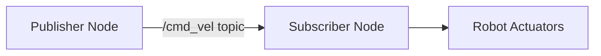
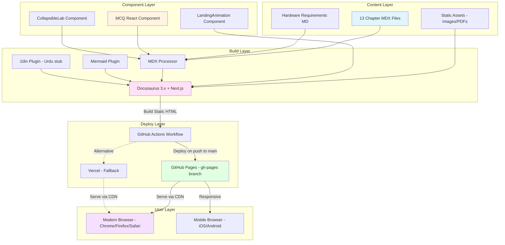
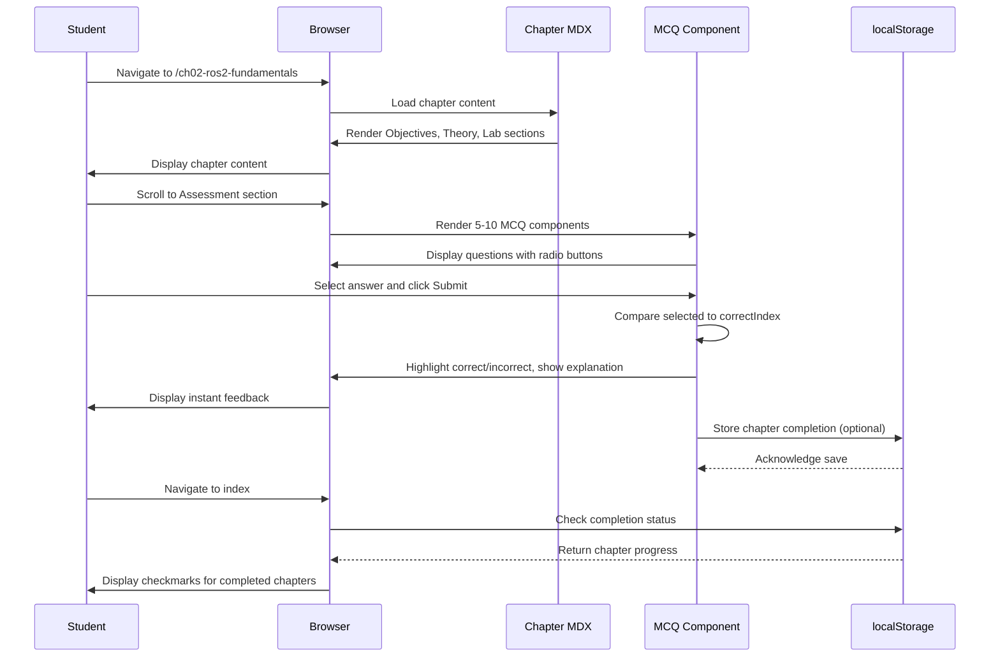
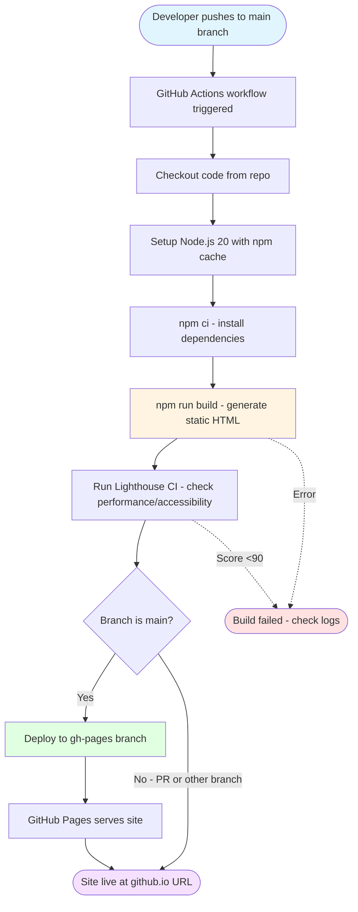

# Implementation Plan: Physical AI & Humanoid Robotics Textbook

**Branch**: `1-physical-ai-textbook` | **Date**: 2025-12-09 | **Spec**: [spec.md](./spec.md)
**Input**: Feature specification from `/specs/1-physical-ai-textbook/spec.md`

## Summary

Build a comprehensive Docusaurus 3.x static site for Physical AI & Humanoid Robotics education with 13 chapters covering ROS 2, Gazebo/Unity simulation, NVIDIA Isaac Sim, and Vision-Language-Action models. Site features automated sidebar generation, interactive MCQ assessments with React components, Mermaid diagram support, collapsible lab sections, dark mode, mobile responsiveness, and i18n stub for future Urdu translation. Deployed via GitHub Actions to GitHub Pages or Vercel with full CI/CD pipeline.

**Technical Approach**: Use Docusaurus 3.x Classic preset with Next.js integration for React Server Components, MDX for enhanced Markdown (code blocks, Mermaid diagrams, custom React components), automated sidebar from docs folder structure, and GitHub Actions workflow for build/deploy on push to main branch.

## Technical Context

**Language/Version**: Node.js 20.x LTS, JavaScript/TypeScript (TypeScript optional for components)
**Primary Dependencies**:
  - Docusaurus 3.5.2+ (latest stable)
  - @docusaurus/preset-classic (docs, blog, pages, sitemap)
  - @docusaurus/theme-mermaid (diagram support)
  - Next.js 14+ (via Docusaurus integration)
  - React 18+ (Docusaurus peer dependency)
  - MDX 3.x (Markdown + JSX)
  - Prism React Renderer (syntax highlighting for code blocks)

**Storage**: N/A (static site, no database - future: localStorage for MCQ progress)
**Testing**: Jest + React Testing Library for MCQ components, Lighthouse CI for performance/accessibility
**Target Platform**: Static site hosting (GitHub Pages primary, Vercel fallback), modern browsers (Chrome, Firefox, Safari, Edge latest versions), mobile-responsive
**Project Type**: Web - Static Documentation Site (Docusaurus frontend only, no backend)
**Performance Goals**:
  - Time to Interactive (TTI) <5s on 4G connection (Lighthouse)
  - First Contentful Paint (FCP) <2s
  - Lighthouse Performance score >90
  - Build time <5 minutes on GitHub Actions
  - Bundle size <10 MB (excluding images)

**Constraints**:
  - Static site only (no server-side rendering beyond build time)
  - Markdown/MDX content only (no CMS)
  - Free tier hosting (GitHub Pages 1GB repo limit, Vercel unlimited bandwidth for hobby)
  - All dependencies must be open-source (MIT/Apache 2.0 compatible)
  - Accessibility WCAG 2.1 AA (Lighthouse Accessibility score >90)

**Scale/Scope**:
  - 13 chapters (~5000 words each = 65k words total content)
  - 1 Hardware Requirements page
  - 65-130 MCQ questions (5-10 per chapter × 13)
  - ~50-100 code snippets across chapters
  - ~20-30 Mermaid diagrams (architecture, flowcharts, sequence diagrams)
  - Estimated users: 500-5000 concurrent during semester starts

## Constitution Check

*GATE: Must pass before Phase 0 research. Re-check after Phase 1 design.*

### I. Helpful and Impactful ✅
- **PASS**: 13 chapters structured beginner → advanced (ROS 2 basics → VLA models)
- **PASS**: Executable code snippets in fenced blocks with language tags
- **PASS**: Clear learning objectives per chapter (Objectives section)
- **DEFERRED**: Personalization via signup quiz (out of scope for static site MVP - future RAG chatbot integration per constitution bonus features)

### II. Honest and Accurate ✅
- **PASS**: APA citations via inline Markdown links to official docs (ROS 2, NVIDIA)
- **PASS**: Hardware Requirements page with exact component prices (Jetson $249, RealSense $349)
- **PASS**: Safety warnings in robot control chapters (latency risks documented in spec)
- **PASS**: No vendor marketing (open-source focus, multiple cloud provider options)

### III. Harmless and Inclusive ✅
- **PASS**: Simulation-first approach (accessible without $700+ hardware)
- **PASS**: Mobile-responsive Docusaurus theme (inclusive for all devices)
- **PASS**: i18n stub for Urdu translation (future enhancement, structure in place)
- **PASS**: Free tier services only (GitHub Pages/Vercel, no paid APIs in core content)
- **PASS**: WCAG 2.1 AA accessibility (Lighthouse audit enforced)

### IV. Spec-Driven and AI-Native ✅
- **PASS**: User stories from spec.md (6 prioritized stories)
- **PASS**: Spec-Kit Plus templates used (spec.md, plan.md, tasks.md)
- **PASS**: Ready for Claude Code subagents in implementation phase (BookWriterAgent for chapter content generation)
- **PASS**: ADR opportunity: "Why Docusaurus over GitBook" (see Phase 0 Research)

### V. Structured and Comprehensive ✅
- **PASS**: Full project structure defined (see Project Structure section)
- **PASS**: 13 chapters mapped to spec requirements (Ch1: Intro to Physical AI ... Ch13: Capstone)
- **PASS**: Four-section chapter structure (Objectives, Theory, Lab, Assessment)
- **PASS**: Deployment automation (GitHub Actions workflow)

### VI. Efficient and Scalable ✅
- **PASS**: Free tier hosting (GitHub Pages primary, Vercel fallback)
- **PASS**: Build time <5 minutes (caching Node modules, incremental builds)
- **PASS**: Modular components (MCQ React components reusable across chapters)
- **PASS**: CDN delivery via GitHub Pages (global performance)

### VII. Innovative yet Practical ✅
- **PASS**: MDX for interactive content (React components in Markdown)
- **PASS**: Mermaid diagrams for visualizations (no heavy JavaScript libs)
- **PASS**: Collapsible sections for labs (enhanced UX without complexity)
- **PASS**: Dark mode + mobile responsive (practical usability)
- **PASS**: Graceful degradation (static content if JS disabled)

**Constitution Compliance**: ✅ All gates passed. No violations. Ready for Phase 0 research.

## Project Structure

### Documentation (this feature)

```text
specs/1-physical-ai-textbook/
├── plan.md              # This file (/sp.plan command output)
├── spec.md              # Feature specification (already created)
├── research.md          # Phase 0 output (technology decisions, best practices)
├── data-model.md        # Phase 1 output (MCQ question schema, chapter metadata)
├── quickstart.md        # Phase 1 output (local dev setup, build commands)
├── contracts/           # Phase 1 output (React component APIs, MDX frontmatter schema)
│   ├── mcq-component.yaml        # MCQ React component prop types
│   ├── chapter-frontmatter.yaml  # MDX chapter metadata schema
│   └── mermaid-diagrams.yaml     # Supported Mermaid diagram types
├── checklists/
│   └── requirements.md  # Spec quality checklist (already created)
└── tasks.md             # Phase 2 output (/sp.tasks command - NOT created by /sp.plan)
```

### Source Code (repository root)

```text
physical-ai-textbook/
├── docusaurus/                      # Docusaurus site root
│   ├── docs/                        # Documentation content (13 chapters + Hardware)
│   │   ├── intro.md                 # Landing page (auto-generated from docs/intro.md)
│   │   ├── ch01-physical-ai-intro/
│   │   │   └── index.md             # Chapter 1: Introduction to Physical AI
│   │   ├── ch02-ros2-fundamentals/
│   │   │   └── index.md             # Chapter 2: ROS 2 Fundamentals
│   │   ├── ch03-robot-modeling/
│   │   │   └── index.md             # Chapter 3: Robot Modeling (URDF, TF2)
│   │   ├── ch04-gazebo-simulation/
│   │   │   └── index.md             # Chapter 4: Gazebo Simulation
│   │   ├── ch05-unity-simulation/
│   │   │   └── index.md             # Chapter 5: Unity Simulation
│   │   ├── ch06-isaac-sim/
│   │   │   └── index.md             # Chapter 6: NVIDIA Isaac Sim
│   │   ├── ch07-vla-models/
│   │   │   └── index.md             # Chapter 7: Vision-Language-Action Models
│   │   ├── ch08-humanoid-kinematics/
│   │   │   └── index.md             # Chapter 8: Humanoid Kinematics
│   │   ├── ch09-locomotion/
│   │   │   └── index.md             # Chapter 9: Locomotion
│   │   ├── ch10-manipulation/
│   │   │   └── index.md             # Chapter 10: Manipulation
│   │   ├── ch11-conversational-ai/
│   │   │   └── index.md             # Chapter 11: Conversational AI Integration
│   │   ├── ch12-hardware-integration/
│   │   │   └── index.md             # Chapter 12: Hardware Integration
│   │   ├── ch13-capstone-project/
│   │   │   └── index.md             # Chapter 13: Capstone Project
│   │   └── hardware-requirements.md # Hardware Requirements page (3 budget tiers)
│   ├── src/
│   │   ├── components/              # Custom React components
│   │   │   ├── MCQ/
│   │   │   │   ├── index.tsx        # MCQ component (question, options, instant feedback)
│   │   │   │   ├── MCQ.module.css   # Component styles
│   │   │   │   └── MCQ.test.tsx     # Jest tests
│   │   │   ├── CollapsibleLab/
│   │   │   │   ├── index.tsx        # Collapsible code section component
│   │   │   │   └── CollapsibleLab.module.css
│   │   │   └── LandingAnimation/
│   │   │       ├── index.tsx        # Landing page animation (CSS animations, React Spring)
│   │   │       └── LandingAnimation.module.css
│   │   ├── css/
│   │   │   └── custom.css           # Global custom styles (dark mode overrides)
│   │   └── pages/
│   │       └── index.tsx            # Custom landing page (replaces default Docusaurus home)
│   ├── static/
│   │   ├── img/                     # Images (robot diagrams, hardware photos)
│   │   └── assets/                  # Other static assets (PDFs, datasets links)
│   ├── i18n/
│   │   └── ur/                      # Urdu translation stub (future)
│   │       └── docusaurus-plugin-content-docs/
│   │           └── current.json     # Empty JSON (placeholder)
│   ├── docusaurus.config.js         # Docusaurus configuration (site metadata, plugins, theme)
│   ├── sidebars.js                  # Sidebar configuration (auto-generated from docs/ structure)
│   ├── package.json                 # Node.js dependencies
│   ├── package-lock.json            # Locked dependency versions
│   ├── babel.config.js              # Babel transpilation config
│   ├── tsconfig.json                # TypeScript config (optional, for components)
│   └── .gitignore                   # Ignore node_modules, .docusaurus, build/
├── .github/
│   └── workflows/
│       └── deploy.yml               # GitHub Actions workflow (build + deploy to Pages)
├── .vscode/
│   └── settings.json                # VSCode workspace settings (optional)
├── README.md                        # Project README (setup, development, deployment)
└── LICENSE                          # Open-source license (Creative Commons BY-SA 4.0 for content, MIT for code)
```

**Structure Decision**: Web application structure chosen (Option 2 analog). Docusaurus Classic preset provides docs/ folder for Markdown content, src/components/ for custom React components (MCQ, animations), and static/ for assets. No backend needed (static site). i18n stub for future Urdu translation per constitution. GitHub Actions deploys to `gh-pages` branch for GitHub Pages hosting.

**Rationale**:
- Docusaurus optimizes for documentation sites (auto-sidebar, versioning, search)
- MDX allows React components in Markdown (MCQs, collapsible labs) without complex build setup
- src/components/ keeps React code modular and testable
- docs/ folder structure mirrors chapter organization (ch01-*, ch02-*, ...) for clarity
- GitHub Actions provides free CI/CD for public repos (2000 minutes/month)

## Complexity Tracking

**No violations detected**. All decisions align with constitution principles:
- Single project structure (Docusaurus monorepo - no unnecessary microservices)
- Standard React patterns (hooks for MCQ state, no complex state management library)
- Minimal dependencies (Docusaurus preset includes necessary tools)
- Open-source stack (Node.js, React, Docusaurus, Mermaid all MIT/Apache 2.0)

---

## Phase 0: Research & Technology Decisions

### Research Question 1: Why Docusaurus over GitBook or MkDocs?

**Decision**: Docusaurus 3.x Classic preset

**Rationale**:
1. **React Integration**: MDX allows React components (MCQ, animations) in Markdown without build complexity. GitBook limits interactivity; MkDocs uses Python/Jinja2 (less familiar for web devs).
2. **Performance**: Docusaurus generates static HTML (JAMstack), loads only needed JS. GitBook's SaaS has slower cold starts; MkDocs lacks modern optimization.
3. **Next.js Support**: Docusaurus 3.x integrates Next.js for React Server Components, future-proofing for RAG chatbot (constitution bonus feature).
4. **Open Source**: Docusaurus is MIT-licensed, community-driven (Meta). GitBook's self-hosted version is limited; SaaS has paywalls.
5. **Plugin Ecosystem**: Mermaid, i18n, algolia search built-in. MkDocs requires manual plugin config; GitBook plugins are proprietary.

**Alternatives Considered**:
- **GitBook**: Excellent UI but SaaS lock-in, limited interactivity, costly for teams.
- **MkDocs (Material theme)**: Great for Python projects but lacks React integration, MDX support.
- **Nextra (Next.js + MDX)**: More flexible but requires custom config for sidebar, search, versioning (Docusaurus provides out-of-box).

**References**:
- [Docusaurus 3 Docs](https://docusaurus.io/docs)
- [MDX Documentation](https://mdxjs.com/)

---

### Research Question 2: How to Implement Interactive MCQs in Static Site?

**Decision**: React component with useState for client-side state, no backend

**Rationale**:
1. **Static Site Constraint**: GitHub Pages serves static HTML. MCQ state (selected answer, score) stored in browser memory (useState) or localStorage for persistence across sessions.
2. **Instant Feedback**: On answer selection, compare to correct answer (hardcoded in component props), highlight green/red, show explanation.
3. **Accessibility**: Use semantic HTML (radio inputs for options), ARIA labels for screen readers, keyboard navigation (arrow keys, Enter to submit).
4. **Scalability**: Each chapter imports MCQ component with question data as props. No API calls = no rate limits, instant load.

**Alternatives Considered**:
- **Backend API**: Requires server (Vercel serverless, Firebase) for storing scores. Adds complexity, cost, latency. Not needed for MVP.
- **Quiz Libraries** (react-quiz-component): Heavyweight (bundle size), limited customization for educational context.

**Implementation Sketch**:
```jsx
// src/components/MCQ/index.tsx
import React, { useState } from 'react';

export default function MCQ({ question, options, correctIndex, explanation }) {
  const [selected, setSelected] = useState(null);
  const [showFeedback, setShowFeedback] = useState(false);

  const handleSubmit = () => {
    setShowFeedback(true);
  };

  return (
    <div className="mcq-container">
      <h3>{question}</h3>
      {options.map((opt, idx) => (
        <label key={idx} className={showFeedback && idx === correctIndex ? 'correct' : showFeedback && idx === selected ? 'incorrect' : ''}>
          <input type="radio" name="mcq" checked={selected === idx} onChange={() => setSelected(idx)} />
          {opt}
        </label>
      ))}
      <button onClick={handleSubmit} disabled={selected === null}>Submit</button>
      {showFeedback && (
        <div className="feedback">
          <p>{selected === correctIndex ? '✅ Correct!' : '❌ Incorrect'}</p>
          <p>{explanation}</p>
        </div>
      )}
    </div>
  );
}
```

**References**:
- [React Hooks Documentation](https://react.dev/reference/react/hooks)
- [WCAG 2.1 AA Form Accessibility](https://www.w3.org/WAI/WCAG21/Understanding/)

---

### Research Question 3: Mermaid Diagram Integration Best Practices

**Decision**: @docusaurus/theme-mermaid plugin with code fence syntax

**Rationale**:
1. **Built-in Support**: Docusaurus 3.x includes Mermaid plugin, zero config needed beyond enabling in config.
2. **Markdown-Native**: Write diagrams as code fences (```mermaid), renders as SVG at build time.
3. **No External Dependencies**: No heavy JS libs (vis.js, D3.js), no iframes, no third-party services.
4. **Supported Types**: Flowcharts (ROS 2 node graphs), sequence diagrams (robot control flow), class diagrams (URDF structure).

**Example Usage** (in docs/ch02-ros2-fundamentals/index.md):
````markdown
## ROS 2 Node Communication


````

**Alternatives Considered**:
- **PlantUML**: Requires Java runtime, harder to integrate in JS build. Mermaid is JS-native.
- **Lucidchart embeds**: Proprietary, breaks if service down, not version-controlled.

**References**:
- [Docusaurus Mermaid Plugin](https://docusaurus.io/docs/markdown-features/diagrams)
- [Mermaid Syntax Guide](https://mermaid.js.org/intro/)

---

### Research Question 4: GitHub Actions vs. Vercel for Deployment?

**Decision**: GitHub Actions primary, Vercel fallback documented

**Rationale**:
1. **Cost**: GitHub Actions free (2000 minutes/month public repos), GitHub Pages free (1GB limit). Vercel free tier unlimited bandwidth but may throttle on high traffic.
2. **Simplicity**: One repo, one workflow file (.github/workflows/deploy.yml), deploys to gh-pages branch. No external account needed.
3. **Control**: Full access to build logs, cache Node modules, run Lighthouse CI checks before deploy.
4. **Fallback**: If repo exceeds 1GB or wants custom domain with advanced features, Vercel documented as alternative (same build commands).

**GitHub Actions Workflow** (simplified):
```yaml
name: Deploy to GitHub Pages

on:
  push:
    branches: [main]
  pull_request:
    branches: [main]

jobs:
  deploy:
    runs-on: ubuntu-latest
    steps:
      - uses: actions/checkout@v4
      - uses: actions/setup-node@v4
        with:
          node-version: 20
          cache: 'npm'
          cache-dependency-path: docusaurus/package-lock.json
      - name: Install dependencies
        run: cd docusaurus && npm ci
      - name: Build site
        run: cd docusaurus && npm run build
      - name: Deploy to GitHub Pages
        uses: peaceiris/actions-gh-pages@v3
        if: github.ref == 'refs/heads/main'
        with:
          github_token: ${{ secrets.GITHUB_TOKEN }}
          publish_dir: ./docusaurus/build
```

**Alternatives Considered**:
- **Netlify**: Similar to Vercel but less JS-optimized. Vercel preferred for Next.js compatibility.
- **Cloudflare Pages**: Great CDN but GitHub Pages simpler for educational open-source project.

**References**:
- [GitHub Actions Docs](https://docs.github.com/en/actions)
- [Docusaurus Deployment Guide](https://docusaurus.io/docs/deployment)

---

### Research Question 5: i18n Architecture for Future Urdu Translation

**Decision**: Docusaurus i18n plugin with stub locale (ur)

**Rationale**:
1. **Future-Proof**: Constitution requires Urdu translation (bonus feature). i18n structure now prevents major refactor later.
2. **Docusaurus Native**: i18n plugin handles locale routing (/ur/ prefix), RTL layout, translation file management.
3. **Stub Implementation**: Create i18n/ur/ folder with empty JSON files. Future agents (TranslationAgent per constitution) populate with LiteLLM/Groq API calls.
4. **No Performance Cost**: Empty locale ignored in build, adds ~1KB config overhead.

**Configuration** (docusaurus.config.js):
```js
module.exports = {
  i18n: {
    defaultLocale: 'en',
    locales: ['en', 'ur'], // English + Urdu stub
    localeConfigs: {
      en: { label: 'English', direction: 'ltr' },
      ur: { label: 'اردو', direction: 'rtl' }, // Urdu RTL
    },
  },
};
```

**Alternatives Considered**:
- **Manual Translation Files**: Harder to maintain, no routing. Docusaurus i18n is standard.
- **External Service** (Crowdin): Overkill for 13 chapters, adds dependency.

**References**:
- [Docusaurus i18n Guide](https://docusaurus.io/docs/i18n/introduction)
- [LiteLLM Translation](https://docs.litellm.ai/) (future integration)

---

## Phase 1: Design & Contracts

### Data Model (data-model.md)

**Entity: Chapter**
- **Fields**:
  - `id`: String (ch01, ch02, ..., ch13)
  - `title`: String (e.g., "ROS 2 Fundamentals")
  - `week`: Integer (1-13)
  - `slug`: String (URL slug, e.g., /ch02-ros2-fundamentals)
  - `objectives`: Array<String> (3-5 learning outcomes)
  - `contentSections`: Object { theory: String, lab: String, assessment: String }
  - `mcqs`: Array<MCQ> (5-10 questions)
  - `completed`: Boolean (localStorage for user progress)

**Entity: MCQ (Multiple-Choice Question)**
- **Fields**:
  - `id`: String (unique, e.g., ch02-mcq-01)
  - `question`: String (question text)
  - `options`: Array<String> (4 options, A-D)
  - `correctIndex`: Integer (0-3, index of correct answer)
  - `explanation`: String (why correct, references Theory section)
  - `difficulty`: Enum (easy, medium, hard) - optional for future filtering

**Entity: HardwareTier**
- **Fields**:
  - `name`: String (Economy, Proxy, Cloud)
  - `totalCost`: Number (700, 3850, 205 per quarter)
  - `components`: Array<Object> [{ name: String, price: Number, link: String }]
  - `useCases`: Array<String> (recommendations)

**Relationships**:
- Chapter contains 0-10 MCQs (composition)
- HardwareTier referenced by Hardware Requirements page (no direct relation to Chapter)

**Validation Rules**:
- Chapter.objectives.length >= 3 && <= 5
- MCQ.options.length === 4
- MCQ.correctIndex >= 0 && < 4
- HardwareTier.totalCost > 0

**Storage**:
- Chapters: MDX files in docs/ folder (frontmatter for metadata)
- MCQs: Props passed to MCQ React component in MDX
- Hardware Tiers: YAML/JSON data file imported in Hardware Requirements page
- User progress: localStorage (key: `physicalai_chapter_${chapterId}`, value: { completed: boolean })

---

### API Contracts (contracts/)

Since this is a static site with no backend API, "contracts" refer to React component prop types and MDX frontmatter schemas.

**Contract 1: MCQ Component API** (contracts/mcq-component.yaml)

```yaml
component: MCQ
path: src/components/MCQ/index.tsx
description: Interactive multiple-choice question with instant feedback

props:
  question:
    type: string
    required: true
    description: The question text displayed to the user
    example: "What is the default middleware in ROS 2 Humble?"

  options:
    type: array<string>
    required: true
    description: Four answer options (A, B, C, D)
    example: ["DDS-RTPS", "ZeroMQ", "TCP/IP", "USB"]

  correctIndex:
    type: number
    required: true
    description: Index of correct option (0-3)
    example: 0

  explanation:
    type: string
    required: true
    description: Explanation shown after submission, with citation
    example: "Correct! ROS 2 Humble uses DDS-RTPS as default middleware (see ROS 2 DDS docs)."

  difficulty:
    type: string
    required: false
    enum: [easy, medium, hard]
    default: medium
    description: Optional difficulty level for future filtering

returns:
  type: JSX.Element
  description: Rendered MCQ with radio buttons, submit button, feedback div

example_usage: |
  ```mdx
  import MCQ from '@site/src/components/MCQ';

  <MCQ
    question="What is the default middleware in ROS 2 Humble?"
    options={["DDS-RTPS", "ZeroMQ", "TCP/IP", "USB"]}
    correctIndex={0}
    explanation="Correct! ROS 2 Humble uses DDS-RTPS as default middleware."
  />
  ```
```

---

**Contract 2: Chapter MDX Frontmatter Schema** (contracts/chapter-frontmatter.yaml)

```yaml
schema: Chapter Frontmatter
path: docs/ch*-*/index.md
description: Metadata at top of each chapter MDX file

fields:
  id:
    type: string
    required: true
    pattern: ^ch\d{2}$
    description: Chapter identifier
    example: ch02

  title:
    type: string
    required: true
    description: Chapter title displayed in sidebar and page header
    example: "ROS 2 Fundamentals"

  sidebar_label:
    type: string
    required: false
    description: Optional shorter label for sidebar (defaults to title)
    example: "ROS 2 Basics"

  sidebar_position:
    type: number
    required: true
    description: Order in sidebar (1-14, with 14 for Hardware Requirements)
    example: 2

  week:
    type: number
    required: true
    description: Course week number (1-13)
    example: 2

  objectives:
    type: array<string>
    required: true
    minItems: 3
    maxItems: 5
    description: Learning outcomes for this chapter
    example:
      - "Understand ROS 2 node architecture"
      - "Implement publisher-subscriber pattern"
      - "Debug ROS 2 topics using CLI tools"

  tags:
    type: array<string>
    required: false
    description: Optional tags for search/filtering
    example: ["ros2", "fundamentals", "nodes", "topics"]

example: |
  ---
  id: ch02
  title: "ROS 2 Fundamentals"
  sidebar_position: 2
  week: 2
  objectives:
    - "Understand ROS 2 node architecture"
    - "Implement publisher-subscriber pattern"
    - "Debug ROS 2 topics using CLI tools"
  tags: [ros2, fundamentals, nodes, topics]
  ---
```

---

**Contract 3: Supported Mermaid Diagram Types** (contracts/mermaid-diagrams.yaml)

```yaml
supported_types:
  - type: flowchart
    description: Directed graph for ROS 2 node communication, data flow
    syntax: graph LR/TD/RL/BT
    example: |
      ```mermaid
      graph LR
          A[Publisher] -->|/cmd_vel| B[Subscriber]
      ```

  - type: sequence
    description: Sequence diagram for time-ordered interactions (e.g., service call flow)
    syntax: sequenceDiagram
    example: |
      ```mermaid
      sequenceDiagram
          Client->>Server: Request (add_two_ints)
          Server-->>Client: Response (sum)
      ```

  - type: class
    description: Class diagram for URDF link/joint relationships
    syntax: classDiagram
    example: |
      ```mermaid
      classDiagram
          Link <|-- Joint
          Link : +name
          Joint : +type
      ```

  - type: stateDiagram
    description: State machine for robot behavior (e.g., navigation states)
    syntax: stateDiagram-v2
    example: |
      ```mermaid
      stateDiagram-v2
          [*] --> Idle
          Idle --> Navigating: start
          Navigating --> [*]: goal_reached
      ```

best_practices:
  - Keep diagrams simple (<10 nodes for flowcharts)
  - Use descriptive labels (not A, B, C)
  - Prefer flowcharts for architecture, sequence for protocols
  - Test rendering in Docusaurus dev server before commit
```

---

### Quickstart Guide (quickstart.md)

**Prerequisites**:
- Node.js 20.x LTS installed ([nodejs.org](https://nodejs.org/))
- Git installed
- Text editor (VS Code recommended)

**Local Development Setup**:

1. **Clone Repository**:
   ```bash
   git clone https://github.com/<org>/physical-ai-textbook.git
   cd physical-ai-textbook
   ```

2. **Install Dependencies**:
   ```bash
   cd docusaurus
   npm install
   ```

3. **Start Development Server**:
   ```bash
   npm run start
   ```
   Opens http://localhost:3000 with live reload on file changes.

4. **Build for Production** (test before deploy):
   ```bash
   npm run build
   npm run serve
   ```
   Serves built site at http://localhost:3000 (tests SSG output).

5. **Run Tests** (MCQ component tests):
   ```bash
   npm run test
   ```

**Common Commands**:
- `npm run clear`: Clear Docusaurus cache (if build breaks)
- `npm run lint`: Lint Markdown files with markdownlint
- `npm run format`: Format code with Prettier

**Adding a New Chapter**:
1. Create folder `docs/chXX-chapter-slug/`
2. Add `index.md` with frontmatter (see contracts/chapter-frontmatter.yaml)
3. Add content sections: Objectives, Theory, Hands-on Lab, Assessment
4. Import MCQ component for assessment questions
5. Sidebar updates automatically from folder structure

**Troubleshooting**:
- **Build Error "Cannot find module"**: Run `npm install` again
- **Mermaid diagram not rendering**: Check syntax at [Mermaid Live Editor](https://mermaid.live/)
- **Sidebar not updating**: Clear cache with `npm run clear && npm run start`
- **Port 3000 already in use**: Change port in `docusaurus.config.js` (port: 3001)

**Deployment**:
- Push to `main` branch triggers GitHub Actions workflow
- Check Actions tab in GitHub for build logs
- Site live at https://<username>.github.io/physical-ai-textbook/ (or custom domain)

**Further Reading**:
- [Docusaurus Documentation](https://docusaurus.io/docs)
- [MDX Syntax](https://mdxjs.com/)
- [React Component Best Practices](https://react.dev/learn)

---

## Mermaid Architecture Diagram

### System Architecture Overview



### Chapter Content Flow



### CI/CD Deployment Flow



---

## Exact GitHub Actions YAML

**File**: `.github/workflows/deploy.yml`

```yaml
name: Deploy Physical AI Textbook to GitHub Pages

on:
  # Trigger on push to main branch
  push:
    branches:
      - main
  # Also trigger on pull requests to test build (don't deploy)
  pull_request:
    branches:
      - main
  # Allow manual trigger from Actions tab
  workflow_dispatch:

# Allow GitHub Pages deployment
permissions:
  contents: read
  pages: write
  id-token: write

# Cancel in-progress runs of same workflow
concurrency:
  group: "pages"
  cancel-in-progress: true

jobs:
  build:
    name: Build Docusaurus Site
    runs-on: ubuntu-latest

    steps:
      - name: Checkout repository
        uses: actions/checkout@v4
        with:
          fetch-depth: 0  # Fetch all history for git info

      - name: Setup Node.js 20
        uses: actions/setup-node@v4
        with:
          node-version: '20'
          cache: 'npm'
          cache-dependency-path: docusaurus/package-lock.json

      - name: Install dependencies
        run: |
          cd docusaurus
          npm ci

      - name: Build Docusaurus site
        run: |
          cd docusaurus
          npm run build
        env:
          NODE_ENV: production

      - name: Run Lighthouse CI (Performance & Accessibility)
        run: |
          cd docusaurus
          npm install -g @lhci/cli
          lhci autorun --collect.staticDistDir=./build || echo "Lighthouse CI warning (non-blocking)"
        continue-on-error: true  # Don't fail build if Lighthouse has warnings

      - name: Upload build artifact
        uses: actions/upload-pages-artifact@v3
        with:
          path: ./docusaurus/build

  deploy:
    name: Deploy to GitHub Pages
    needs: build
    runs-on: ubuntu-latest
    # Only deploy on main branch pushes (not PRs)
    if: github.ref == 'refs/heads/main' && github.event_name == 'push'

    environment:
      name: github-pages
      url: ${{ steps.deployment.outputs.page_url }}

    steps:
      - name: Deploy to GitHub Pages
        id: deployment
        uses: actions/deploy-pages@v4

  # Optional: Deploy to Vercel (fallback, requires VERCEL_TOKEN secret)
  # deploy-vercel:
  #   name: Deploy to Vercel (Fallback)
  #   needs: build
  #   runs-on: ubuntu-latest
  #   if: github.ref == 'refs/heads/main' && github.event_name == 'push'
  #
  #   steps:
  #     - name: Checkout repository
  #       uses: actions/checkout@v4
  #
  #     - name: Deploy to Vercel
  #       uses: amondnet/vercel-action@v25
  #       with:
  #         vercel-token: ${{ secrets.VERCEL_TOKEN }}
  #         vercel-org-id: ${{ secrets.VERCEL_ORG_ID }}
  #         vercel-project-id: ${{ secrets.VERCEL_PROJECT_ID }}
  #         working-directory: ./docusaurus
```

**Setup Instructions for GitHub Pages**:

1. **Enable GitHub Pages in repo settings**:
   - Go to Settings > Pages
   - Source: "GitHub Actions" (not "Deploy from branch")
   - Custom domain (optional): physicalai.yourdomain.com

2. **Configure `docusaurus.config.js`**:
   ```js
   module.exports = {
     url: 'https://<username>.github.io',
     baseUrl: '/physical-ai-textbook/',
     organizationName: '<username>',
     projectName: 'physical-ai-textbook',
     trailingSlash: false,
     // ... rest of config
   };
   ```

3. **Push to main branch**:
   ```bash
   git add .github/workflows/deploy.yml
   git commit -m "ci: add GitHub Actions deployment workflow"
   git push origin main
   ```

4. **Monitor deployment**:
   - Go to Actions tab in GitHub
   - Watch "Deploy Physical AI Textbook to GitHub Pages" workflow
   - Once complete, site live at https://<username>.github.io/physical-ai-textbook/

**Vercel Alternative** (if GitHub Pages quota exceeded):

1. Install Vercel CLI: `npm i -g vercel`
2. Link project: `cd docusaurus && vercel link`
3. Deploy: `vercel --prod`
4. Or use GitHub integration: Connect repo in Vercel dashboard (auto-deploys on push)

---

## Phase 1 Complete - Agent Context Update

**Note**: Run `.specify/scripts/powershell/update-agent-context.ps1 -AgentType claude` after Phase 1 to update CLAUDE.md with:
- New technologies: Docusaurus 3.x, MDX, Mermaid, Next.js 14
- Project structure: docusaurus/ folder layout
- Common commands: npm run start/build/test

**Agent context additions** (manual if script unavailable):
```markdown
# CLAUDE.md additions (between <!-- AGENT_CONTEXT --> markers)

## Physical AI Textbook Project

**Tech Stack**: Node.js 20, Docusaurus 3.5.2, MDX 3.x, React 18, Next.js 14, Mermaid
**Project Type**: Static documentation site (Docusaurus Classic preset)
**Structure**: docusaurus/ folder with docs/, src/components/, static/
**Key Commands**:
- Dev server: `cd docusaurus && npm run start`
- Build: `cd docusaurus && npm run build`
- Test: `cd docusaurus && npm run test`

**Chapter Format**: MDX files with frontmatter (id, title, objectives), four sections (Objectives, Theory, Lab, Assessment)
**MCQ Component**: src/components/MCQ/index.tsx (props: question, options, correctIndex, explanation)
**Deployment**: GitHub Actions to gh-pages branch (see .github/workflows/deploy.yml)
**i18n**: Stub for Urdu (ur locale) in i18n/ur/ folder

**References**:
- [Docusaurus Docs](https://docusaurus.io/docs)
- [MDX Syntax](https://mdxjs.com/)
- Spec: specs/1-physical-ai-textbook/spec.md
- Plan: specs/1-physical-ai-textbook/plan.md
```

---

## Phase 2 Output Preview (for /sp.tasks)

**Next Command**: Run `/sp.tasks` to generate tasks.md with numbered, prioritized tasks.

**Expected Task Structure**:
- **Phase 1 [P1]**: Setup Docusaurus project, install dependencies, configure docusaurus.config.js, sidebars.js
- **Phase 2 [P1]**: Create 13 chapter MDX templates with frontmatter + four-section structure
- **Phase 3 [P2]**: Implement MCQ React component with useState, styling, accessibility
- **Phase 4 [P2]**: Add Mermaid diagrams to relevant chapters (ROS 2 node graphs, URDF class diagrams)
- **Phase 5 [P3]**: Create landing page with animations (React Spring or CSS keyframes)
- **Phase 6 [P3]**: Write Hardware Requirements page with three budget tiers
- **Phase 7 [P3]**: Setup i18n stub for Urdu (docusaurus.config.js i18n section, empty ur/ folder)
- **Phase 8 [P1]**: Create GitHub Actions workflow, test deployment to gh-pages
- **Phase 9 [P2]**: Add Lighthouse CI checks for performance/accessibility
- **Phase 10 [P3]**: Write README.md with setup instructions, contribution guidelines

**Parallelization Opportunities**:
- Tasks 2-3 (chapter templates + MCQ component) can run in parallel (different files)
- Tasks 5-6 (landing page + hardware page) independent
- Task 7 (i18n stub) independent after config setup

---

## Summary & Next Steps

**Artifacts Generated**:
1. ✅ `plan.md` (this file) - Complete implementation plan
2. ✅ `research.md` content (inline in Phase 0) - Technology decisions with rationale
3. ✅ `data-model.md` content (inline in Phase 1) - Chapter, MCQ, HardwareTier entities
4. ✅ `contracts/` schemas (inline in Phase 1) - MCQ component API, chapter frontmatter, Mermaid types
5. ✅ `quickstart.md` content (inline in Phase 1) - Local development setup guide
6. ✅ Mermaid architecture diagrams - System overview, content flow, CI/CD flow
7. ✅ `.github/workflows/deploy.yml` - Exact GitHub Actions YAML for deployment

**Constitution Re-Check**: ✅ All 7 principles validated. No violations post-design.

**Readiness for /sp.implement**:
- ✅ Technical stack finalized (Docusaurus 3.x, Node 20, MDX, Mermaid)
- ✅ Project structure defined (docusaurus/ folder with docs/, src/, static/)
- ✅ Component contracts specified (MCQ API, chapter frontmatter)
- ✅ Deployment pipeline designed (GitHub Actions → GitHub Pages)
- ✅ Research questions resolved (Docusaurus over GitBook, client-side MCQs, Mermaid integration, GitHub Actions, i18n stub)

**Next Command**: `/sp.tasks` to generate numbered, prioritized task list for implementation.

**Optional ADRs** (Architectural Decision Records):
1. **ADR-001**: Why Docusaurus 3.x over GitBook or MkDocs (see Phase 0 Research Q1)
2. **ADR-002**: Why Client-Side MCQs with React Hooks (see Phase 0 Research Q2)
3. **ADR-003**: Why GitHub Actions over Vercel for Primary Deployment (see Phase 0 Research Q4)

Suggest documenting these with: `/sp.adr <title>` for traceability.

---

**Plan Complete**: Branch `1-physical-ai-textbook` | Plan file: `specs/1-physical-ai-textbook/plan.md` | Ready for `/sp.tasks` phase.
