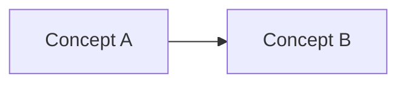

# Quickstart Guide: Physical AI Textbook Development

**Feature**: Physical AI & Humanoid Robotics Textbook
**Date**: 2025-12-09
**Audience**: Developers, contributors, maintainers

## Prerequisites

Before starting local development, ensure you have:

1. **Node.js 20.x LTS** installed
   - Download: [nodejs.org](https://nodejs.org/)
   - Verify: `node --version` (should show v20.x.x)
   - npm comes with Node.js: `npm --version` (should show 10.x.x+)

2. **Git** installed
   - Download: [git-scm.com](https://git-scm.com/)
   - Verify: `git --version`

3. **Text Editor** (recommended: VS Code)
   - Download: [code.visualstudio.com](https://code.visualstudio.com/)
   - Recommended extensions: MDX, Prettier, ESLint

4. **Basic Knowledge**:
   - Markdown syntax
   - React fundamentals (JSX, hooks)
   - Git workflows (branch, commit, push)

---

## Local Development Setup

### 1. Clone Repository

```bash
git clone https://github.com/<org>/physical-ai-textbook.git
cd physical-ai-textbook
```

### 2. Navigate to Docusaurus Folder

```bash
cd docusaurus
```

All commands below assume you're in the `docusaurus/` directory.

### 3. Install Dependencies

```bash
npm install
```

This installs all dependencies from `package.json` (Docusaurus 3.x, React 18, Mermaid, etc.). Takes ~2-3 minutes on first run.

### 4. Start Development Server

```bash
npm run start
```

**Output**:
```
[INFO] Starting the development server...
[SUCCESS] Docusaurus website is running at http://localhost:3000/
```

**Features**:
- **Live reload**: Automatically refreshes browser on file changes
- **Fast refresh**: React components update without full page reload
- **Error overlay**: Shows build errors in browser

**Access**: Open http://localhost:3000/ in your browser.

---

## Common Development Tasks

### Build for Production (Test Before Deploy)

```bash
npm run build
```

Generates static HTML/CSS/JS in `build/` directory. Takes ~30-60 seconds.

**Serve Built Site**:
```bash
npm run serve
```

Opens http://localhost:3000/ serving the built site (tests SSG output, minification, etc.).

### Run Tests (MCQ Components)

```bash
npm run test
```

Runs Jest tests for React components (`src/components/MCQ/MCQ.test.tsx`, etc.).

**Watch Mode** (auto-rerun on changes):
```bash
npm run test -- --watch
```

### Lint Markdown Files

```bash
npm run lint
```

Uses `markdownlint` to check docs/*.md files for formatting issues (line length, heading style, etc.).

**Auto-fix**:
```bash
npm run lint:fix
```

### Format Code (Prettier)

```bash
npm run format
```

Formats all JavaScript, TypeScript, JSX, MDX, JSON files with Prettier.

### Clear Docusaurus Cache (Troubleshooting)

```bash
npm run clear
```

Deletes `.docusaurus/` cache directory. Use if build breaks unexpectedly.

**Then restart**:
```bash
npm run start
```

---

## Adding a New Chapter

### Step 1: Create Chapter Folder

```bash
mkdir -p docs/ch14-new-topic
```

Replace `ch14` with next chapter number (ch01-ch13 already exist).

### Step 2: Create index.md with Frontmatter

```bash
touch docs/ch14-new-topic/index.md
```

**Template**:
```markdown
---
id: ch14
title: "New Topic Title"
sidebar_label: "Short Title"
sidebar_position: 14
week: 14
objectives:
  - "Learning outcome 1 (use Bloom's taxonomy verb: understand, implement, analyze)"
  - "Learning outcome 2"
  - "Learning outcome 3"
tags: [topic, keywords]
description: "SEO-friendly description for search engines."
---

# New Topic Title

## Objectives

By the end of this chapter, you will be able to:

- Learning outcome 1
- Learning outcome 2
- Learning outcome 3

---

## Theory

[Explain concepts with diagrams, citations to official docs]

### Subsection 1

Content here...



### Subsection 2

Content with APA citation: [ROS 2 Docs](https://docs.ros.org/en/humble/).

---

## Hands-on Lab

### Prerequisites

- Software: ROS 2 Humble, Gazebo Harmonic
- Hardware (deployment): Jetson Orin Nano (see [Hardware Requirements](/hardware-requirements))

### Lab Code

\`\`\`python
# example_node.py
import rclpy
from rclpy.node import Node

class ExampleNode(Node):
    def __init__(self):
        super().__init__('example_node')
        self.get_logger().info('Example node started')

def main(args=None):
    rclpy.init(args=args)
    node = ExampleNode()
    rclpy.spin(node)
    rclpy.shutdown()

if __name__ == '__main__':
    main()
\`\`\`

**Run**:
\`\`\`bash
ros2 run my_package example_node
\`\`\`

**Expected Output**:
\`\`\`
[INFO] [example_node]: Example node started
\`\`\`

### Deployment to Jetson

1. Copy code to Jetson: `scp example_node.py jetson@192.168.1.100:~/`
2. SSH into Jetson: `ssh jetson@192.168.1.100`
3. Run: `python3 example_node.py`

---

## Assessment

import MCQ from '@site/src/components/MCQ';

<MCQ
  id="ch14-mcq-01"
  question="What does the example_node do?"
  options={[
    "Publishes sensor data",
    "Logs a startup message",
    "Controls robot motors",
    "Saves data to file"
  ]}
  correctIndex={1}
  explanation="Correct! The example_node logs 'Example node started' using rclpy logger. See Theory section on ROS 2 logging."
  difficulty="easy"
/>

<MCQ
  id="ch14-mcq-02"
  question="Which command runs the node?"
  options={[
    "ros2 launch",
    "ros2 run my_package example_node",
    "python3 example_node.py",
    "rosrun"
  ]}
  correctIndex={1}
  explanation="Correct! ROS 2 uses 'ros2 run <package> <node>' syntax (rosrun is ROS 1)."
  difficulty="medium"
/>

[Add 3-8 more MCQs to total 5-10 per chapter]
```

### Step 3: Verify Sidebar Auto-Update

Docusaurus automatically generates sidebar from `docs/` folder structure.

**Check sidebar**:
1. Save `index.md`
2. Refresh http://localhost:3000/
3. See "New Topic Title" in sidebar at position 14

**Manual Override** (if needed):
Edit `sidebars.js`:
```javascript
module.exports = {
  docs: [
    'intro',
    {
      type: 'category',
      label: 'Chapters',
      items: [
        'ch01-physical-ai-intro/index',
        // ...
        'ch14-new-topic/index', // Add manually if auto-gen fails
      ],
    },
  ],
};
```

---

## Project Structure Reference

```
docusaurus/
├── docs/                          # Documentation content
│   ├── intro.md                   # Landing page
│   ├── ch01-physical-ai-intro/
│   │   └── index.md               # Chapter 1
│   ├── ch02-ros2-fundamentals/
│   │   └── index.md               # Chapter 2
│   └── hardware-requirements.md   # Hardware page
├── src/
│   ├── components/                # Custom React components
│   │   ├── MCQ/
│   │   │   ├── index.tsx          # MCQ component
│   │   │   ├── MCQ.module.css     # Component styles
│   │   │   └── MCQ.test.tsx       # Jest tests
│   │   └── CollapsibleLab/
│   │       └── index.tsx          # Collapsible code section
│   ├── css/
│   │   └── custom.css             # Global custom styles
│   └── pages/
│       └── index.tsx              # Custom landing page
├── static/
│   ├── img/                       # Images (robot diagrams, hardware photos)
│   └── data/
│       └── hardware-tiers.yaml    # Hardware tier configurations
├── i18n/
│   └── ur/                        # Urdu translation stub (future)
├── docusaurus.config.js           # Docusaurus configuration
├── sidebars.js                    # Sidebar configuration
├── package.json                   # Node.js dependencies
└── package-lock.json              # Locked dependency versions
```

**Key Files**:
- **docusaurus.config.js**: Site metadata, plugins, theme, i18n
- **sidebars.js**: Sidebar structure (auto-generated or manual)
- **src/components/MCQ/index.tsx**: MCQ React component
- **docs/chXX-*/index.md**: Chapter content (MDX format)

---

## Troubleshooting

### Build Error: "Cannot find module '@docusaurus/core'"

**Cause**: Dependencies not installed or corrupted.

**Fix**:
```bash
rm -rf node_modules package-lock.json
npm install
```

### Mermaid Diagram Not Rendering

**Cause**: Syntax error in Mermaid code.

**Fix**:
1. Copy diagram code to [Mermaid Live Editor](https://mermaid.live/)
2. Check for errors (red error message)
3. Fix syntax (e.g., missing arrow `-->`, invalid node label)
4. Paste corrected code back into MDX

**Common Errors**:
```mermaid
# ❌ Wrong (missing arrow)
A B

# ✅ Correct
A --> B
```

### Sidebar Not Updating

**Cause**: Docusaurus cache not cleared.

**Fix**:
```bash
npm run clear
npm run start
```

### Port 3000 Already in Use

**Cause**: Another service using port 3000.

**Fix Option 1 (Change Port)**:
Edit `docusaurus.config.js`:
```javascript
module.exports = {
  // ...
  port: 3001, // Change to 3001 or any free port
};
```

**Fix Option 2 (Kill Process)**:
```bash
# macOS/Linux
lsof -ti:3000 | xargs kill -9

# Windows (PowerShell)
Get-Process -Id (Get-NetTCPConnection -LocalPort 3000).OwningProcess | Stop-Process
```

### MCQ Component Not Rendering

**Cause**: Import statement missing or incorrect path.

**Fix**:
Ensure top of MDX file has:
```markdown
import MCQ from '@site/src/components/MCQ';
```

**Path**: `@site` is alias for `docusaurus/` root. Do NOT use relative paths (`../../src/components/MCQ`).

### Dark Mode CSS Issues

**Cause**: Custom CSS overrides conflicting with dark mode.

**Fix**:
In `src/css/custom.css`, use CSS variables:
```css
/* ❌ Wrong (breaks dark mode) */
.my-class {
  background: #ffffff;
  color: #000000;
}

/* ✅ Correct (respects dark mode) */
.my-class {
  background: var(--ifm-background-color);
  color: var(--ifm-font-color-base);
}
```

**Docusaurus CSS Variables**: See [Infima Docs](https://infima.dev/).

---

## Deployment

### GitHub Pages (Primary)

**Prerequisites**:
1. Repository pushed to GitHub
2. GitHub Pages enabled in repo settings (Settings > Pages > Source: GitHub Actions)

**Deploy**:
```bash
git add .
git commit -m "feat: add chapter 14"
git push origin main
```

**GitHub Actions** automatically:
1. Builds site (`npm run build`)
2. Runs Lighthouse CI checks
3. Deploys to `gh-pages` branch
4. Site live at https://<username>.github.io/physical-ai-textbook/

**Monitor**:
- Go to Actions tab in GitHub
- Watch "Deploy Physical AI Textbook to GitHub Pages" workflow
- Check logs if build fails

### Vercel (Fallback)

**Prerequisites**:
1. Vercel account ([vercel.com](https://vercel.com/))
2. Install Vercel CLI: `npm i -g vercel`

**Deploy**:
```bash
cd docusaurus
vercel --prod
```

**Or GitHub Integration**:
1. Go to [vercel.com/dashboard](https://vercel.com/dashboard)
2. Import Git Repository
3. Select `physical-ai-textbook` repo
4. Set root directory: `docusaurus`
5. Build command: `npm run build`
6. Output directory: `build`
7. Deploy (auto-deploys on push to main)

**URL**: https://physical-ai-textbook.vercel.app/

---

## Performance Optimization

### Image Optimization

**Problem**: Large images slow page load.

**Solution**:
1. Use WebP format (lossy compression, ~30% smaller than JPEG)
2. Compress images with [TinyPNG](https://tinypng.com/) or [Squoosh](https://squoosh.app/)
3. Store in `static/img/` folder

**Example**:
```markdown

```

### Code Splitting

**Problem**: Large bundle size (>1MB) slows initial load.

**Solution**:
Docusaurus automatically code-splits by page. No action needed for MDX content.

For custom React components, use dynamic imports:
```javascript
// ❌ Static import (loads on all pages)
import HeavyComponent from './HeavyComponent';

// ✅ Dynamic import (loads only when used)
const HeavyComponent = React.lazy(() => import('./HeavyComponent'));
```

### Lighthouse CI Checks

**Run Locally**:
```bash
npm run build
npm install -g @lhci/cli
lhci autorun --collect.staticDistDir=./build
```

**Output**: Performance, Accessibility, Best Practices, SEO scores (target: >90).

**Improve Scores**:
- **Performance**: Optimize images, reduce bundle size
- **Accessibility**: Add alt text, ARIA labels, keyboard navigation
- **Best Practices**: Fix console errors, use HTTPS
- **SEO**: Add meta descriptions, sitemap, structured data

---

## Further Reading

- **Docusaurus Documentation**: [docusaurus.io/docs](https://docusaurus.io/docs)
- **MDX Syntax**: [mdxjs.com](https://mdxjs.com/)
- **React Hooks**: [react.dev/reference/react/hooks](https://react.dev/reference/react/hooks)
- **Mermaid Diagrams**: [mermaid.js.org](https://mermaid.js.org/)
- **GitHub Actions**: [docs.github.com/en/actions](https://docs.github.com/en/actions)
- **WCAG 2.1 AA**: [w3.org/WAI/WCAG21/quickref](https://www.w3.org/WAI/WCAG21/quickref/)

---

## Contributing

See [CONTRIBUTING.md](../../CONTRIBUTING.md) for guidelines on:
- Code style (Prettier, ESLint)
- Commit message format (Conventional Commits)
- Pull request process
- Code review checklist

---

## Support

- **Issues**: [GitHub Issues](https://github.com/<org>/physical-ai-textbook/issues)
- **Discussions**: [GitHub Discussions](https://github.com/<org>/physical-ai-textbook/discussions)
- **Email**: support@physicalai.edu (for institutional inquiries)

---

**Quickstart Complete**: You're ready to develop locally, add chapters, and deploy to production.
